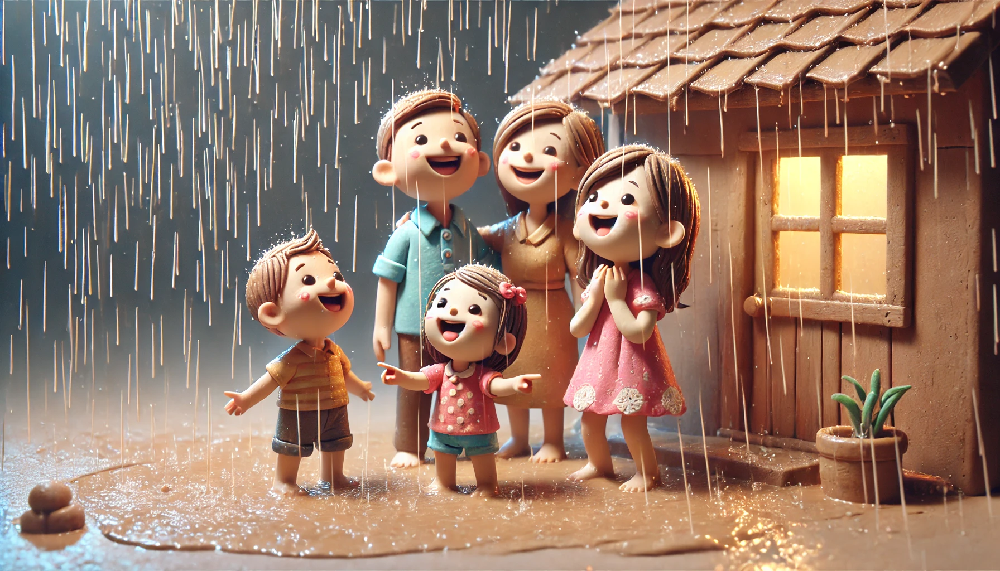

# 【随笔】运气不错

阿宝说要去四海公园抓蝌蚪玩，虽然天气预报说今天有雨，可是已经挨到快中午，也没见一滴雨落下来。

小家伙们早就等不及，阿宝给自己穿上了一身漂亮的裙子，大鱼则用玩具和零食把自己的背包装得满满地。

于是，我把大鱼幼儿园带回来已经洗干净的床单、被套晒到了楼顶天台，然后就和大宝一起带着孩子们出发了。

不知因为什么原因，四海公园的湖边并没有多少人。除了我们，只有另外一个带着小男孩的妈妈在。

吃了些零食，小家伙们就开始挥舞着网兜在草坪、湖边跑来跑去。

阿宝专心地抓了一只又一只蝌蚪；大鱼捞了两三网兜，发现抓不住，就把网兜挂在树梢上，跑到身后缠着妈妈去了。我喝了几口咖啡，放下杯子，逍遥快活地拿起尺八，练习了起来。

不知不觉，太阳从云层后探出头来，把草坪烤得暖融融的。小鸟儿在身后凉亭边的树尖唱着歌，大宝也和凉亭里另一个带孩子的妈妈聊起天来。湖面上微波粼粼，不时有一两只小鱼儿在水面嘬出一圈圈涟漪，又慢慢荡漾着消失不见。

一只灰色肚子，白色翅膀的水鸟从水面掠过，落在对岸的树上。似乎已经抓到了一条小鱼，又好像没有抓到，站在树枝上，依旧机警地盯着湖面。

湖面上倒映着天空的云朵和湖边的绿树与红栏杆。

> 真是一幅绝美的水彩画啊！

我正这么想着，老天爷似乎听到了我的心声，送来一阵清风作答：

> 哪里，还可以更美的！

风从身后掠过，拂过湖边那株开满花朵的紫花风铃木。紫色的花朵扑扑簌簌地飘落下来……

> 哇哦，真的是落英缤纷啊！

等到这阵风停，树下那云色青青，像镜子一般的湖面已经落满了紫色的花瓣。它们在水面打着转，像一群小鸭子一样，一会儿往左，一会儿往右，随着水波飘来荡去。

大宝带着孩子回到我身边，我叫住她：

> 你看那些花瓣，刚刚在这树下一大片，现在已经飘到湖对岸去了！

大宝说：

> 我已经带着孩子们跑了两圈了，你也来吧！

我一跃而起，追着落在最后的大鱼跑了过去。大鱼一边跑，一边叫着：

> 爸爸！爸爸！
>
> 你追上我了吗？你看见我了吗？

……

终于玩累了，我们往附近一家商场走去，打算给孩子们买点酸奶什么的。还没逛多久，路过天庭，才发现外面已经是暴雨倾盆。

原来，天气预报还是挺准的呀。

还好，这雨下下来时，我们已经来到室内了！

索性在外面找了家餐馆，随便吃了点东西。然后，坐地铁回家。

等从地铁出来时，雨已经停了！

大宝笑着对我说：

> 我们运气真好呀……
>
> 在外面玩时没下雨，下暴雨时在室内，等回来雨又停了！

我说：

> 可不？

不过，屋顶天台晾的床单被套估计得拿回来重新洗一遍了^_^