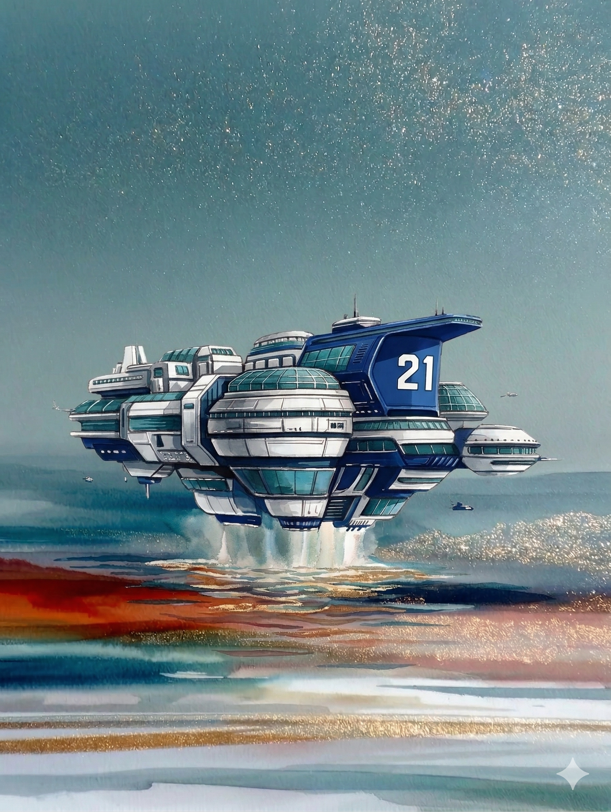

# 【方舟】珠穆朗玛号

2145 年 3 月 19 日，「珠穆朗玛」号的升空仪式在海港城开启，这同时也是庆祝百年战争结束 19 周年的日子。

白色的云层笼罩在海港城的上方，港口各处都挂着大红灯笼和彩旗，蓝白的巨型邮轮也被一串又一串的彩旗打扮了起来。

李尘早早就一大群工作人员一起，穿着崭新的邮轮工作制服，挤过两旁庆祝的人群，登上了邮轮。

他回头时，看见人群中，那个胡子拉碴的中年男人举起手里的酒壶，远远对他挥了挥手。他也赶紧对师傅挥了挥手，然后被身边同事推推搡搡，只好转过了身继续向前走。

在他身后的小胖子和他搭着话：

> 那是你家里人啊？

> 嗯，我师傅。他说他老了，懒得动了，放弃了转岗到邮轮的机会。

> 是吗？我可是第一时间就报名了，可算是被选上了。不过事有利弊啊，这么早就得登船，庆典的开头都没法看了。

……

李尘的宿舍，紧靠着货仓附近。这也是他新工作要负责的安保区域。

他来到监控室，领班已经把其中一个监视屏调到了直播的画面。大家都盯着屏幕看着。

随着一声又一声的礼炮响过，表演的无人机用彩色的烟雾在云层上绘出了巨大的 19 两个字。等彩雾散去，它们又飞了回来，在天空中拼成闪耀的 Ark 21# 字样，然后撒下了漫天飞舞的人造花瓣。

李尘感到脚下地板猛烈地震动了一下，然后又稳定下来。

屏幕上的巨大邮轮，轰然移动起来，船身与船坞之间的缝隙渐渐扩大，海水冲进来，猛地冲击着那些立在峭壁礁石上的钢铁支架，腾起几十米高的巨浪与水舞。

反重力引擎开始运转，邮轮的底部的水域开始出现耀眼的蓝光，在海浪的翻滚中，邮轮从水中腾空而起，然后离开水面，加速向天空升去。海水迅速地涌进了邮轮离开时留下的巨大空间，山一般的巨浪涌过堤坝，翻卷着直扑向那些港口的建筑。

邮轮被底部闪耀的蓝色光晕托举着，继续上升。

看上去，海面的巨浪渐渐归于平静，变得好像一圈又一圈白色的花纹。港口城在这花纹的正中间，只是一座百米高的小岛，小岛顶端那四个人类雕像，静静地伫立在这闪耀着水光的蓝色星球表面。

大洋上，有无数大大小小的船只，从高空往下看，只是一些闪闪的光点，隐匿在粼粼水波之中。

李尘想要再仔细看一看自己曾经生活过的那个小岛，却只能找到一处对着邮轮外的监控屏幕。

他看到邮轮已经钻过了云层，继续上升。云层上方强烈的阳光从倾泻在邮轮蓝白的外壳上，给它们镀上一层金色的光晕。

「珠穆朗玛」号，人类建造的第21艘，也是最后一艘超级豪华赌场邮轮升入了它的轨道。和它同样的高度，另外20艘大约同样规模的邮轮，也围绕着地球，缓缓旋转着。

更高一层的太空中，是密密麻麻如星尘般闪耀的光带，那是百年战争期间形成的太空垃圾，如一层细密的盔甲，牢牢地覆盖在星球的上方。

