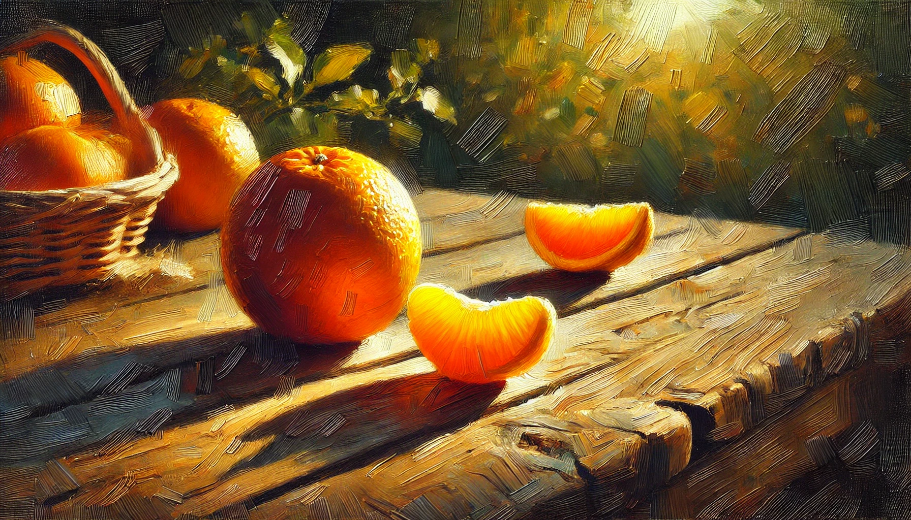

# 【生命⋅修行】吃橘子

《佛陀传》里，佛陀教导孩子们吃橘子时，有这么一段：

> 孩子们，留心吃橘子的意思，就是要吃它时真正地与橘子接触和沟通，你的心没有思想着昨天或明天，只是全神贯注地投入这一刻。这时那橘子才真正存在。

而必经之路•悟空训练营第三日的练习，正是效法佛陀的这一课，通过吃橘子来练习觉察。

> 家里应该没有橘子，可能我得通过走路或者其他方式来练习了。
>
> 而且，我觉得今天很累，就完成必修的练习就好了。
>
> 吃东西、走路、喝水、抄经，所有这些日常活动中的觉察，我以前都练习过……

这么想着，我感觉到有那么一丝「轻视」的态度从心中飘过。

查看了一下「作业说明」，建议说，最好在单独走路时来练习，我还在想，究竟什么时候可以真正地开始练习觉察呢。

就是这么巧，没多久，大宝拉着我还有大鱼出门一起转一转。结果到了二楼平台，大鱼不肯走。大宝便吩咐我，自己一个人去把垃圾扔了，然后再给大鱼买药，最后把快递拿上就回二楼平台来找他们。

于是，我一个人上路了。

鞋底软软的，踩在地上很舒服。左脚换到右脚，右脚换到左脚，我发现这双鞋不像练拳时穿的双星排球鞋那么底薄，左脚足弓平时会疼痛的地方只不过稍微有那么一点点牵扯和不适。但奇怪的是，右脚膝盖的某个位置有些痛，每一步都会牵扯到。

我意识到，自己已经开始在组织语言，准备着一会儿在记录这个觉察过程时要写些什么东西了。

把这思想拉回来，继续下楼。风从背后吹过来，掠过后脖子，与此同时，阳光也从屋顶、树梢掠过，晒在自己后背上。还挺舒服的，我想起林世儒老师说他某一次课后，连着七天都努力觉察自己的每一刻、每一个动作，之后，在他的老师告诉他，他太紧张的那一刻哭了出来。

可这是林老师自己的修行经验，我要不要也努力精进这么几天呢？

我知道自己想远了，便在脑海里假装甩了甩脑袋，赶紧又把注意力回到自己身体的感受上来。

下楼梯时，有个微妙的重心转化过程，膝盖的受力会增加，右膝盖的疼痛感规律地出现。我一只手拎着垃圾袋，一只手跟着摆动着，却发现肩胛骨附近的肌肉紧张而酸痛，三角肌也酸酸的，应该是前天练习俯卧撑时遗留的影响。

扔过垃圾，走到小区门口时，路边有两个工人正拆卸，检查着门禁处的感应开关。我忍不住多看了他们两眼，耳朵也竖起来听他们正在说什么。结果，小区的保安大声和我打招呼，我被吓了一跳。

觉察着走路，却没觉察到和有人在和我打招呼，这觉察也不算彻底吧。

到红绿灯路口，我又想起骑电动车时高速穿梭，不时闯红绿灯的情形。那时候，应该是高度觉察的吧？

> 念头真多!

我忍不住再次评价自己，接着再次意识到，其实每次都想用「语言」来描述当下的觉察，这个过程也一样是脱离当下有一段距离了吧。

一秒钟、一刹那的感受，如果真正敞开，完全收到的话，想要用文字再描述出来，可能一个小时也不够用。可如果那个瞬间，并没能沉浸当下，而是念头纷飞，在一刹那间升起的无数想法，关乎过去、将来、自己、他人，同样也是无法追述的。更何况，想法、念头叠加着感受，感受又牵起更多的想法、念头，无穷无尽啊……

……

回家后，我准备去厨房，路过大宝身边，她一抬手，塞了两片橘子进我嘴里。

> 嗯，你什么时候买的橘子？

不过，这个问题被我吞进了肚子里。这不是正好再练习吃橘子的觉察机会吗？我收回心神，嘴里甜蜜蜜、冰冰凉。轻轻再咬一下，那汁水从唇齿尖渗透出来，淌过舌尖，把甜甜、香香的橘子味带到嘴里每一个角落，轻轻吞下去，那清甜冰凉顺着食管，一直到胃里。连我那老鼻炎的鼻子，都闻到从嘴里反冲上去的清香。

真是太美味了。橘子软软的，轻轻嚼上两下，就几乎消失不见了。香甜的橘汁都被咽下，只剩下一点点薄薄的皮和橘络，可是唾液却止不住地继续分泌出来，于是一个下意识的吞咽动作，嘴里就什么都没有了。只剩下遗留的一些香气，和那舍不得忘记的香甜混合成一种奇妙的回味。

难怪世尊以橘子来教孩子觉察啊，一个美味的橘子，天然就能把人抓在当下……

当然，我这么一想，注意力就又跑走了！

餐桌上还有一个耙耙柑，我轻轻地拿起它来，用一只手剥开皮，从里面掏出两瓣橘瓤来，把它们一起塞进嘴里……

佛陀说：

> 看着橘子，一个修习专注的人能看到宇宙间的奥妙和万事万物的相互关系。

……

> 孩子们，我们的日常生活就像橘子一样。就如每个橘子是由一瓣瓣的橘子肉组成，每一天也是由二十四小时组成。一小时就如一瓣橘子肉。生活了二十四小时就如吃完了全部的橘子肉。我所找到的道路，就是要把每一个小时都活在专注觉察之中，心念永远只投入目前这一刻。

 ……

> 真理就在那里，可是我们若无法平静此心，就看不见它，而平静的真谛是专注于当下，此地此刻此事，专注于一花一木，一笔一划，一心一念，一个橘子一阵微风，就能从水滴中窥见宇宙。

真是一颗好吃的橘子🍊！