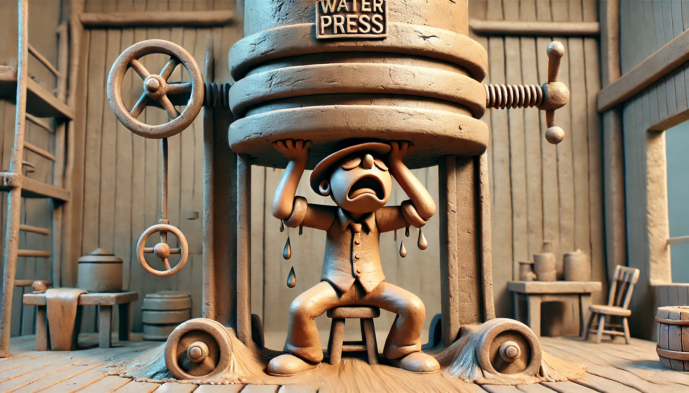

# 【生命⋅修行】压力来来又去去

我能感觉到的压力，在大约前天晚上的时候到达了最高峰。

我甚至还在想和大宝探讨一下，不知道自己内心里，为什么把与家人相处这个领域的事情，和做那些自己想做却没做的事情（比如坚持写作，启动一年12个和AI相关的项目等）对立了起来。

然后无论我把时间、精力放到哪一边，都会在另一边添上一根稻草，心情越来越闷，人也越来越累。虽然能睡着，但是总也睡不够。

到了晚上，终于我自己还没爆，大宝已经爆发了。

那一晚上，她哭了很久。她告诉我说，我对她和孩子们的不耐烦，已经藏不住了。这，不是她想要的！

我于是又开始想，是不是要去上次大宝看过的那个心理医生挂个号，请专业的医生为我指条出路来。

但是，到了第二天下午。一件正在胶着的事情有了些进展，这意味着大概率上，未来一段时间基本够用的现金流问题即将被解决。

我把这事儿告诉大宝，她也很高兴。

然后，很快我发现，自己的眉头舒展了许多，那种闷闷的压力感似乎也消散了不少。

大宝也一样。

我问她：

> 我还要不要去找那个心理医生挂号呢？

她说：

> 我觉得不用了，你想要找他解决的压力问题，不是已经消失了吗？

我仔细感觉了一下，好像确实如此。

也就是说，我内心里，最大最大的压力源，其实就是来自这个现实世界的收入问题。

想到这里，不由得哀叹，自己的智慧与心力实在是太微不足道了。

到至今，所能承担的极限，只不过为全家稻粱谋而已。而且，就这，也能常常把自己压得动惮不得。困顿之下，几乎连「爱」的能力都丧失殆尽。

今天，又看到[「躬行客」写的一篇关于毛泽东的文章](https://mp.weixin.qq.com/s/Q8YCEbNGj27Tdr9EnxXJEQ)，讲当年红军初到陕北时所面临的「死局」和压力，对比之下，更觉得汗颜。

……

最近这8、9年，反反复复，眼见着自己状态起伏，究其根源，原来一半是因为感情，而另一半则完全取决于剩下的存款和预期的收入。

这个发现，让自己不禁忍不住呜呼～

智慧，关于生命智慧这方面，可能压根儿没怎么进步而已。

对了，其实说起来，「智慧」本身就无所谓进步，按六祖惠能的说法，「人人本具自足」，只不过被执着妄想迷住了慧眼罢！

那么我现在这十年，究竟是在围着那一个执着打转呢？

接下来的十年，或者凑个整，下一个十二年，我该破的是什么「我执」，又该如何修行呢？

