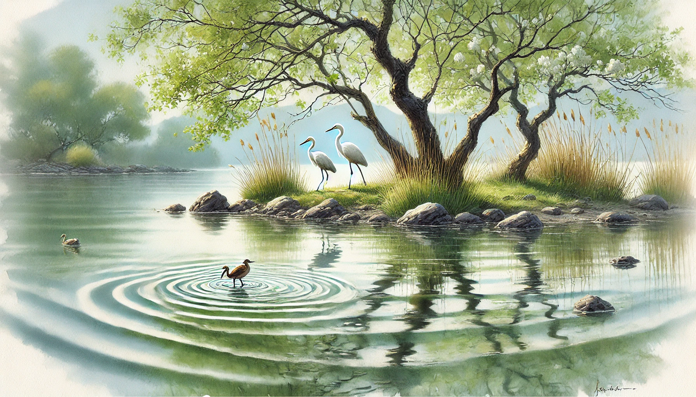

# 【随笔】仙湖的春天

太极拳的师兄师姐们邀请大宝一起去仙湖玩，本来想让她自己去来着，却又想着可能下周就要开始上班了，临时决定一块儿跟了去。

毕竟，以后这种非工作日和大宝一起出游的机会，可能又不知要到什么时候才会有了。

在弘法寺进过香后，我们一行人下到湖边。

那里有沿湖的凉亭，还有两棵树，歪着脖子一直把树干伸到水面上。

我坐到树干上，大宝给我拍了几张照片后，又跑去和其他师姐拍照。

于是，我开始悠然自得地练习起尺八来。说是练习，不如说是瞎玩，我就着自己熟悉的那些音（主要是乙音），随心所欲地胡乱吹出不同的旋律。

是的，任何不熟练的高难度音一概不吹，中途试了试了转换到甲音，发现不熟练，果断放弃……

就这样，吹了好一会儿，竟然有些困了。

这时，大宝跑过来，给我嘴巴里塞了一块儿点心，甜甜的，应该是有什么馅儿吧，细细嚼了，却依旧尝不出是什么做的。有些干，但是我懒得动，便收了尺八，认真地吧嗒着嘴，想把嘴里的食物残渣全部咽下去。

湖面上有风吹过，水波荡漾着击打着岸边的岩石和树干。远处有两只白鹭，在靠近岸边的浅水处踩着高跷。树枝轻轻摇着，树叶嫩绿，还保留着早春的颜色。

湖中心有个小岛，绿草丛生。在靠近小岛的水面上，有一只棕色的小水鸭子，游了两下，一个猛子扎了下去，在水面空留下一圈涟漪。

Z师兄远远地冲我打趣儿：

> 你好像黄药师啊！

我笑着指着那个小岛说：

> 嗯，就做这座小岛的岛主好了！

大宝笑着说：

> 你要是现在能水上漂过去，这座岛就送给你了！

我低头看了看水面，甚至真的仔细评估了一下，如果我试着从水面上跑过去，会是什么光景。

嗯，一定会浑身湿透吧，再顶上一头水草也说不定。

唉，没这本事，还是别做岛主了。

我拿起尺八，闭上眼，开始继续我那随心所欲的尺八爵士乐……

远处，有两只小鸟，竟然咕咕咕咕地和我应和起来……

礼佛归来入仙湖，春光懒困依微风。

真是一个美好的春天。

