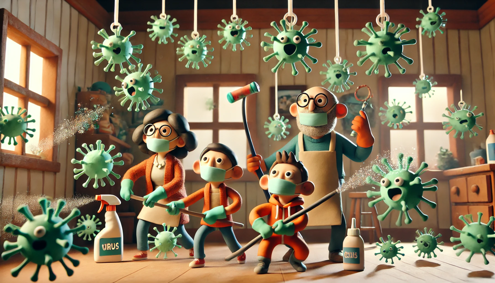

# 【随笔】想必还是新冠

在这次大鱼生病后没多久，大宝忽然就不舒服了。然后，紧跟着是我。甚至连一向不会被影响的阿宝，这次也跟着出现了咳嗽症状。

昨天，或者说前天夜里，应该是到了我身体最不舒服的顶点。晚上一再因为呼吸困难醒过来，喉咙痛且不说，浑身上下都是痛的，而且经常性会觉得心脏部位不舒服。这不就是「水泥鼻」、「刀片嗓」的简配版本吗？

正巧昨天因为体检，去医院查了血。一看血相，和大鱼上次简直一模一样，典型细菌、病毒的合并感染症状。只不过这一次，除了大鱼，我们都没发烧。

回想一下，自从新冠疫情之后，就经常出现一家人相继被传染「感冒」的情况，而且都是全家中招，一个不落下。以前似乎频率没这么高。也不知道是病毒变厉害了，还是免疫系统变弱了。

现在也少有人争论新冠是否源自美国制造的生化武器了，不管是俄罗斯披露的那些在乌克兰发现的证据材料，还是英国在新冠基因中发现莫德纳公司在2016年2月申请的专利基因片段。渐渐地，都不再有人关注和讨论。

但是，这场灾难，真的对人类影响挺大的，甚至直到现在都还有，想想就很是无语。

网上有很多讨论所谓「长新冠」症状，最据共性的，可能就是心跳变化的问题了。许多人是单纯的静息心率变快，而我自己却是平时静息心率降到了60以下，但稍微一动心率就迅猛增加。

在昨天的生病状态下，则变成了静息心率70多接近80，但正常走动时，心率一直在90多以上。

我虽然只打过灭活的新冠疫苗，并没有打mRNA版本的。不过自己显然在刚放开的那个风口，亲身感染过。

看到有些研究说，这个病毒与某些RNA感冒病毒一样，本身就具备RNA反转录能力，套用JT 叔叔的玄学说法，这也是一个会导致「厥阴病」的起因了。

……

话说回来，可能因为自己正在生病的当口，对身体和病症太敏感，想太多了。想起懒兔子在公众号写了几个故事，关于被癌症吓死的那些案例。

我还是不要太自己吓自己才好。

但不管怎么说：

身体健康一定要当作重要的头等大事来对待，与之相应的：

就是说睡觉和运动的优先级，一定要提升、提升、再提升，怎么强调都不为过！

