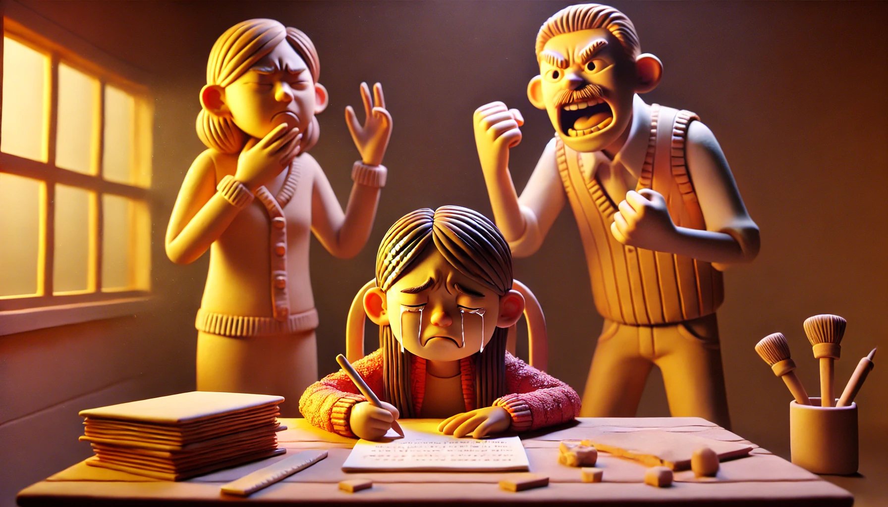

# 【随笔】辅导作业之双杀

晚上，阿宝依旧要求妈妈辅导作业，她说：

> 如果爸爸的话，我就会做得很慢！

听起来像是威胁，我按耐住心中的不悦，转头带着大鱼，哄骗着他跟着我出门去买药，又一起研究怎么修卫生间的水龙头。

水龙头修好时已经到了晚上九点多，我打开阿宝的房门放那些工具，大宝冲我哀叹到：

> 为啥要给孩子辅导作业啊？
>
> 作业不是她自己的事吗？

而阿宝则在一旁眼泪婆娑，哭哭啼啼……

我赶紧抱住大宝：

> 好了好了，要不然换我来吧？
>
> 我把没收拾完的厨房换给你？

大宝还在犹豫，忍不住还要对阿宝发点火什么的，我说：

> 你只是情绪不好了，情绪不好了我们俩就换班。

她同意了，一会儿转身又回来，手里拿着一块刚刚烤好的面包来递给阿宝：

> 要不吃个香香的面包，调整一下情绪吧？

说话间，她又忍不住叨叨阿宝惹发她怒气的事情：

> 我要被气出心脏病了……

我推着她转过身：

> 现在，你的任务是带着阿宝，哄好她，让她调整好情绪。
>
> 然后我来辅导她作业……

于是，阿宝跟着大宝跑出自己房间，不一会儿就开心地和猫咪玩起来。大宝跑回来找我：

> 我还不舒服，需要安慰！

然后我就说：

> 第一，通常来说，小学一二年级的成绩，和他们长大了的学习成绩没什么相关性。
>
> 第二，我现在发现，在高速进化的AI面前，人类传统的那些智能，也就是我们学习的那些东西，不管是语文、英语，还是数学、物理，在AI 面前都被秒成渣渣。其实我现在很困惑，现在这些学习对孩子们有什么用处。所以，可能还是得回到梁启超说的那最根本的两条吧。

我停了停，接着说：

> 也就是强健的身体和精神。这方面，你最擅长了！

大宝想了想，高速我说：

> 好吧。
>
> 可能是因为我小时候最讨厌写作业，最讨厌写作文，所以我才容易被惹怒。
>
> 既然像你说的这样，接下来，你赶紧帮她把作业弄完，早点睡觉是正事。

接着，她把阿宝叫进房间，告诉她我们的决定，然后说：

> 妈妈从小时候起就不擅长作文，但并不意味着这件事情不重要。
>
> 爸爸喜欢写东西，写作文的事情你就请他帮忙好了！

于是乎，房间里留下了我和阿宝。阿宝还在继续兴奋地用她的衍纸条为我制作手环，我则趁机研究里一下她的作文作业。如大宝所说，她已经在作业本上写了一行字，关于和好朋友生气的一行。接下来，应该写她的好朋友怎么帮助她，一起找东西什么的吧。

阿宝终于把她的手环制作完毕，拿起来笔，然后转过头，用一问三不知的眼神看着我。我问她：

> 后来发生什么事情了，你的好朋友帮助你做什么了？

她摇头表示不知道，我又问了两句，她依旧表示不知道。我腾的就有些怒了，赶紧站起身跑到厨房：

> 才三秒钟就被气到心脏疼！
>
> 对了，刚刚你告诉她写什么的来着，那些事她怎么说都没做过呢？

大宝笑了：

> 就是一起捡东西什么的呀？没发生过随便写写不就好了吗？

我一听，明白了，转身回到阿宝的房间。说：

> 来来来，把这行擦掉。我们重新想，有哪些你朋友帮助你的事情。

我一边擦，一边耐心地启发阿宝：

> 生气那次，你好朋友后来和你一起做了什么事情啊？

我想起来大宝刚刚告诉我说的，阿宝其实连什么是「帮助」都不太明白。我又继续启发她：

> 要不和我讲讲，最近一次你好朋友和你玩了什么呀？

于是，阿宝和我讲了她好朋友和她一起在小区草丛入口处用树枝、枯草、鲜花搭门的事情。我告诉她，搭门的这个过程，就可以当作好朋友帮助她的事情。她觉得很困惑，我耐心地说：

> 如果没有她出力，你能搭得一样快，一样好吗？
>
> 如果没有你出力，她能搭得一样快，一样好吗？
>
> 这算是互相帮助，也叫合作。

然后，我让她继续讲了一遍事情的经过，把重要的、值得写的要素记录在纸上。看着记录的这些完整故事，以及阿宝自己想起的各种细节和句子，我忍不住心想：

> 我真耐心，真厉害，辅导得真棒。

阿宝写完了第一句话，转头问我：

> 然后呢？

然后？我刚才和你絮絮叨叨和你说的那么多，不都是「然后」吗？我明显火气再次被激发出来。阿宝一面转头看着我，手里一面玩着各种东西，一副一边自己玩，一边等着我喂饭的架势。

我一边强压住怒火，让她再想想，想不起来可以看看我记录在纸上的要点。一边把她手里正在玩着的环形针，纸条一一夺过来，放到另外一边。她则继续翻着白眼，一问一个「不知道」。

一边和我说这话，一边还把自己的袜子脱下来，套在床头的柱子上。我顺手一把扯下袜子，扔在地上。

阿宝「哇」地一声大哭起来！

我愤怒地起身：

> 哭就不要写了！
>
> 先去洗脸刷牙，不哭了再回来弄！

阿宝则继续哭哭啼啼，过了一会儿，大宝听见了，跑进房间来问我发生了什么事情。弄明白后，

大宝说：

>  好了，你可以去洗脸刷牙了，现在作业是你爸爸妈妈的事情了 。

阿宝不放心地回头看看，发现妈妈真的拿起来铅笔，这才出了房门。我只好把刚刚阿宝讲的故事重新整理了一下，我来说，大宝来写，完成了阿宝的作文作业。

……

事情结束，我忍不住对大宝吐槽道：

> 你看，我和你讲怎么辅导作业的时候，说得头头是道。
>
> 等到我上手没多久，就也被点爆了！
>
> 真是经典的「双杀局」，阿宝凭一己之力，成功击杀「妈妈」和「爸爸」。我们俩的心脏都要被气爆了！

……

不过，此时再回顾起来，这整个过程，好像完全是阿宝利用（也许是无意识）她的哭泣，最终成功地控制着我们替她完成了作业。反正她最在乎的，只是老师的评价和批评。

那么，到底应该怎么办呢？真有点不知所措了！这才二年级呢！！！

