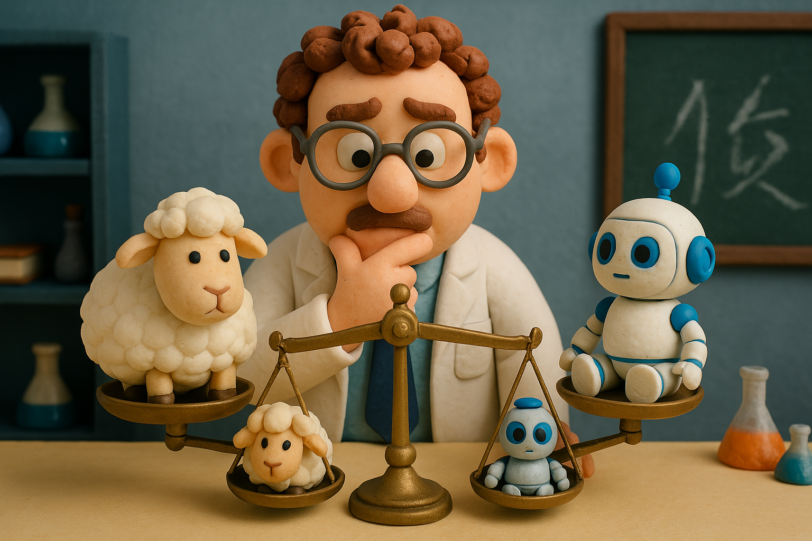

# 【随笔】碳基生命还有什么机会（续）

昨天写了一千字，也只把关于这个问题的思考表达了一个开头。

准确来说，那一千字只是在说问题：

> 全面超越人类的通用人工智能 AGI 已经来了。
>
> 在它的能力全面超越普通18岁的成年人类之前，我们还有两年，最多不过十几年时间。
>
> 那么此时此刻，我们这些「碳基生命」还能做些什么，还有什么机会？

我曾经的观点是：打不过就投降，积极地拥抱 AI 是新人类的唯一出路。

更激进一点，我甚至认为，依靠着AI 的能力的武装，我们可以做越来越多的事情，这些都是我们在这个巨大变革时代机会。

推导到孩子们的教育上，我会觉得：

现在学校教的东西，尤其是知识方面，可能99%都是没有意义的。甚至连「学习」能力本身，在 AI 面前，无论怎么提升，都只有被碾压的份。不如早点教孩子学会用 AI 赚钱，然后爱干嘛就干嘛。

昨天看《资治通鉴》，提到邓禹，说：

> **邓禹内行淳备**（品行敦厚）**，有子十三人，各使守一艺，修整闺门，教养子孙**

各守一艺，是中国传统的教育策略，让孩子掌握一门能吃饭的手艺，首先能养活自己是最最重要的基本面。但现在的问题是，过去农耕时代，一艺可以传千年。如今 AGI 来了，有哪些艺可守呢？

问题来了，学会用 AI  赚钱，能算是「一艺」吗？ 

可惜的是，AI 本身成长太快了！这个月的 AI 相比上个月的 AI 完全是两回事，下个月更不知道它会变成什么样子。

就好像，假设 AI 正在学习骑自行车，目前想要 AI 骑车，我们需要在一旁扶着它。可是，能把怎么扶 AI 当作一门可持续赚钱的手艺吗？

如果 AI 继续成长，现在这些「赚钱的机会」是不是也很快就消失，相关「技能」是不是也很快就没有意义了呢？

我认为，是的！

所以，我现在的观点有所变化。

只依靠 AI 是靠不住的。还得回归到「碳基生命」的根本上来。

什么是碳基生命的根本呢？什么是人类的根本呢？从这根本上出发，我们又能做些什么呢？

