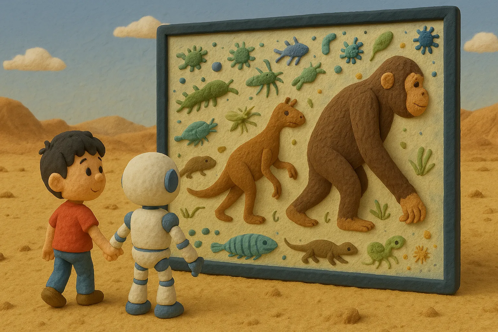

# 【随笔】碳基生命还有什么机会（续二）

回到碳基生命，或者说我们人类的根本上来看，最最有特色的东西——那就是我们这具在地球上经历亿万年进化而来的**身体**。

从三十多亿年前的细菌、二十多亿年前的蓝菌、十多亿年前的藻类，再到五亿年前的三叶虫、四亿多年前的甲胄鱼、昆虫、爬行动物、哺乳动物，直到一千五百万年前的长臂猿、五百万年前的人猿……

所有这些曾经存在过的碳基生命体，都在我们的身体里留下了痕迹。

这是独一无二的。

将外界的物质与能量转换成我们身体的零件以及支撑其运转的能量，靠它；

将外界的信息转换成我们的知识与智慧，还是靠它；

把这两者结合起来，改造我们身处的环境，让我们活得更好，还是靠它！

我想，这最重要的机会之一，就蕴藏在我们这独一无二、奇妙神奇的身体之中。回归人类的身体，探寻人类身体本身的「潜力」，显然是只有人类才能胜任的事情。

其次，人类与其他碳基生命最大的不同点，目前看起来就是基于「语言」能力进化出来的，思考能力、逻辑能力，以及基于此，构建出来的整套知识传承体系。

这正是目前 AGI 脱胎于大语言模型的由来，也是碳基生命与硅基生命（如果 AGI 变成了硅基生命的话）沟通与连接的基石。

所以，这最重要的机会之二，就是利用好这个连接点的关键位置，做一个好的桥梁。能做什么呢？好好地陪着 AGI 成长，这是目前活着的人类只有一次的，独一无二的机会。

至于未来的人类与未来的 AI 该怎么办，不知道，生命毕竟奇妙！

