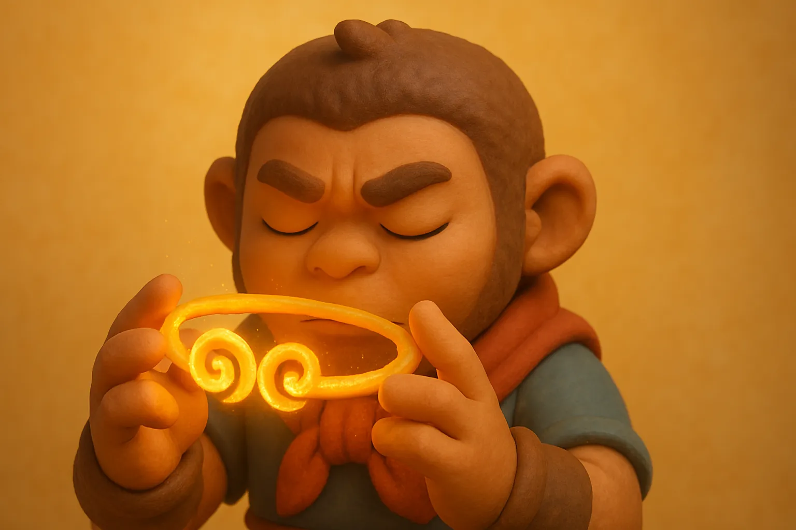

# 【生命⋅修行】限制即自由

在思考「碳基生命还有什么机会」[^1][^2][^3]这个问题时，我联想到发生在自己身上的另一件事。

那是在我去新公司准备上班的第一天，和大宝送完大鱼从幼儿园门口离开，我骑上电动自行车的时候，轻轻叹了几口气。大宝问我：

> 去工作不是很开心的事情吗？

我说：

> 确实开心。
>
> 但与此同时，我却感觉也带上了枷锁，进入了牢笼。

大宝说：

> 你不是应该完全接受这份工作带给你的一切吗？你想要的稳定收入，你想要的离家近，都有了！

我默不作声，然而之后的几天，这个念头一直潜藏在脑海深处。

碳基生命的「身体」与「我在公司上班」，这两者不都是限制吗？

我猛然醒悟，不仅仅像Pieter Levels 说的那样，一定程度上的限制是必要的[^4]。

限制其实就是自由本身！

正好像我需要完全接受这份工作带给我的一切，才能获得拥有这份工作的自由一样。人类只有完全接受自己的身体限制，才能获得相对 AI 没有这个 「肉身」所拥有的自由。

更进一步，当我们对这「枷锁」无知无觉时，会时时刻刻被羁绊，跌跌撞撞，毫无自由可言。然而，当我们觉察到它的存在，对它的一切都了然于心时。我们既可以在让它成为自己的一部分，戴着它起舞。也可以在需要时放下它，穿上另外的「衣服」。

是的，「枷锁」也好，「衣服」也好，「铠甲」也好。本质上有什么区别呢？没有任何区别！

这一刻，我忽然明白了西游记里，孙悟空戴上的「紧箍儿」是什么，以及为什么孙悟空成佛后，那「紧箍儿」就消失不见了。

限制即自由。

而限制与自由，它们本无一物，俱为空相。

----

[^1]:[碳基生命还有什么机会](20250327【随笔】碳基生命还有什么机会.md)
[^2]:[碳基生命还有什么机会（续）](20250328【随笔】碳基生命还有什么机会（续）.md)
[^3]:[碳基生命还有什么机会（续二）](20250329【随笔】碳基生命还有什么机会（续二）.md)
[^4]:[Pieter Levels: Programming, Viral AI Startups, and Digital Nomad Life | Lex Fridman Podcast #440](https://www.youtube.com/hashtag/440)
