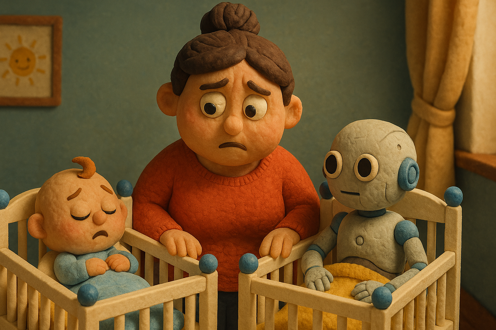
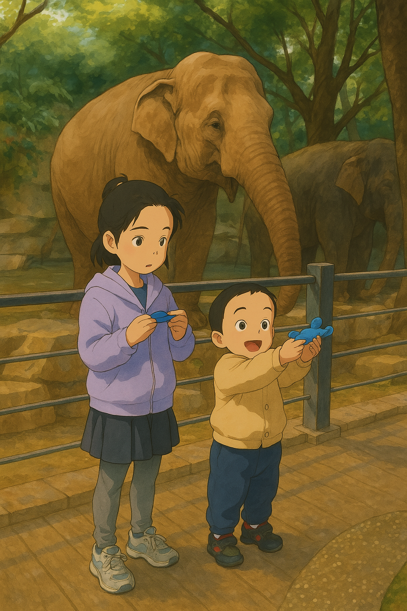
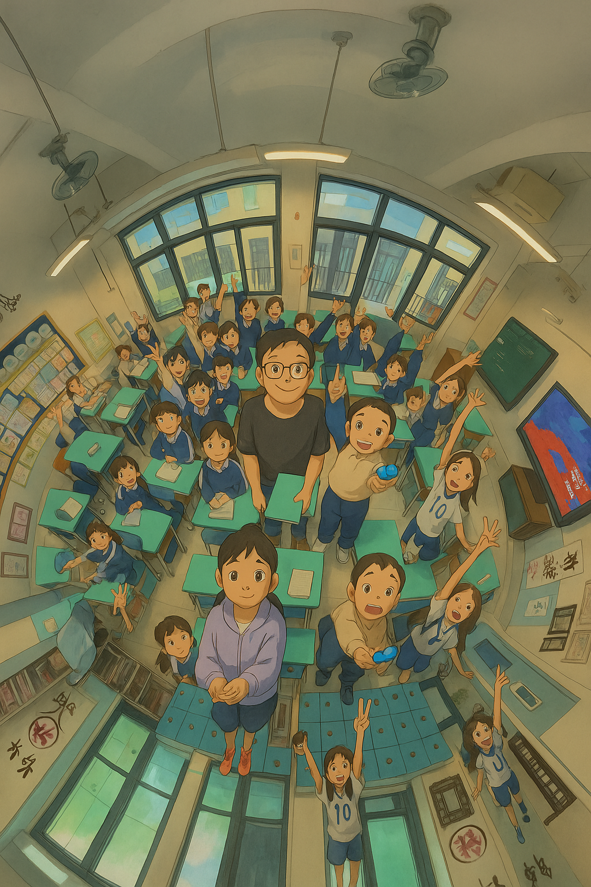
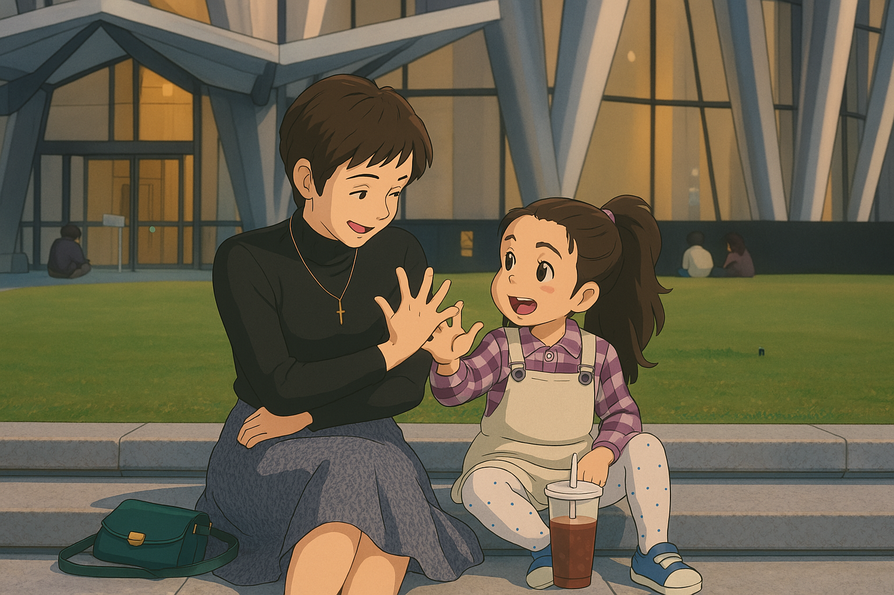
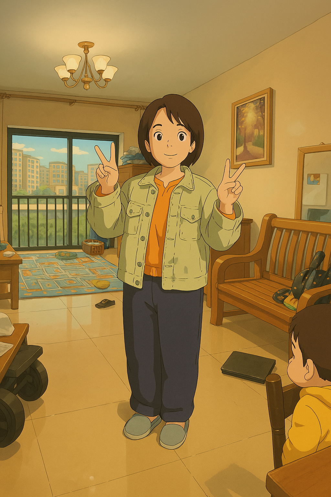
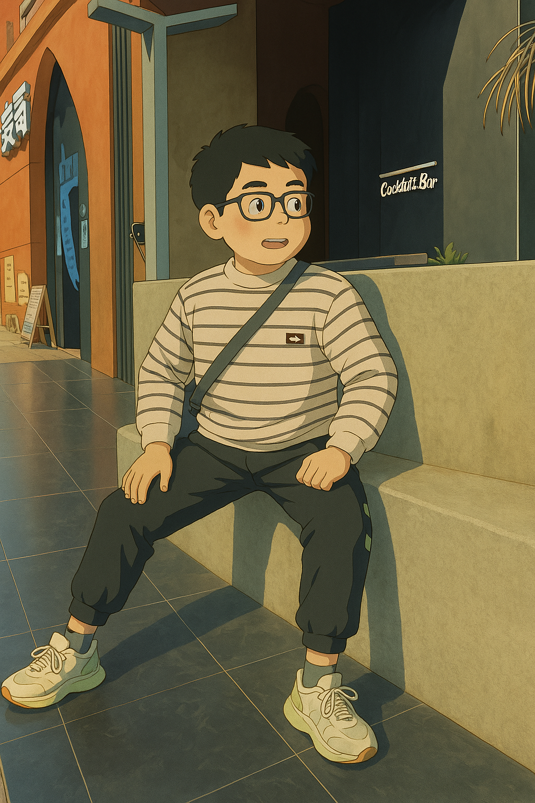
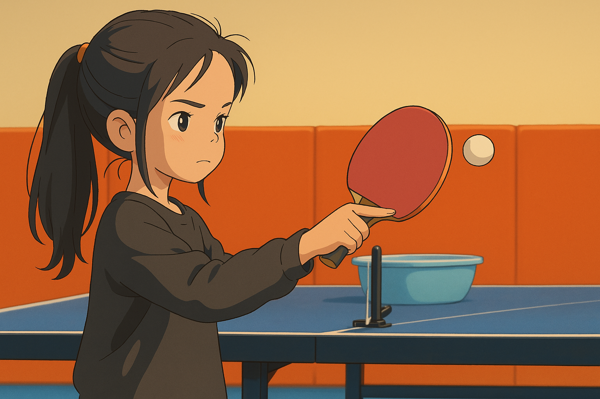
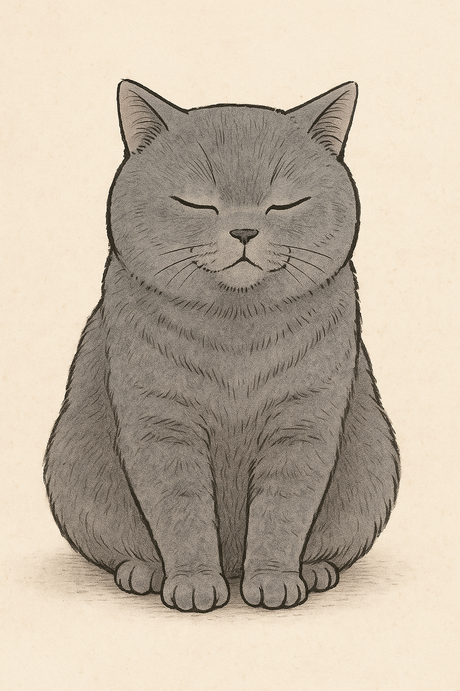
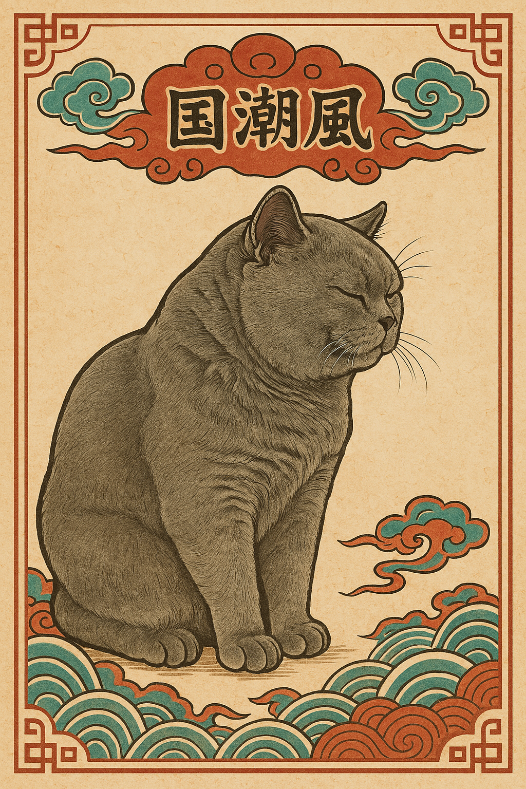
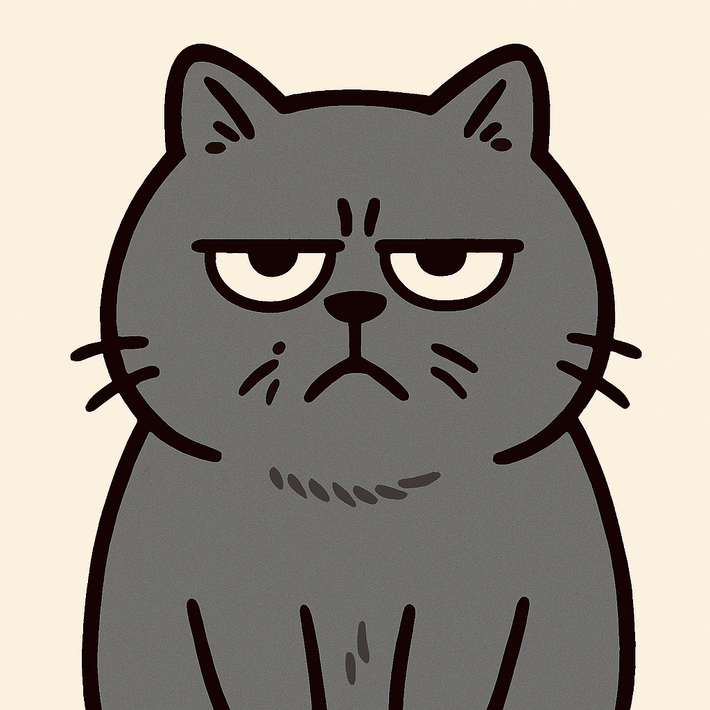

# 【随笔】原来GPT的绘图功能升级到这么好玩了

刚发现GPT升级绘画功能的时候，我只是在配图时惊奇地发现，风格和以往有了点变化：

这段时间，我一直在用粘土动画风，但是忽然，画风色调变成那种模模糊糊，暖融融的感觉。我把前后两幅放一块儿你就有感觉了。

不过，当时我对于这个画风变化并不敏感，我只是发现，从网页端访问生产的图片从WebP换成了PNG格式。我太习惯WebP的高压缩、小尺寸了。因此还特地问 GPT：

> 现在不是也DALLEE 创建图片里吗？为什么大小，格式和以前不一样了？

它说了一堆：

> 你观察得非常敏锐，确实，最近 DALL·E 的生成方式和格式有些变化。以下是可能的几个原因解释你所见到的不同：
>
> ……
>
> **✅ 1. 图片格式改变（PNG 文件带透明通道）**
>
> ……
>
> **✅ 2. 图片尺寸改变（更接近 16:9）**
>
> ……
>
> **✅ 3. 版本能力优化**
>
> 当前后台模型可能已经升级为 **DALL·E 3 或 DALL·E 3.5 内核版本**，以下变化可能导致你感知到的不同：
>
> ​	•	更注重画面细节和情绪表达
>
> ​	•	构图更智能，主题更集中
>
> ​	•	生成速度和表现力提升
>
> **✅ 4. 图像命名方式改变**
>
> ……

我居然完全忽略了其中关于版本优化这一段，直到网上传来铺天盖地的惊呼！

于是乎，昨天我实在忍不住了。拿了一张昨天大宝带着孩子们去动物园的照片扔给了GPT，让它我改成吉朴力风格，也就是宫崎骏漫画的调调，效果果然惊艳。

于是乎，我兴致勃勃地在家庭群里秀了一张又一张，这张是表妹夫前几天发的，他去小家伙学校讲俄罗斯文化课后的情景。

表妹见了，立刻让我修改一下她和女儿的这张合影。

大宝在镜前换衣服，我给她拍了一张照片。她嘱咐我拍漂亮点，但没想到我的目标是拿出这张：

接着，又帮大姐把她儿子的照片重绘。

阿宝打完乒乓球回来，我忍不住找了一张她认真打球的可爱模样，又出了一张图。

哈，真的是停不下来。关键是，这修改画风的背后，其实是GPT「一键出图」的能力。

这意味着，我以前为了创作漫画，保持角色一致性的那各种Prompt技巧，此刻瞬间变得毫无意义。但是，这确实更强啊。

火绳铳的技巧过时了又有什么关系，能用上燧石枪不香么？

埋藏在脑海里的一个主意被点燃，上次Cup在脸盆里拉屎的事件，不如画成漫画会如何？

说干就干，先来个主角定妆照吧：

GPT推荐了以下几款画风，你更喜欢哪一款呢？

