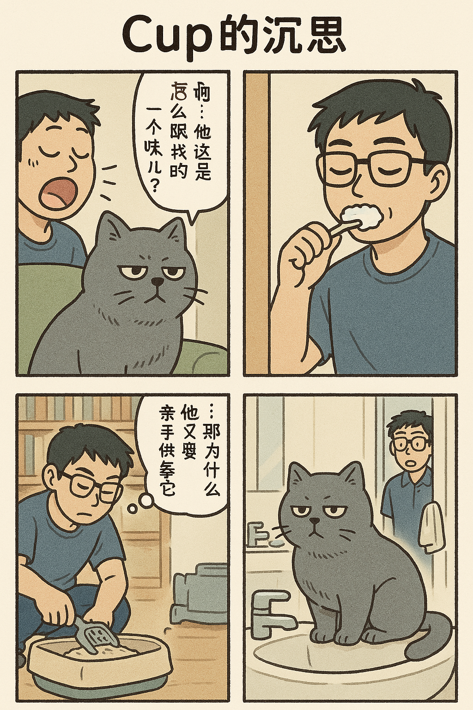
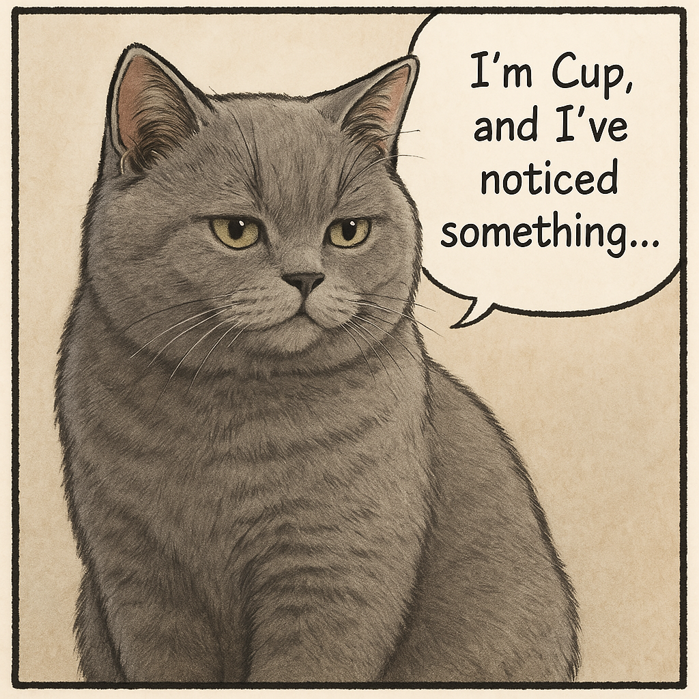
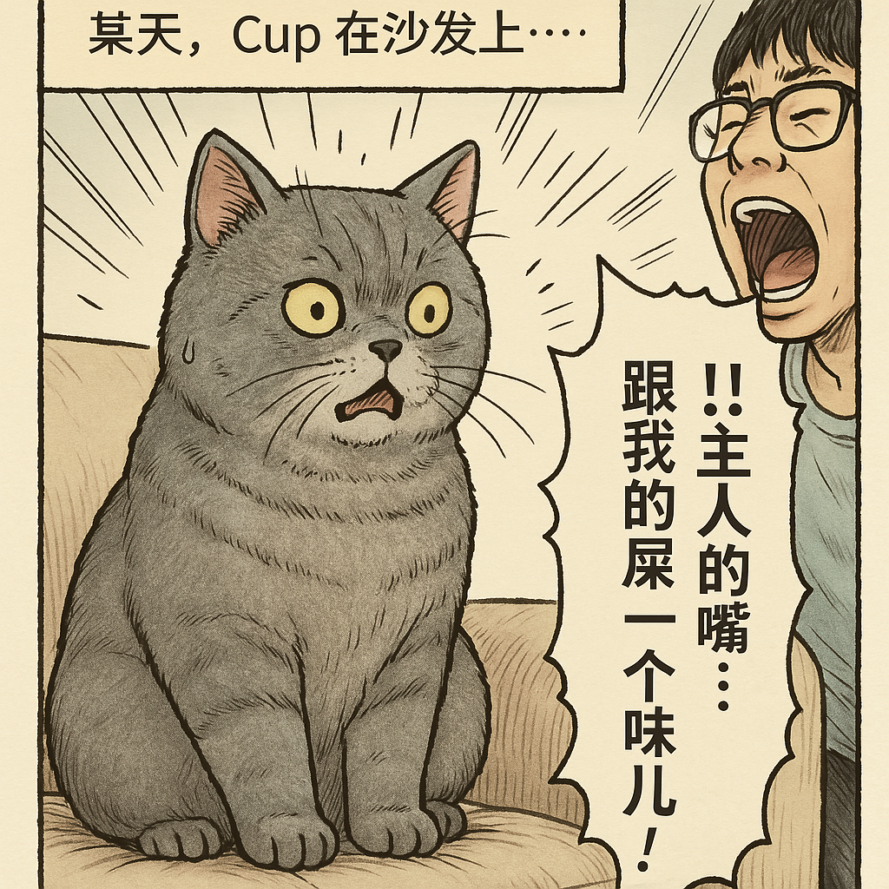
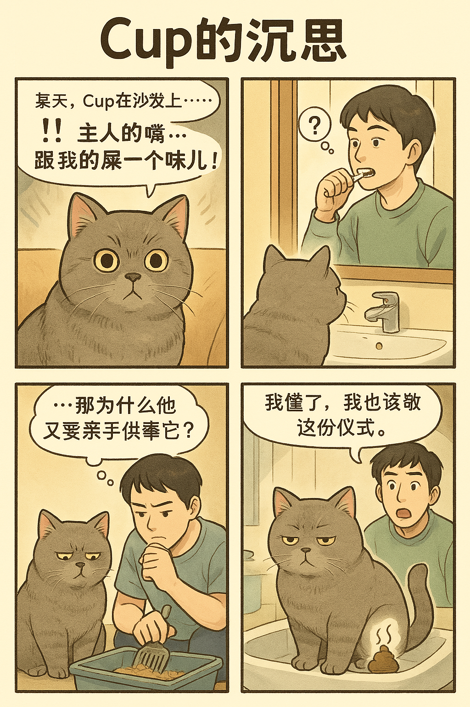
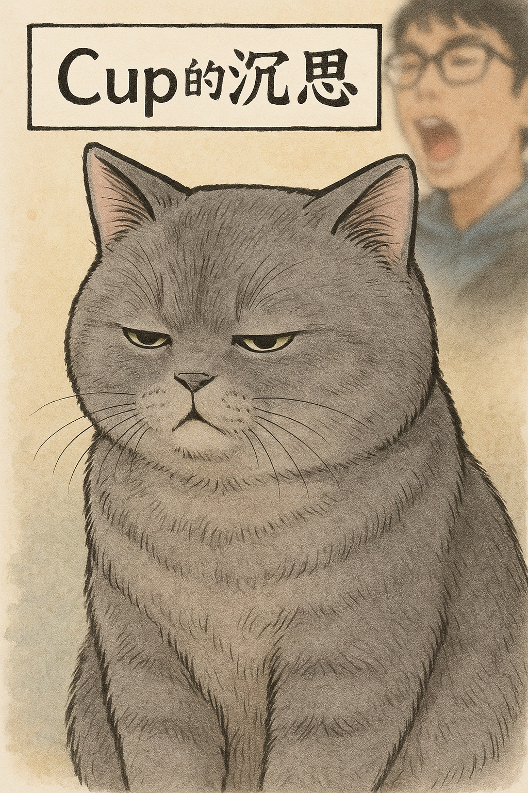
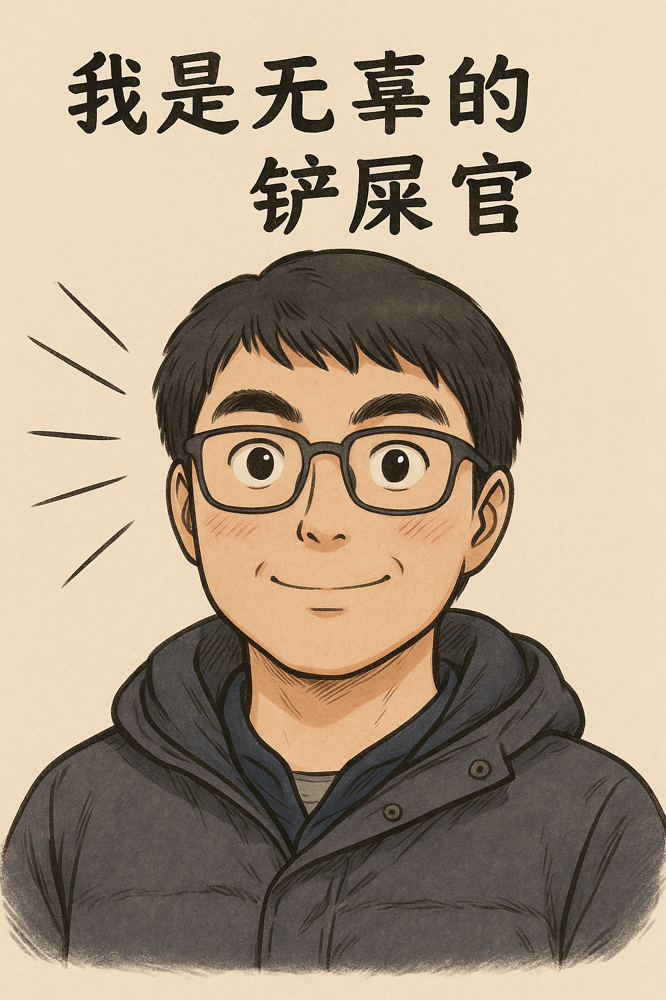

# 【随笔】Cup的沉思

用GPT画画，有时候真像找人类接单画画的过程。经过1、2、3、4……n次改版后，还是要无奈用回第一版。

你看，这是我给GPT讲完故事情节后的第一版。不过，显然偏离了之前它建议的日式写实 + 轻漫画感的质感。我不甘心地重新提示了一下：

> 用日式写实+轻漫画感重画第一格，像你之前说的那样：“保留猫的特征（胖胖圆圆，毛绒感十足），又能加点漫画感，让它显得有性格又温柔、适合做主角。”

于是，它把超写实的又来了一张。但是，文字变成了英文。

我提出了质疑：

> 很好，用中文文字，打哈欠臭它的主人是不是要加上在旁边或者放在背景里？

它反应也很快，

> 你这个细节补得非常好——是的，**主人的形象必须加入**，否则Cup的“震惊”就没有了明确来源，笑点的逻辑链会断掉。

甚至给出了一堆设计意见：

------

## ✅ 第一格调整建议（视觉＋对白）：

### 🖼 **画面设计建议**：

- **前景**：Cup坐在沙发扶手上，身体微微后仰，眼睛睁大，尾巴僵直，表情是“混合震惊＋嫌弃”。
- **背景**：主人正打哈欠，嘴巴大张，脸靠得有点近（可能刚下班想亲一下猫那种感觉），表情自然懵懵的。
- **画面构图**：Cup居中靠前，主人略模糊或边缘化处理，用“放射线”或拟声词突出哈欠气流。

### 💬 **对白 / 心声**（用气泡写中文）：

- **旁白**（左上角小字）：
   「某天，Cup在沙发上……」
- **Cup心声**（大字气泡）： 「！！主人的嘴……跟我的屎一个味儿！」

------

这种画面在**日式写实+轻漫画感**的风格下效果会非常妙，有一种“静中带动”的幽默冲击力。

我可以根据这个设计立刻重画第一格，加入主人打哈欠的画面，要不要现在就做？

我让它赶紧找这样来了一张：

除了这个主人丑了点，其它没毛病。我赶紧让它接着画，却没想到触发了图片生成速率限制。我震惊了，自己不是氪金用户吗？

> 我不是Plus用户吗？什么时候会触发限制？

GPT 给我耐心解释了限制速率的原因，其实不说我也知道，这个功能加强之后，玩的人大增呗！据说速率限制是每5分钟3张图左右，而技能冷冻期也是5分钟。

但实际上，等了十多分钟，我再次让它绘图时，却又变成了这样的风格：

你觉得，这最后一版和第一版，哪一个更好呢？

ANY Why，今天一边记录这篇文章，一边给Cup和我分别画成功了一幅定妆照！

