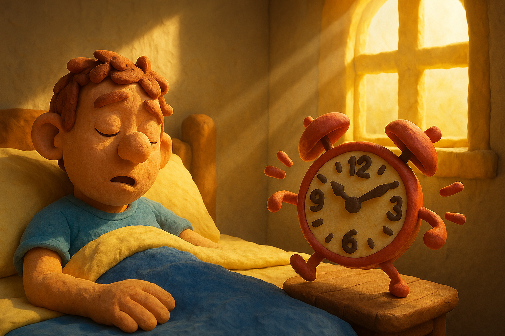

# 【生命⋅修行】一心一境的难

那天早上和大宝一起到公园的时候，我看了一眼时间，8点37分。我说：

> 今天只能随便活动一下了，早上有个会议，我想早点去公司。
>
> 嗯，8点45就得走吧……

这么说着，我开始练金刚功，心却明显慌慌的。我知道平时随便不太计数，练完金刚功大约要十多二十分钟。每个动作如果只练三遍的话，五分钟左右就可以结束。

但是，这么想着，整个人都是慌的，完全不能享受到筋骨寸寸拉开的舒爽感觉。

练完金刚功，我再次看了看时间，8点48分。我想，不管怎样，完全投入当下，做一个「易筋桩」的拉伸好了，只做一个。可是，大宝开始在我耳边念叨：

> 你应该走了！

我只好放弃，拿起包，有点气鼓鼓地出发了。虽然，明明知道，她的催促，其实也正是自己内心的催促而已。

……

我发现，只要心里想着下一件事情，或者上一件事情，当下这件事情就一定做不好。锻炼如此，陪孩子的时候也是如此。想着赶紧陪会儿孩子，一会儿还要干嘛干嘛，大概率就会爆发一场「情绪冲突」。内心的焦灼，通常会被孩子敏锐地捕捉到，然后用她 / 他的方式把它呈现出来。

然而，想要把下一件事情放下，对我而言，还真不容易做到。

岂止一件事，由于自己搜集信息的偏好与特点，我会把很多事情的苗头抓取过来；而由于自己习惯多思考的特点，这些事情通常不仔细思考、精心准备就无法开始。

于是乎，即便我试着用各种技巧——GTD、TimeBoxing等等，还是常常出现这件事情还没做完，已经开始想着下一件事的情况。

更有甚者，连这些工具本身，也成为我焦灼的「下一件事」。比如，用TimeBoxing 的方法时，要记录一下用时，但有时就会想着：

> 这件事我干了多久了？
>
> 刚刚那件事儿我干了多久，是不是忘记计时间了？
>
> 等等……

想用「工具」解放、帮助自己，却凭空多添了一层束缚。

……

将作息表尽可能固定下来，或许算是解决之道的方向吧。虽然，这个方向，也同样带我我的特点，那种「理想化」的特点。

真正「固定」又「简单」的作息表，我只在十日内观禅修时经历过。而后来有一次自己一个人「闭关」时，缺少外力的帮助，就很难固定下来。

难怪有科学研究说，现代人，在监狱里待几年，许多现代病都会得到好转。想必主要就是这方面的原因吧。

……

不管怎么说，这是目前看到的一个锚点。就以日常上班这个场景，把自己的作息时间表和那些最重要的事情固定下来吧！

早起写作，是锚点中的锚点。

今天又完成了，非常好！

