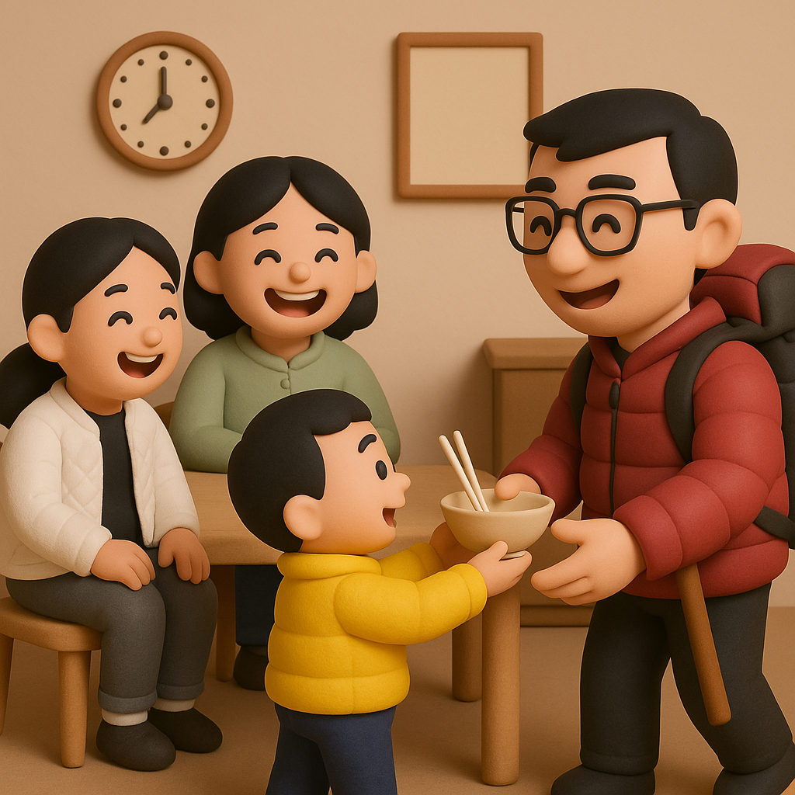

# 【生命⋅修行】看见

大鱼的幼儿园开家长会，主题是《看见》。

我好奇地在他们班级门口拍了几张照片后，进教室，找到写着大鱼名字的小板凳坐下。

板凳很小，大人挤卡卡地坐在这小孩子的板凳上，身前身后都是其它家长，颇有的拥挤。

好在旁边就是孩子们的桌子，我拿起矿泉水来喝了一口。和上次一样，矿泉水瓶被老师精心装饰过，还挂上了大鱼的照片。

主班老师开始播放一段视频，我一面心不在焉地看着，一面翻看自己的背包，拿出本子和笔来。心想着要不要趁着开家长会的功夫，抄个心经算了。

视频放完。老师说：

> 桌上有纸和笔，请家长们花几分钟时间，写下你们看见了什么。

我猛然惊醒，看见了什么？我简直什么都没有看见啊？我使劲儿回忆自己瞥向屏幕的那几个瞬间。

嗯，有几次可爱的大鱼出镜，一下抓住了我的眼球。

可是，其它时候呢？我都不敢保证看见了每一次大鱼出镜的镜头，我看见了什么呢？几分钟的片子，我看见的不过几秒钟而已。

大鱼上幼儿园快一年了，大宝总在和我念叨，他成长的好快，可我看见了吗？

……

早上，我喊阿宝起床。

我轻轻地亲了亲她的脸，然后有使劲抱了抱她。满心期待着，收获和前一天一样的撒娇和微笑。

她醒了，叫我待在房间里不要走。

我拉开窗帘，房间里立刻传来她的尖叫声，让我把窗帘关上。

我纳闷，要起床了，当然要把窗帘打开，这样才亮啊。

无法忍受她的尖叫，我走出她的房间，开始干别的事情。阿宝在尖叫哭泣着，我一面觉得烦躁，一面觉得不明就里。

大宝在厨房问我：

> 你为什么要把阿宝惹哭呢？

我有点小委屈地告诉她事情的经过。

大宝说：

> 难道不能要求你关上窗帘吗？她要是觉得冷呢？

对啊，原来她是怕冷啊？我怎么没想到呢？

……

事后，我向大宝感概：

> 同样的情景，你能看见阿宝的感受和需求。
>
> 我却完全没有看见！

大宝说：

> 不只是阿宝，大鱼也一样。
>
> 你经常性看不见他们。
>
> 只不过，阿宝不被理解，没被看见就会伤心、生气；大哭、大叫。
>
> 大鱼要皮实一些，他会一直说，一直叫，用各种方法让你看见为止！

……

晚上下班回到家，我推开门，开心地说：

> 我回来了。

大宝笑着告诉我，烧了美味的糖醋排骨，不过，我回来晚了。糖醋排骨只剩下醋了。

我正说着没关系，却惊喜地看见大鱼跑进出发，拿出一个小碟子来。上面还有一大块排骨。

我问大宝：

> 这是我的吗？

大宝点点头，说：

> 本来给你留了两块。
>
> 孩子们吃完盘子里的之后意犹未尽，阿宝把自己的一块大骨头和你交换了一块漂亮的肋排。
>
> 大鱼悄悄吃掉了另一块小的漂亮肋排。

说话间，大鱼又往厨房跑了两趟，拿出了他的小碗，和一双筷子。我问大鱼：

> 这是你给爸爸拿的碗、筷吗？

他使劲地点点头！

我和大宝都乐坏了。大宝使劲笑着说：

> 看见没？你儿子给你拿碗筷呢！

……

原来，只要稍加用心，就能看见那么多温暖和美好的瞬间！

#### **《看见》**

—— 海灵格

当你只注意一个人的行为，

你没有看见他；

当你关注一个人行为背后的意图，你开始看见他；

当你关系一个人意图背后的需要和感受，你看见他了。

透过你的心看见另一颗心，

这是一个生命看见另一个生命，

也是生命与生命相遇了，

爱就发生了，

爱会开始在心之间流动，喜悦而动人。

这就是吸引的幸福！

当你只关注自己的行为时，

你没有看见自己；

当你关注自己行为背后的意图时，

你就开始看见自己了；

当你关心自己意图背后的需要和感受时，

你才真的看见了自己。

透过内心看见了自己的心灵真相，

这就是你的生命和心相遇了，

爱自己就发生，

并开始在自己身上流动，

你整个人就和谐而平静。

这就是真爱的发生！

……

看见他人，看见自己，惟有用心。

与你共勉！