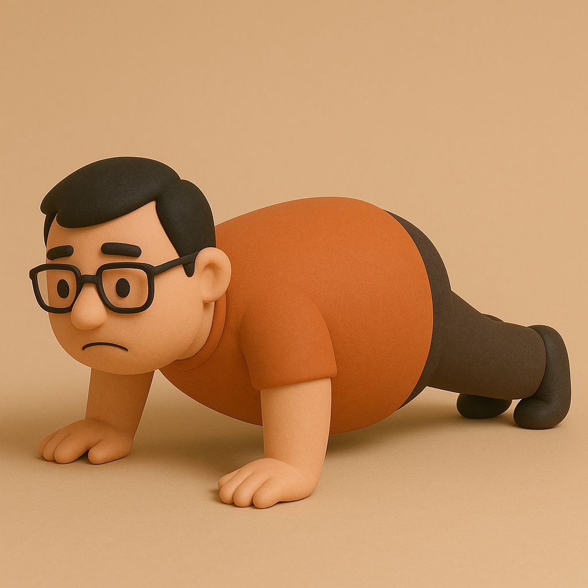

# 【随笔】躺平躺不平

连续几天，应该说是一个多星期吧——早起写每天的文章。

到了今天，终于无法坚持了！

原因想必是累了，但触发点是到了昨天晚上。大约8、9点时累得不成样子，却还给自己安排了两件事：

* 剁肉馅
* 抄心经

我执念于破壁机打碎的肉不如我用两把菜刀剁的好吃，却没曾想昨晚大宝准备了四斤肉，而不是一两斤。

累得几乎要瘫倒时，另一个执念又放不下。

上周六承诺要连抄7天心经并且打卡来着，从周日算起，这才第5天，可不能中断了。

于是乎，咬着牙、慌里慌张、竟然只用了20来分钟完成了之前通常需要40分钟完成的心经抄写。

等到睡觉，可能已经是11点过了。

于是乎今天早上虽然听见了闹钟响，还是赖床了……

……

等到起床，已经7点过、8点，孩子们都醒了，我也只好开始接下来的活动：

给孩子们玩玩具的地垫吸尘，然后全家出门，吃早茶，再去仙湖植物园。

……

等到晚上回家，已经是9点过了。把孩子们哄睡觉后，我再次开始犹豫：

心经还没抄？唉，答应了自己的，还是抄吧！

对了，清明节到了，刚才回家的路上看见有人烧纸钱。不如我就把抄写的心经烧了，回向给所有家人的累世冤亲债主，家宅附近的一切人天鬼神好了。

愿他们不管在哪里，都平安喜乐，福慧增长，闻善法，走善道，终成正果！

……

这么一通折腾下来，嘿嘿，都快12点了！

想躺平，又没躺平的一天！

