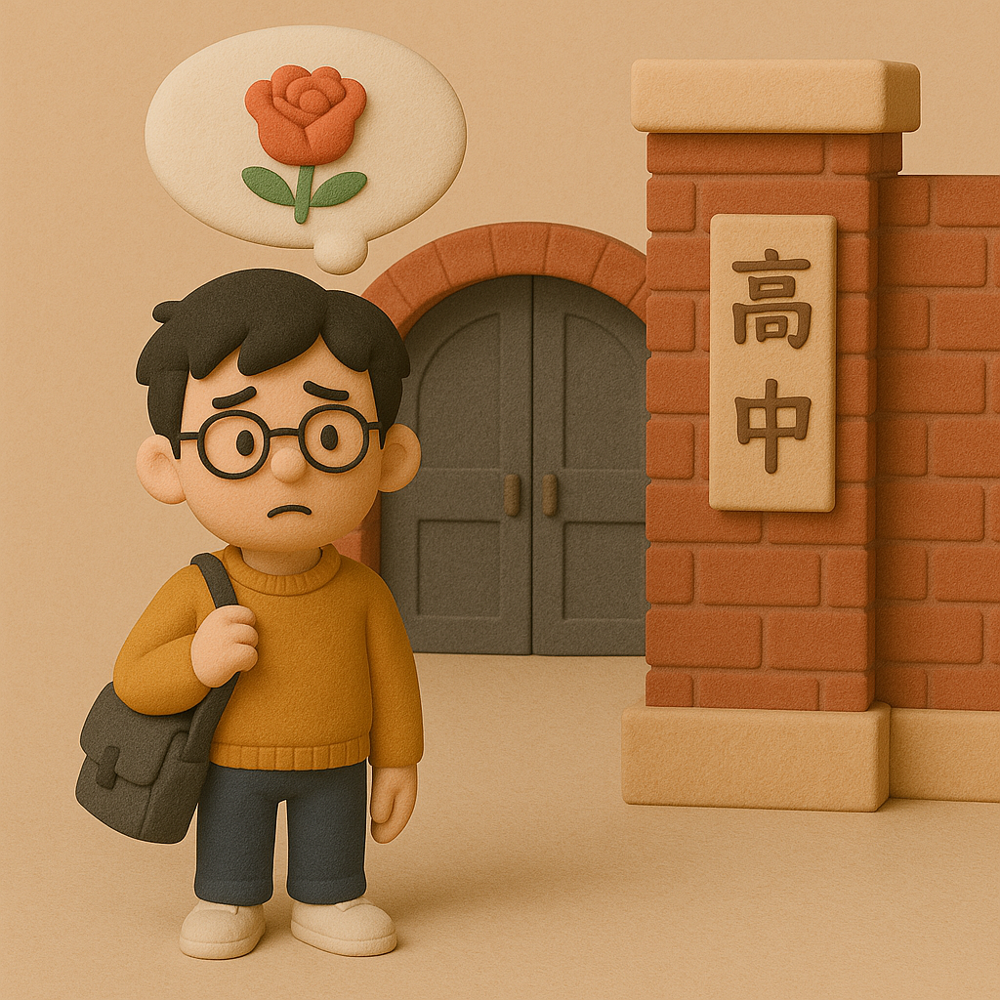

# 【生命•故事】（131）十六岁的花季

在快要16岁的时候，电视台播放了中国历史上第一部青春片——《十六岁的花季》。

这部热播的电视剧，让我们这群初中生，无比地憧憬高中生活。

然而很快，我也升入了高中。

我就读的那所高中，如今已经早已过了她的百岁生日。那时，也已经是颇为著名的一所重点高中了。

只不过，到那里上学，我需要坐公交车，从起点几乎坐到终点。

我记得，那时候入学，我们的班主任在班级的后门给大家发书。他年纪轻轻，姓钟，带着一副金丝眼镜，斯斯文文的，教我们地理。常常和他在出现一起的，是他的搭档，同样年纪轻轻，但是却没有戴眼镜的数学老师——吴老师。

学校正在翻新教学楼，进门处就是工地。要走一段才能到我们上课的教学楼。

记得紧挨着学校大门的左边，是一所师范学校。那里几乎全是女孩子，我们学校的男孩子们每次经过校门口，往往都会情不自禁地扭头往那边多看几眼。

……

应该是高一吧，可能刚入学没多久。在上学路上的公共汽车上，有个女孩子叫住我。我回头一看，是小学同学邹XX。初中时我们已经不同班了，整个初中三年我们可能都没怎么打过交道。不知不觉，印象中的小小姑娘竟然变成了青春靓丽的少女。

我觉得有一点害羞，又有一点少年的得意。她却大大方方地和我聊着天，告诉我那些小学同学如今的去向。

许多和我考入同一所高中。还有一些考入更好的，当时在全市排名第一的华师一附中。

我小学最好的朋友 H 就考去了华师一附中。

不过，她好像对 H 颇有些微词，似乎是因为 H 志向是去国外读书，她颇为不屑他这种「卖国」的志向吧。

……

新的学校，新的生活。

入学没多久我就发现，自己曾经引以为傲的成绩，在这个掐了各学校尖子生的重点高中里，根本不算什么。我的入学成绩，在班上大约排在中下游，大概3、40名的样子。

最开始的同桌是个子和我差不多高的男孩，他来自离这所高中不远的另一所中学，母亲就是他所在初中的老师。出乎我意料的是，他根本不是那种传统意义上的好学生。他给我讲他初中的各种故事，让我大开眼界。

原来，他大约是和那些差生们整天混在一起、到处玩、到处打架的男孩子。只不过，或许是因为他太聪明，加上母亲是老师，即便过着和我完全不一样的初中生活，也照样不耽误自己考入重点高中。

后来还要一位同桌，来自红钢城的女孩。她是那种典型的好学生，成绩远远比我好更多的那种。她是班里的团支部书记还是组织委员，不过后来，老师嫌我总是上课和她说话，又给我调换了座位。

……

我努力了一个学期，成绩的排名终于进入了十多名。然后，开心地玩了一个寒假。开学后，摸底考试，我的成绩再次回到了30名开外，完美地原地踏步！

闭上眼睛，我记得校门的样子，记得下车后必然经过的那条小巷，甚至还记得某些同学的模样。

但是，那时的生活，却遥远得有些模糊了！

