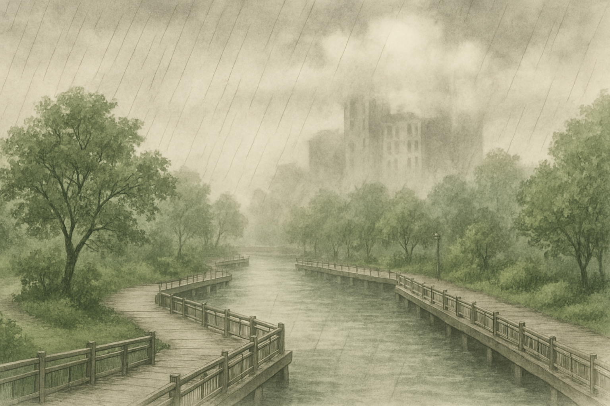

# 【随笔】清明时节

杜牧的这首诗，简直已经刻在脑子里了：

> 清明时节雨纷纷
>
> 路上行人欲断魂
>
> 借问酒家何处有
>
> 牧童遥指杏花村

昨天早上还没起来，听见窗外雨声淅沥的时候，就默默念了一遍这首诗。那时候还只是暗自嘀咕：

> 真的下雨了？

等到起床，确认了那滴滴答答的水声不是卫生间哪里漏水，而是真的窗外在下雨的时候，这首诗再一次自动进入了脑海。

也真是神奇，清明时节好像经常赶上这样下雨的日子。

外面雨半大不小的，湿气却极重，客厅的落地窗凝上了厚厚的一层水雾。两只猫蹲在窗边，Cup 神色一如既往的凝重，小玉则盯着屋外树梢间唱歌的鸟儿，机灵而好奇地把脑袋转来转去。

屋子里了空间太小，小家伙们在家里呆久了便开始各种打闹，我们决定，不管怎样，还是要出门去转转。便给孩子们穿上雨靴，拿上雨伞和雨衣，带上水杯和大宝刚刚蒸好的几个包子出了门。

阿宝打着她的透明小蘑菇伞，大鱼穿着他的蓝色蜘蛛侠雨衣，先在小区的儿童游乐场里快乐地踩了一会儿水；然后又转战小区后门的文体公园。真的是只要一出门，他们俩就可以自己一直一直地玩下去，基本上不需要再麻烦爸爸妈妈。

然后我们去超市采购了他们一直想要的巧克力，继续回到雨里，本来想往人才公园走走，结果到了中心河那里户外的锻炼器材处，小家伙们就又不肯走了。

雨丝细细地随风飞舞。真是：

> 沾衣欲湿杏花雨
>
> 吹面不寒杨柳风

我把雨伞固定在一个攀爬架上，阿宝和大鱼很高兴有这么一个「小屋子」，愉快地躲在伞下玩起来。我和大宝则挪步到一边雨篷的座位上，坐着聊起来天来。

云朵压在头顶，呈现出各种深浅墨色，有一些甚至直接沉到对面高楼顶上，把楼顶的几层楼弄得云遮雾绕，仙气十足。

大宝说：

> 你说，我们以后要不要买个高层的房子，享受一下住在云里的感觉？

转眼她又想起来：

> 嗯，这种仙气袅袅的样子，只能远看才看得到。
>
> 住在里面应该是什么也看不见，就像我们在老家时，其实就在云里头，但是自己只是觉得在雾中，什么也看不见而已……

……

不过，我想住在高楼上，在云端沏上一壶茶，应该也是别有一番滋味吧。

我想起当年有一次去杭州参加公司的Kick-off大会，我躲在酒店房间里改PPT，好像也是这样清明时节的雨季。

窗外就是西湖，湖水碧绿，湖边绿树清幽，云层也是这般低低地压在山头，如泼墨一般，雨色朦胧，把房间那巨大的落地玻璃窗，愣是变成了一副绝美的泼墨山水画。

嗯，此时此刻的中心河，也是类似又别样的泼墨山水呢。

