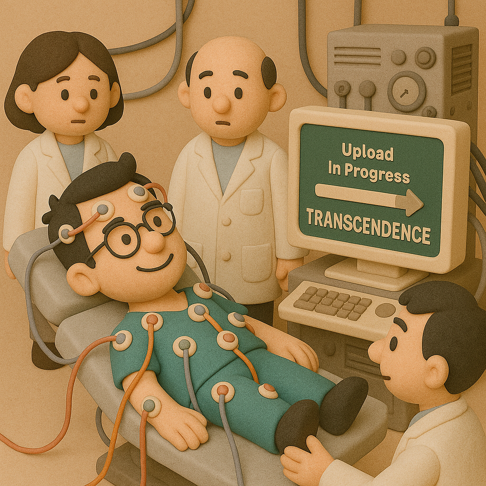
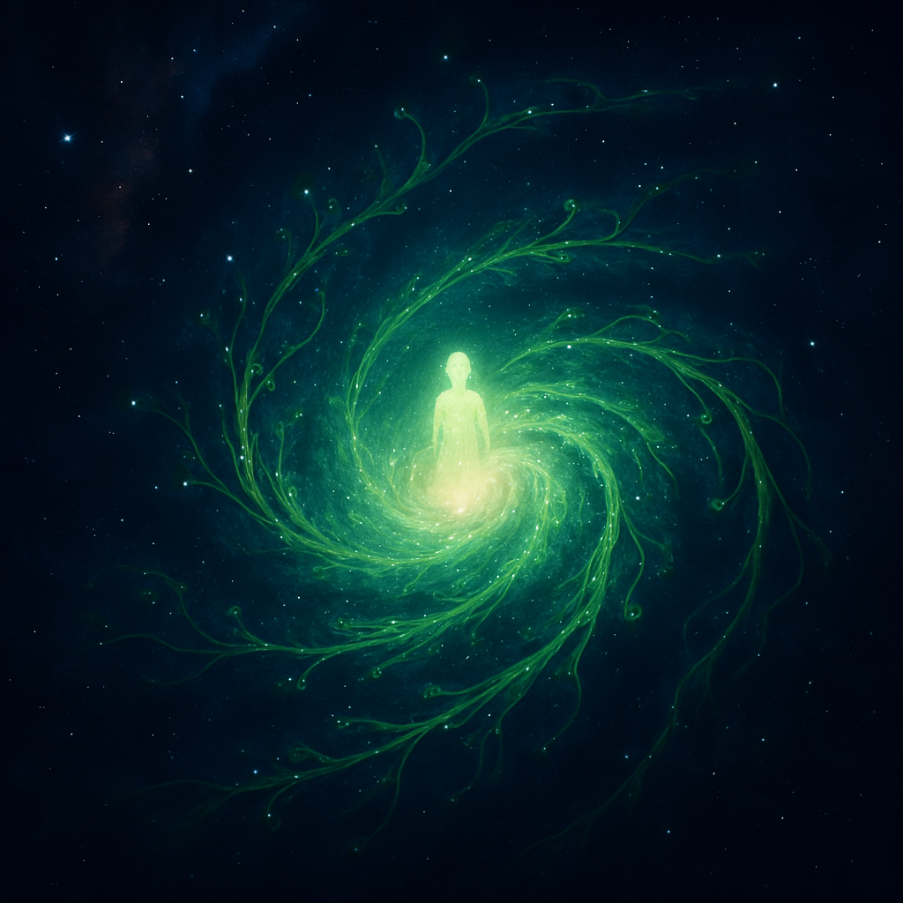

# 【随笔】意识上传

男人聊起天来，经常避免不了「宏大」到天马行空的程度。

昨晚和几个老朋友撸串聊天，不知怎么的，说起「脑机接口」和「数字化永生」的话题来。

让我惊讶的是，连我在内在座的四个人，竟然有两个人表示，如果足够安全了，那么会很愿意接受「侵入式脑机接口」，因为这样可以让自己变得更聪明。

这背后有一个哲学问题，之前也聊到过。

就算是人类大脑的所有数据，神经元所有的计算模式都能够上传云端并且能够完美模拟了。那么在云端那个「数字孪生」开机运行的一刹那，本地这个肉身智能要不要关机呢？

如果不关机，那只是复制、粘贴了一份。哪一份是所谓的「自己」呢？

如果可以不关机，那么「关机」，是不是等同于「谋杀」？

当时，我心里想，其实，这只是把进程Fork一个副本而已。和人类生孩子并抚养后代，本质上并没有什么不同。

然而，回来后我再次想起这个话题，我意识到，其实，于我而言，所谓的意识上传，早就开始了。

只不过，这并不是像《[*Transcendence*](https://m.douban.com/movie/subject/10810745/)》里那样，是一次性完成的过程。

从2018年开始，我每天写下的那些短短的百来个字，不仅仅存在自己的电脑上，还上传了Github，简书，新作，以及目前的公众号。

而随着 AI 技术的发展，公众号已经学习了我所有的文章，开启了智能对话功能。

是的，你可以直观感受一下，我目前这个不完美的「数字分身」。

直接在我的公众号里发消息，这个学习过我所有文章的数字分身就会和你聊天。搜索历史文章，这或许是当前这个版本的数字人，最最实用的一个功能。

当然，我自己也可以和「它」「交流」，并且通过后台参数，些微地调整它的应答模式。

而且将来，我或许会同步更多的文章，放更多关于我自己的资料到云端。

这意味着，这个「数字分身」，在激活之后，还能够继续和我的本体交流、同步。

假设，在我有生之年，技术就发达到这样的程度。

我这个人类本体和云端数字人之间的交互带宽，达到人类大脑左右半脑的交互带宽同样水平。

那是不是意味着，我其实拥有了三个半脑？

在这样的情况下，我会怎么定义「我」？

而且，在这种情况下，所有的「第三半脑」之间，它们的交互带宽显然可以达到更高水平。

它们的集体意识，又回怎样显化？

我知道，阿西莫夫在他的《[基地系列](https://zh.wikipedia.org/wiki/%E5%9F%BA%E5%9C%B0%E7%B3%BB%E5%88%97)》里，表达过他关于这个类似问题的思考答案，那就是——

==盖亚星系==

