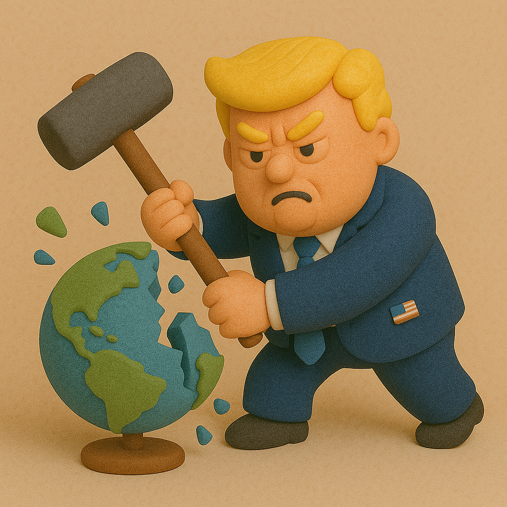
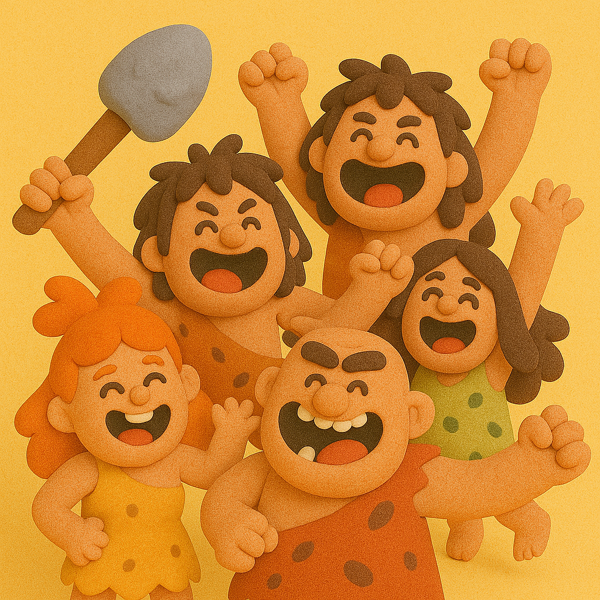

# 【随笔】乱纪元生存指南

我想，乱纪元大抵是已经明确无误的来了。

……

前几天和大女儿C通话，她告诉我，因为支持巴勒斯坦的学生抗议，课上不成了。

表达不同意见本来是件很好的事情，但现在似乎到处都演变成这样的局面：

那些不允许别人有不同意见的极端意识形态者，占据了世界的主流！

……

本来在准备一份几天后研讨要用的材料，今天临时领导又嘱咐增加两页，说得讲讲关税事件造成的影响以及我们的判断是什么。

「特靠谱」先生的关税新闻我是知道的，之后我们国家的迅速反制措施我也是知道的。此时，再上网一搜，才知道原来世界已经因此乱成了一锅粥。

网上各种观点都有，骂他的变多了，挺他的依旧有，因此看好中国的有，看好美国的依然也有。看来看去，唯一的共识就是：「乱局已来」，以及因为混乱带来的「焦虑感」。

于是乎，连分析师的生意都一下子好了起来，因为在这混乱之中，谁都想得到一个斩钉截铁、确定无疑的答案：

> 接下来会发生什么？
>
> 我应该怎么办？

……

既然，「乱纪元」已来是唯一的共识，那么基于这个判断，我忍不住还是想给出点「足够笃定」的建议，给我自己，也给有缘看到的你。

世界这么乱，该干嘛还得干嘛。

### 一、照顾好自己的身体

注意休息，注意运动，注意饮食。

因为接下来的几十年，一副强健的身体是你最后也是最重要的底牌。

### 二、照顾好自己的心灵

或者换句话说，你不仅仅需要强健的身体，也需要强健的精神。

同样的，

心与神也需要注意「休息」—— 有效的休息，冥想，观呼吸，正念都是科学证明了，行之有效的好办法。

心与神也需要注意「锻炼」—— 乐观、悲观通常只是一念之间的事情。可以在日常的工作和运动中锻炼心神；而意料之外的各种事情发生，也正好是锻炼自己稳住心神的能力以及坚韧不拔的意志力的时候。

心与神也需要注意「饮食」—— 每天读什么信息，与什么人相处，待在什么环境里，自己要有觉知。那些扰乱心神的信息，人和环境，有意识地隔离一下。每天，或者至少每周给自己制造出一个隔绝「干扰」，让心神安定下来的时间与空间。

### 三、多手准备

这段，是关于投资与理财的。

当然，最最核心的，是生存第一。

1. 优先保障现金流。
2. 用储蓄和投资构筑安全蓄水池。

那么怎么储蓄和投资呢？

既然当前时间的主要矛盾已经变成了东西方文明之间的矛盾。

身处何地，身为哪个族群，还是得坚定地站队。

不过，即便是美国人，也不妨保留一些对东方的投资；而中国人，也不妨保留一些对那些西方顶尖科技企业的投资。

与此同时，黄金（实物黄金与纸黄金）、数字货币（有最大共识的那些，比如比特币）也可以纳入投资的视野。

既然局面已乱，那么金融市场的波动和剧烈波动是必然。如果你懂，或许还可以用一些擅长面对剧烈波动的量化手段，或者投资这方面的量化基金；当然，如果不太懂这句话什么意思，就忽略好了。

既然预测变成几乎不可能，那么最简单、最值得实操的办法，就是 —— 

==定投！==

其实，关于投资，面对乱局，你其实还得做好最后的心理准备。

那就是最重要的投资 —— 是定投自己的「头脑」。

就好像传说中犹太人妈妈告诉自己孩子的那样：

==在最危险的时刻，你唯一能带走和依靠的，只有你的「头脑」==

### 四、输出稳定

纵观历史，乱局之下，一般会有两种生存策略。

1. 趁乱获利。甚至像「特靠谱」先生那样，主动把局面搞得更乱，兴风作浪，囤积居奇。

如果你擅长此道，那么你的时候来了，凭本能行动就好。

如果你和我一样，不擅长，并且从内心认定，做人不应该如此。你大可以奉行另一种策略：

2. 输出稳定

在保障自己安全生存、自己有足够能力的情况下，坚定地输出稳定：

* 稳定的价值观
* 稳定的行动和结果
* 尽可能地为小家、为大家构建一个稳定的小环境、乃至大环境

这就是中国人所谓的王道，哪怕你是一个人，你也可以做自己的「王」！

### 五、远离扎堆的人群

混乱中，人类的不理性会放大。

而不理性、疯狂的人群基本上是另一种生物形态，伤害力极强。

远离！

尤其是那些正在表现出极端意识形态的人群。

必要时，和光同尘地把自己藏起来。

### 六、对人类的最后乐观

诚然，人类有那么多槽点。但是，人类也是地球上这么多年来，最会适应变化的生物。

据考证，历史上，人类的族群曾经经历过总人口降低到数千人的极端危险情况。

但最终，人类挺过去了。

相信自己身上的人类基因，相信人类吧！

