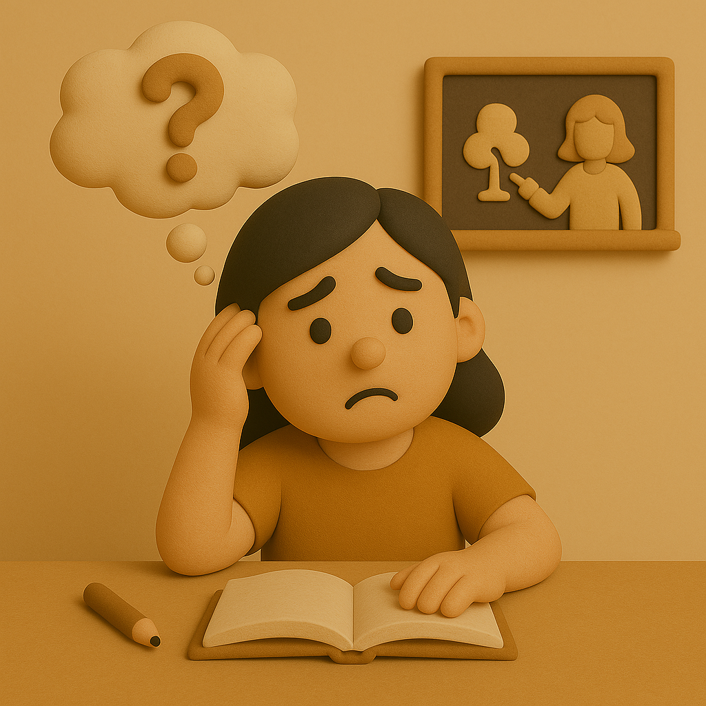

# 【随笔】教育的迷思

不由自主地，最近又开始操心阿宝的教育问题。

起因或许是因为，大宝又开始在辅导阿宝作业的过程中，遇到各种个样的烦恼吧。

同时，我们也在想着，是不是要为阿宝的兴趣爱好，找一个好的老师来继续引导呢。毕竟，不管是画画，还是目前喜欢的那些体育运动，我们俩都不专业。而好老师真的不知怎么才能找到，我们可不希望，因为一个不好的老师，就此扑灭了她心中那些爱好的小火苗。

于是乎，我「斥巨资」参加了郝景芳老师组织的「拾光计划」。然而，那天听过开场演讲，我却充满了不适。

或许是因为郝景芳习惯性、机关枪式的语速给我这种感觉。但我想，更深层的原因，可能在于，她是为一群陷入AI 焦虑的家长们设计的这个话题，结果，这些家长的焦虑，让我既觉得无意义，又在情绪上受到了感染。

后来，我在反馈孩子们信息时，把自己的思考也扔到了群里：

> 关于教育，我觉得身体和精神领域的底层能力是最重要的。这样子，想要适应当前的教育大环境，有冲突和压力。这方面有时也需要指导。
>
> 此外，我认为教育只为了在职场打工赚钱太窄化。最好能让他们先掌握基本的赚钱能力，比如通过投资，再学任何想学的东西，做任何想做的事情。
>
> 我对拾光计划核心的期望，是希望能有合适的导师在孩子们已经展现出优势的领域更好的引领他们。

这与教育大环境的「冲突和压力」，正是大宝和我当前所面对和挣扎的。

因为又开始催不动阿宝写作业，大宝和阿宝达成了协议，阿宝以后自己安排写作业的时间，但是要10点前睡觉。

计划是至少实施一个星期，结果第一天很好、第二天还不错、第三天就熬夜到了十二点，让大宝愤怒不已，狠狠吼了阿宝一顿。

接下来该怎么办呢？我是有点困惑了。

而大宝更困惑的是，阿宝曾经做得不错的写话作业，现在也一副不愿意思考的样子了。她是不知道怎么教，我则一开口，阿宝就不愿意听……

呼呼～真是切实的烦恼啊！

