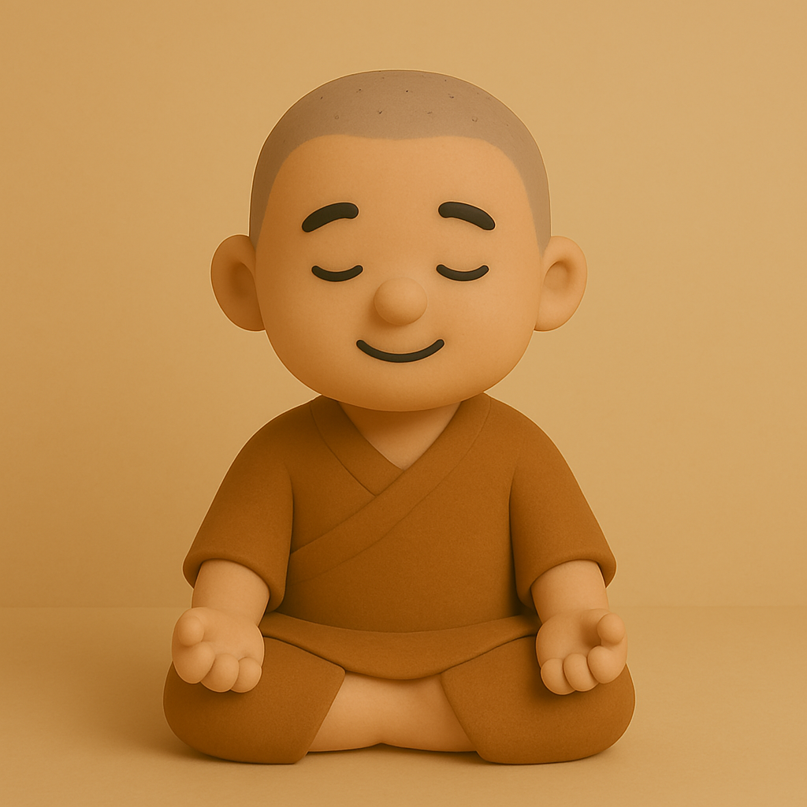

# 【生命⋅修行】多心经

## [《般若波羅蜜多心經》 唐·三藏法師玄奘譯](https://zh.wikisource.org/zh-hant/%E6%91%A9%E8%A8%B6%E8%88%AC%E8%8B%A5%E6%B3%A2%E7%BE%85%E8%9C%9C%E5%A4%9A%E5%BF%83%E7%B6%93)

觀自在菩薩，行深般若波羅蜜多時，照見五蘊皆空，度一切苦厄。舍利子，色不異空，空不異色；色即是空，空即是色。受、想、行、識，亦復如是。 舍利子，是諸法空相，不生不滅，不垢不淨，不增不減，是故空中無色，無受、想、行、識；無眼、耳、鼻、舌、身、意；無色、聲、香、味、觸、法；無眼界，乃至無意識界；無無明，亦無無明盡；乃至無老死，亦無老死盡。無苦、集、滅、道，無智亦無得。以無所得故，菩提薩埵， 依般若波羅蜜多故，心無罣礙，無罣礙故，無有恐怖，遠離顛倒夢想，究竟涅槃。三世諸佛，依般若波羅蜜多故，得阿耨多羅三藐三菩提。故知般若波羅蜜多，是大神咒，是大明咒，是無上咒，是無等等咒，能除一切苦，真實不虛。故說般若波羅蜜多咒，即說咒曰：揭諦、揭諦，波羅揭諦，波羅僧揭諦，菩提薩婆訶。

大家都说，玄奘法师翻译的这个《般若波罗蜜多心经》的版本，是与汉族人缘份最深的一个。就连西游记里的唐僧，西行路上，也是一路依着乌巢法师传给他的《心经》修行。这个故事，应该是脱胎于《[大慈恩寺三藏法師傳](https://zh.wikisource.org/zh-hans/%E5%A4%A7%E6%85%88%E6%81%A9%E5%AF%BA%E4%B8%89%E8%97%8F%E6%B3%95%E5%B8%AB%E5%82%B3)》这一段：

> 初，法師在蜀，見一病人，身瘡臭穢，衣服破汙，湣將向寺施與衣服飲食之直。病者慚愧，乃授法師此《經》，因常誦習。

最近，默诵和抄写《心经》比较多，有些疑惑常常萦绕。

记得以前也有过类似的困惑，搜索过一些讲解，当时觉得明白了。没想到时间一久，又会困惑。这种感觉，有点像在困顿、睡梦边缘时默诵心经的情景。清醒时明明背得滚瓜烂熟，但在那个时刻，前面一个字刚过念过，后面一个字还没想起，念到哪里就忽然忘记了。

索性把这些思索和找到的答案和还未解答的困惑先记录在这里吧。

**「行深般若波罗蜜多时」**，这句我以前常常困惑，究竟应该断句成「波罗蜜」「多时」，还是「波罗蜜多」「时」。

现在终于确定，「波罗蜜多」是一个音译的整体。在有些场合，只翻译成「波罗蜜」。

因此，在[维基百科里波罗蜜的解释是](https://zh.wikipedia.org/zh-hk/%E8%88%AC%E8%8B%A5%E6%B3%A2%E7%BE%85%E8%9C%9C%E5%A4%9A%E5%BF%83%E7%B6%93)这样的：

> （梵語：Prajñāpāramitā）：般若（prajñā）直譯為「慧」，波羅蜜多（pāramitā）又譯「波羅蜜」「波羅密」，直譯爲「到彼岸」「事究竟」「度無極」。

曾经记得，葛印卡老师讲过，六波羅蜜是成就涅盘的各种功夫。我想，或者也可以说这些都是到彼岸的渡船，或者说那渡船划的桨。般若波罗蜜，就是智慧波罗蜜，而且是了解宇宙一切原理的智慧。

可是，最大的困惑来了。

### 这个根本智慧怎么「行」呢？又怎样才能「行」深呢？

先放下这个困惑，后面的整段都变成字面意义上似乎理解，但实际上却不解了。

先继续说字面意义上曾经有过的困惑。参考[九华山心安禅室的一段心经翻译](https://www.jhsxacs.com/56715.html)，基本解决了。

「**无无明尽**」——这连续的两个无，常常让我困惑不已。

今天意识到，这「尽」可以和前面的「界」联系起来理解，只是说明「眼」与「意识」没有空间的界限，「无无明」和「无老死」没有时间的界限。或者说，这些都没有时空的界限。

「**菩提萨埵**」——这是个音译，和[菩萨](https://zh.wikipedia.org/wiki/%E8%8F%A9%E8%90%A8)一个意思。[梵语](https://zh.wikipedia.org/wiki/梵語)：बोधिसत्त्व，bodhisattva；[巴利语](https://zh.wikipedia.org/wiki/巴利語)：बोधिसत्त，bodhisatta。就是觉悟者。

「**阿耨多罗三藐三菩提**」——又是音译，就是[无上正等正觉](https://zh.wikipedia.org/wiki/%E7%84%A1%E4%B8%8A%E6%AD%A3%E7%AD%89%E6%AD%A3%E8%A6%BA)。又可以说是**无上正等菩提**、**无上正等觉**、**无上正觉**。梵语：samyaksaṃbodhi；巴利语：sammāsambodhi。这是成就的境界了！

最后的咒语一般不翻译，就是怕翻译了，反而执着于那个解释。不过，字面的略解，在九华山心安禅室的网站，也有基本的解释。

现在，第二个的问题与困惑也来了。

### 经中所说的 眼耳鼻舌身意等等一切 明明就在这里，怎么就无了呢？

