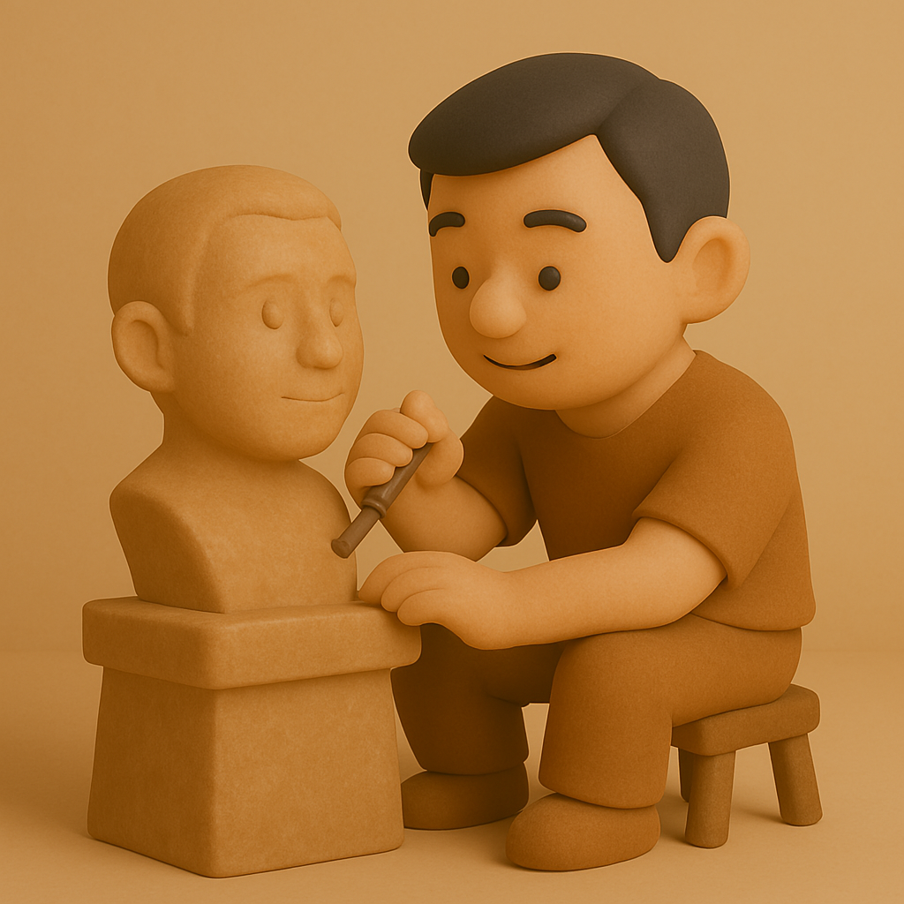

# 【随笔】做点什么呢

前几天Mac talk 池建强推荐 Paul Graham 保罗•格雷汉姆的新文章《人生应做之事》，昨天终于抽时间看完。

和《怎么干大事》不同，这篇文章并不长。讨论的不也是什么宏大问题，却依然很重要。

最近几年，这也是我常思考的问题，为自己，也为孩子们的将来。

Pual Graham 保罗•格雷汉姆也没有给出什么标准答案和复杂的原因，但他的「猜想」却暗合我心。

几千年来，关于人应该做什么事这个具体问题，其实探讨得不多。大部份人就是子承父业，或者最多送孩子去多学一门能够赚钱的手艺。孔老夫子说的「行有余力、则以学文」，其实也是在构建了最基本的人类道德修养与习惯——「孝、悌、谨、信、爱众、亲仁」——之后，再学「文」这门手艺。

然而，时代变化到如今这个境地：

过去一门手艺可以传承数千年，如今，一个新职业可能的生命周期却只有几十年（比如程序员这个面临消失危机的职业）。

就算是选择手艺，我们要如何选择，也变得格外复杂和艰难。

Pual Graham 保罗•格雷汉姆给出的两个「猜想」：

1. 人应当帮助他人，照顾世界；
2. 创造美好的新事物；

在我看来，这其实是顺着古人那些「学艺」的基本答案，又往根源和深处再回溯了一层。

帮助他人，照顾世界。保罗没有提到照顾自己，可能在他看来，这是一个隐藏的必选项。反正我觉得，顺序显然应该是照顾好自己，帮助他人，照顾世界。

正心、诚意、修身、齐家、治国、平天下——儒家的这一整套修平治齐的逻辑，讲的就是保罗说的第一个答案。

显然，这其实是嵌在人类基因中的，既有和所有生物相同的部分：生存、繁衍；也有和其他生物略略不同的部分：自觉地顺应和辅助天地之道。

就好像中庸里所说的：

> *可以赞天地之化育*；*可以赞天地之化育*，*则可以与天地参矣*。

在漫长的人类历史上，大部分普通人类想要生存，几乎没有什么额外的选择。

据说，东西方共同的那个圣人（阿基米德、耶稣、孔、老、释加牟尼等等……）叠出的时代，正是因为农耕技术的普及，能养足够的「闲人」开始思考世界、思考人生。

所以，中国的读书人大多有「耕读传家」的祖训。

「耕」—— 是农耕文明时代，活下来的基石。

「读」—— 既是思考世界、思考人生的基石，也是可以「卖与帝王家」的手艺。

可如今，人类整体已经到了一个「基本生存」无忧的时代。于是，怎样满足「活着」的最低要求，其实已经有了各种个样的选择。虽然，整个社会还是依着惯性，依旧给普通人划出了很多道道。但这些道道，其实已经有些落后于世界的变化了。

既然「活着」不成问题，那么活出最大的价值就变成了最重要的事情。

可是，怎么活出最大的价值呢？

==创造美好的新事物==

我喜欢保罗给出的这个答案！

----

以下是[ Paul Graham 保罗•格雷汉姆的原文](https://www.paulgraham.com/do.html)及DeepSeek 的翻译：

----

### What to Do 人生应做之事

March 2025 / 2025 年 3 月  

What should one do? That may seem a strange question, but it's not meaningless or unanswerable. It's the sort of question kids ask before they learn not to ask big questions. I only came across it myself in the process of investigating something else. But once I did, I thought I should at least try to answer it.

人应当做些什么？这看似是个奇怪的问题，却并非无意义或不可回答。这是孩子们在学会不再追问宏大问题前会提出的那种疑问。我本人也是在探究其他问题时偶然想到它的。但一旦意识到这个问题，我认为至少应该尝试给出答案。  

So what should one do? One should help people, and take care of the world. Those two are obvious. But is there anything else? When I ask that, the answer that pops up is Make good new things.

那么，人应当做些什么？应当帮助他人，照料世界。这两点显而易见。但还有其他吗？当我如此自问时，脑海中浮现的答案是：**创造美好的新事物**。  

I can't prove that one should do this, any more than I can prove that one should help people or take care of the world. We're talking about first principles here. But I can explain why this principle makes sense. The most impressive thing humans can do is to think. It may be the most impressive thing that can be done. And the best kind of thinking, or more precisely the best proof that one has thought well, is to make good new things.

我无法证明人必须这样做，正如我无法证明人必须帮助他人或照料世界。我们讨论的是最根本的原则。但我可以解释为何这条原则合理。人类最令人惊叹的能力是思考——这或许是宇宙间最非凡的行为。而最佳思考的证明，或更准确地说，证明一个人思考卓有成效的标志，就是创造出美好的新事物。  

I mean new things in a very general sense. Newton's physics was a good new thing. Indeed, the first version of this principle was to have good new ideas. But that didn't seem general enough: it didn't include making art or music, for example, except insofar as they embody new ideas. And while they may embody new ideas, that's not all they embody, unless you stretch the word "idea" so uselessly thin that it includes everything that goes through your nervous system.

这里的"新事物"含义极广。牛顿的物理学是美好的新事物。实际上，这条原则最初版本是"提出卓越的新思想"。但这显得不够全面：例如它未涵盖艺术或音乐创作，除非将其强行解释为"体现新思想"。尽管艺术可能蕴含新思想，但其价值不止于此——除非把"思想"一词稀释到能囊括神经系统所有活动的程度。  

Even for ideas that one has consciously, though, I prefer the phrasing "make good new things." There are other ways to describe the best kind of thinking. To make discoveries, for example, or to understand something more deeply than others have. But how well do you understand something if you can't make a model of it, or write about it? Indeed, trying to express what you understand is not just a way to prove that you understand it, but a way to understand it better.

即便对于有意识产生的思想，我也更倾向"创造美好新事物"的表述。描述最佳思考方式还有其他说法，比如"做出发现"或"比他人更深刻理解某事"。但若无法构建模型或撰文阐述，你的理解又有多深刻？事实上，尝试表达所理解的内容不仅是验证理解的途径，更是深化理解的方法。  

Another reason I like this phrasing is that it biases us toward creation. It causes us to prefer the kind of ideas that are naturally seen as making things rather than, say, making critical observations about things other people have made. Those are ideas too, and sometimes valuable ones, but it's easy to trick oneself into believing they're more valuable than they are. Criticism seems sophisticated, and making new things often seems awkward, especially at first; and yet it's precisely those first steps that are most rare and valuable.

偏爱这一表述的另一原因是它偏向创造。它促使我们青睐那些自然被视为"造物"的思考，而非对他人造物进行批判性观察。后者同样是思想，有时也具价值，但人容易自欺其价值更高。批判显得精致，创造常显得笨拙——尤其在初期；但正是那些笨拙的第一步最为稀有珍贵。  

Is newness essential? I think so. Obviously it's essential in science. If you copied a paper of someone else's and published it as your own, it would seem not merely unimpressive but dishonest. And it's similar in the arts. A copy of a good painting can be a pleasing thing, but it's not impressive in the way the original was. Which in turn implies it's not impressive to make the same thing over and over, however well; you're just copying yourself.

"新"是否必要？我认为是。科学中不言自明：抄袭他人论文发表不仅平庸更是欺诈。艺术亦然：优秀画作的复制品或许悦目，却无法媲美原作的震撼。这也意味着重复制造相同事物——无论多完美——都不令人赞叹，那只是自我复制。  

Note though that we're talking about a different kind of should with this principle. Taking care of people and the world are shoulds in the sense that they're one's duty, but making good new things is a should in the sense that this is how to live to one's full potential. Historically most rules about how to live have been a mix of both kinds of should, though usually with more of the former than the latter. [^1]

需注意这条原则中的"应当"与前两者不同。照料人与世界是责任层面的应当，创造美好新事物则是实现潜能的应当。历史上多数人生准则混合了这两种应当，通常前者占比更大[^1]。  

For most of history the question "What should one do?" got much the same answer everywhere, whether you asked Cicero or Confucius. You should be wise, brave, honest, temperate, and just, uphold tradition, and serve the public interest. There was a long stretch where in some parts of the world the answer became "Serve God," but in practice it was still considered good to be wise, brave, honest, temperate, and just, uphold tradition, and serve the public interest. And indeed this recipe would have seemed right to most Victorians. But there's nothing in it about taking care of the world or making new things, and that's a bit worrying, because it seems like this question should be a timeless one. The answer shouldn't change much.

长久以来，"人应当做些什么"的答案各地趋同，无论询问西塞罗还是孔子：智慧、勇敢、诚实、节制、公正，维护传统，服务公益。某些历史时期部分地区答案变为"侍奉上帝"，但实践中前述品质仍被视作美德。这配方对多数维多利亚时代人也适用。但其中缺失了"照料世界"与"创造新事物"，这令人忧虑——因这问题本应永恒，答案不该剧变。  

I'm not too worried that the traditional answers don't mention taking care of the world. Obviously people only started to care about that once it became clear we could ruin it. But how can making good new things be important if the traditional answers don't mention it?

传统答案未提"照料世界"我并不担忧，显然人类是在意识到可能毁灭世界后才开始关注这点。但若创造美好新事物如此重要，为何传统答案只字未提？  

The traditional answers were answers to a slightly different question. They were answers to the question of how to be, rather than what to do. The audience didn't have a lot of choice about what to do. The audience up till recent centuries was the landowning class, which was also the political class. They weren't choosing between doing physics and writing novels. Their work was foreordained: manage their estates, participate in politics, fight when necessary. It was ok to do certain other kinds of work in one's spare time, but ideally one didn't have any. Cicero's De Officiis is one of the great classical answers to the question of how to live, and in it he explicitly says that he wouldn't even be writing it if he hadn't been excluded from public life by recent political upheavals. [^2]

传统答案针对的是稍不同的问题："如何为人"而非"如何行事"。受众对"行事"几无选择权——直至近几个世纪，读者群仍是同时作为政治阶级的地主阶层。他们无需在研究物理与写作小说间抉择，其命运早已注定：管理庄园、参与政治、必要时作战。业余从事其他工作虽被允许，但理想状态是无业余时间。西塞罗《论义务》是古典时期对"如何生活"的经典解答，其中他明言若非政治动荡被迫退出公共生活，根本不会撰写此书[^2]。  

There were of course people doing what we would now call "original work," and they were often admired for it, but they weren't seen as models. Archimedes knew that he was the first to prove that a sphere has 2/3 the volume of the smallest enclosing cylinder and was very pleased about it. But you don't find ancient writers urging their readers to emulate him. They regarded him more as a prodigy than a model.

当然存在从事我们所谓"原创工作"的人，他们也常受钦佩，但未被视作楷模。阿基米德深知自己是证明球体体积等于外切圆柱体2/3的第一人，并为此欣喜。但古代作家从未鼓励读者效仿他，他被视为天才而非榜样。  

Now many more of us can follow Archimedes's example and devote most of our attention to one kind of work. He turned out to be a model after all, along with a collection of other people that his contemporaries would have found it strange to treat as a distinct group, because the vein of people making new things ran at right angles to the social hierarchy.

如今更多人能追随阿基米德的榜样，将主要精力投入某类工作。他终究成了楷模，与一群同时代认为"不应归为同类"的人并列——因创造者的脉络与社会等级正交。  

What kinds of new things count? I'd rather leave that question to the makers of them. It would be a risky business to try to define any kind of threshold, because new kinds of work are often despised at first. Raymond Chandler was writing literal pulp fiction, and he's now recognized as one of the best writers of the twentieth century. Indeed this pattern is so common that you can use it as a recipe: if you're excited about some kind of work that's not considered prestigious and you can explain what everyone else is overlooking about it, then this is not merely a kind of work that's ok to do, but one to seek out.

哪些新事物算数？我宁愿将此问题留给创造者。设定任何标准都风险巨大，因新类型工作常初遭轻视。雷蒙德·钱德勒写的是廉价侦探小说，如今却被誉为二十世纪最伟大作家之一。这一模式如此普遍，甚至可总结为配方：若你对某种不受重视的工作充满热情，并能解释他人忽视的价值，那么这不仅是可做之事，更值得主动追寻。  

The other reason I wouldn't want to define any thresholds is that we don't need them. The kind of people who make good new things don't need rules to keep them honest.

不愿设定标准的另一原因是我们无需它们。创造美好新事物之人不需要规则约束其诚实。  

So there's my guess at a set of principles to live by: take care of people and the world, and make good new things. Different people will do these to varying degrees. There will presumably be lots who focus entirely on taking care of people. There will be a few who focus mostly on making new things. But even if you're one of those, you should at least make sure that the new things you make don't net harm people or the world. And if you go a step further and try to make things that help them, you may find you're ahead on the trade. You'll be more constrained in what you can make, but you'll make it with more energy.

这就是我对人生原则的猜想：照料人与世界，创造美好新事物。不同人对此践行程度各异：有人全心照料他人，少数专注创造新事物。但即便属于后者，至少应确保创造不伤害人与世界。若更进一步，尝试创造有益之物，你会发现已占据优势——虽受更多限制，却会投入更大能量。  

On the other hand, if you make something amazing, you'll often be helping people or the world even if you didn't mean to. Newton was driven by curiosity and ambition, not by any practical effect his work might have, and yet the practical effect of his work has been enormous. And this seems the rule rather than the exception. So if you think you can make something amazing, you should probably just go ahead and do it.

反之，若你创造出非凡之物，即使无意也常能惠及他人与世界。牛顿受好奇心与野心驱动，而非作品的实际效用，但其工作影响深远。这似乎是常态而非例外。因此，若自觉能创造非凡之物，尽管放手去做。  

Notes 注释

[1]: We could treat all three as the same kind of should by saying that it's one's duty to live well — for example by saying, as some Christians have, that it's one's duty to make the most of one's God-given gifts. But this seems one of those casuistries people invented to evade the stern requirements of religion: you could spend time studying math instead of praying or performing acts of charity because otherwise you were rejecting a gift God had given you. A useful casuistry no doubt, but we don't need it.

可将三者视为同类"应当"，声称"善用天赋是责任"（如某些基督徒所言）。但这像为逃避宗教严规发明的诡辩：你能以"不辜负上帝赐予才能"为由研习数学而非祈祷行善。有用，但非必需。

We could also combine the first two principles, since people are part of the world. Why should our species get special treatment? I won't try to justify this choice, but I'm skeptical that anyone who claims to think differently actually lives according to their principles. 

人与世界本可合并原则，因人类属于世界。为何人类享有特殊待遇？我不试图辩护此选择，但怀疑声称异议者真会按其原则生活。  

[2]: Confucius was also excluded from public life after ending up on the losing end of a power struggle, and presumably he too would not be so famous now if it hadn't been for this long stretch of enforced leisure.

孔子在权力斗争失败后同样退出公共生活。若非这段被迫闲暇，他恐怕也不会如此闻名。  

Thanks to Trevor Blackwell, Jessica Livingston, and Robert Morris for reading drafts of this.

感谢特雷弗·布莱克韦尔、杰西卡·利文斯顿和罗伯特·莫里斯阅读本文草稿。  