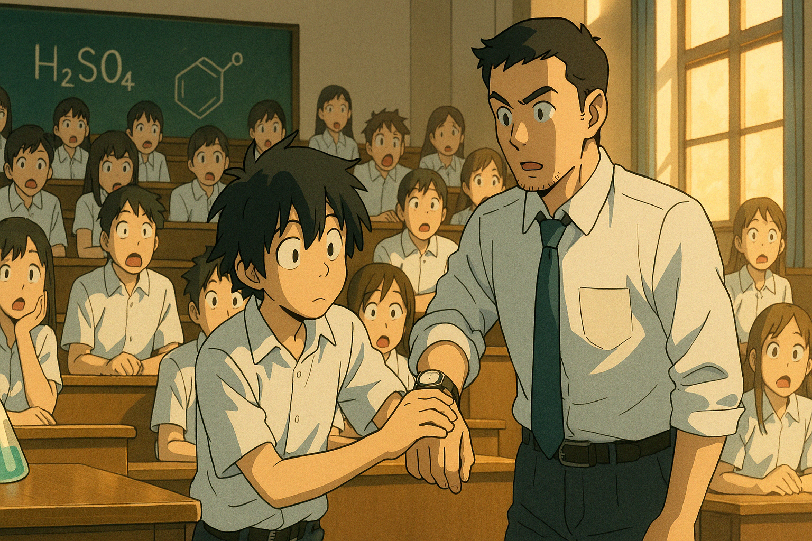

# 【生命•故事】（132）有趣的同桌和老师

高中三年说起来不过三年时间，回忆起来却有许许多多的人物与片段。

我一直以为，那些片段如同雕刻在脑子里，这辈子永远不会忘记，没想到这两天想写下来时才发现，好像自己已经记不清时间顺序了。

不过，想到最近看《乡下人的悲歌》里，万斯在三十多岁写这本书时，就发现有和自己姐姐记忆不一致的地方，也就释然了。

自己存储年少时光记忆的方式，也同样是构成现在这个自己的根源之一，不是么。

高中有一个同桌男孩，他姓S，和我一直关系很好，至今还偶尔联系。他来自武昌区距我非常遥远的另一个区域，一个大学后面的宿舍区里。后来我考到了他住的大学对面的大学，而他则读了我对面的大学。再后来，这两所大学，对了，还有另外一所大学，正好是我另一个高中好友就读的大学，合并成了武汉理工大学。

S让我真正惊讶的地方是，原来真的有人（而且有很多人）比我更聪明。

他总是穿着有点灰扑扑的衣服，有时候头发也乱糟糟的。我们常常在上课时竖起课本，躲在课本后面下军旗，我常常下不过他。

而我引以为傲的物理、化学，遇到不懂的地方，他也经常能给我指点。

对了，他好像是物理课代表。和我们高中时的物理老师正好像是奇葩一对儿。

物理老师也整天穿着皱巴巴不体面，甚至有些邋里邋遢的衣服，头发更是乱糟糟的一团。他经常上课铃响了也不出现，然后我的同桌S会跑去他的家里，敲门把他从床上叫起来。他很快就会跟着S来到教室，顶着一头乱发，手里拿着一本物理书，从来没见他拿过什么备课的教案。他走上讲台，有那么一点抱歉的表情，好像刚睡醒一样问我们：

> 上次我讲哪儿了？

通常S，或者前排同学会告诉他。然后他拿起书，翻到上次讲的地方，再把翻开的书扣在讲台上。直到下课，他再也不会拿起这课本，就这么侃侃而谈，说实话，讲得还真不错！

后来高二、高三的班主任嫌他不够负责，悄悄请了其他老师给我们补课，但我觉得还是他更厉害。

我去过S的家里，在他们家玩，还在他家吃过饭，估计不止一次。记得他还有一个妹妹，但对他母亲印象不深，但是记得他总是会念叨自己父亲喜欢喝酒，喝到自己大脑都慢性酒精中毒那种感觉。他父亲用那种一次性的小塑料杯，一次至少喝一满杯。和我们吃饭时喝，据说连早餐都会喝。

S的化学超级厉害，即便是在这个强手如林的高中，他也照样是可以参加化学竞赛的选手。

我后来听另一个同学说过他的轶事，那是学校著名的一个特别凶悍、但厉害的年轻化学老师在周末给参加竞赛的同学培训。培训在学校的阶梯教室里，巨大的教室坐满了来自各个班的化学尖子。开始上课之后，S迟到才来，他懵查查地冲进了教室，在众目睽睽之下径直走上讲台，抬起化学老师手腕，看了看老师手表上显示的时间，然后走下讲台，找到座位坐下听课。那个以凶巴巴闻名学校的老师竟然什么也没有说，就继续开始讲课了。

听到这个故事，脑子里勾画了一下当时的画面，我竟然觉得S和我们的物理老师，简直一模一样。

我的另一个高中同学H常常说，S是我们三个人中最聪明的一个，我也同意这个看法。

不过现在回想起来，几十年过去，S虽然没有继续深入物理、化学，只是成为了一名建筑设计师，但人生却好像走上了我们物理老师的道路 —— 聪明，私下里有点邋里邋遢，虽然在上海买了房子，却依旧单身。