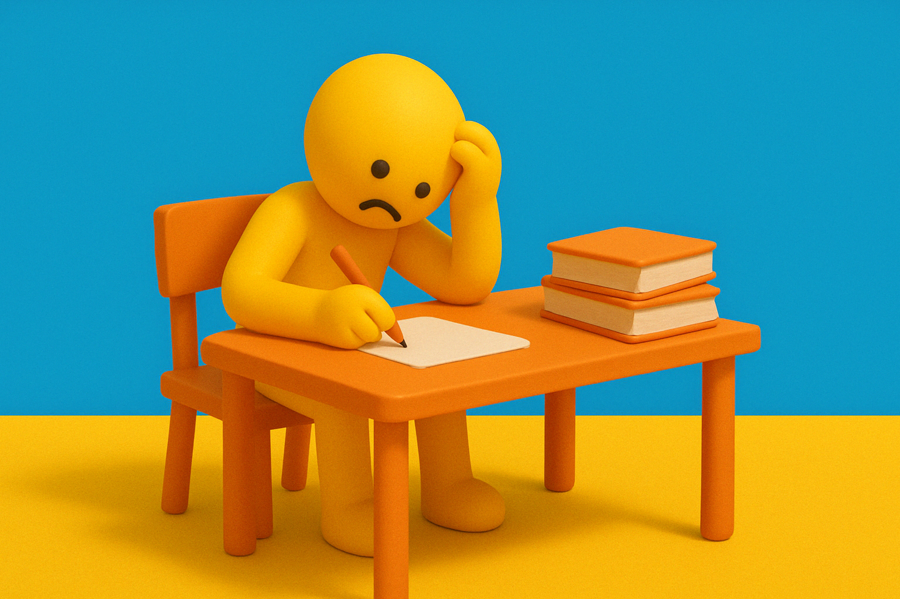

# 【随笔】被卡住的清晨

这应该是第二次、或者第三次清晨5点就醒来。

连续两天在困顿着6点才起床之后，今天又一次在5点醒来。

显然，我已经开始享受早上在7点之前就把文章写完的轻松感。

对自己而言一天最重要的「锻炼」在一天刚开始的时候已经完成，接下来的整个一天，心里都会觉得更加轻松和舒适，连工作也会专注得多。而到了晚上，精力消耗殆尽、感觉疲惫的时候，也不用想着还有一件「最重要」的事情，纠结「睡觉」重要还是「坚持写作练习」更重要。

而这样的作息规律，通常晚上也睡得更好了。一过晚上9点半，我变得比家里的其他人更渴望上床睡觉。也通常能够在上床几分钟后就进入梦乡。

当然，偶尔会起不来，是这样的作息安排所遇到的第一个挑战。好在这段时间最迟6点爬起来，依旧来得及，在7点左右勉强完成练习。

而如果晚上没睡好，第二天却依旧5点起床，早上到了9点多10点就会困得不行。会在上午就出现那种以前只在下午出现的，昏昏沉沉打瞌睡的情况——这种情况，遇到过一次，真的是一个难捱的上午。

可是今天，遇到了第三种挑战，那就是「被卡住」了。

今天早上我很早就在琢磨要不要起床了，天似乎一直黑着，我在浑浑噩噩中无法判断时间，还一直琢磨着今天写什么。爬起来看时间，发现是5点过5分。于是我起床了，按这段时间的经验，如果在5点之后醒来，最好不要再回去企图睡所谓半小时，否则6点前很难再次爬起来。

其实，写什么这个问题，昨晚就想过一阵子，大致上的决定是写阿宝的科学作业——和父母一起，用 AI 创作自己长大后的样子。

然而，我写下这个题目之后，却写不下去了。因为，我还惦记着，想要再试试MidJourney，看能不能画得更好一点。

但是，打开MidJourney，没有免费出图，必须10美金一个月，或者一年打8折。

我犹豫了，已经购买了GPT Plus，还有必要再花这10美金吗？原因只是GPT自带的 DALL•E 画得不够美？

时间一晃就到了5点30，窗外已经开始蒙蒙亮了。我再次打开 Gemini的网站，依旧不能画图，然后他也撺掇着我，升级我的Google One订阅到 AI 版，每个月又是接近20美金——话说，这个升级我之前也一直在犹豫，主要是惦记那一百万 Token 的上下文窗口，写长篇或学习论文时或许有用，再就是 NotebookLM……

对了，自己所有这些数字产品、服务的订阅是不是也需要再整理、清理一下了？钱花了不少，真的都有那么大价值吗？

想远了，时间已经到了5点45，天更亮了！

我决定放弃这个题目，打开Notes 看我以前记录的一些想写的话题。

竟然没有一个是我现在想要写的！

我这次意识到，「被卡住」很常见，但「清晨被卡住」却很麻烦。

我用了快四十五分钟来犹豫不知道写什么，但整个早上的时间，通常只不过一个小时或者两个小时。

还好，今天不是6点才起床。我不由得暗自庆幸！

但不管怎样，「被卡住」就「熬过去」，然后又可以重新开始！

我想，实验新的作息时间、停不下来的思考、写作、卡住、坚持的决心、面对键盘和空白屏幕的犹豫与混沌，所有这些过程，其实都构成了此时此刻真真切切的我，也成为了过去、现在、未来所有的「我」的组成部分。

