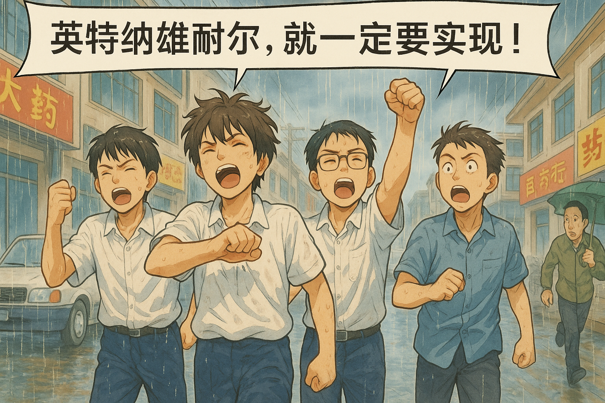

# 【生命•故事】（133）暴雨中的《国际歌》

中午休息的时候，我们有时候会离开学校，去附近转一转，玩一玩。学校附近没多远，其实就是那时候武昌区比较著名的商业区之一。

不过，除了有时候去新华书店，我们并不喜爱逛其他商店，就是绕着学校在街边暴走。

记得有那么一天，除了 同桌 S，还有另两个同学也加入了我们的队伍。其中一位名字中有一个「甦」字，因为那时我不会读这个字，所以对他的名字记忆深刻。他告诉我，其实这就是「苏」的繁体字，我便一直记住了。

他头发浓密，还有点软软、卷卷的感觉，浓眉大眼，是个帅小伙。最重要的是，感觉他读过很多书，这是让我印象最深，让我佩服的一点。

另一个同学，我竟然记不清是 H 还是另一个和我同姓的好朋友了。

反正，那天我们边走边聊着天，不知怎么说起《国歌》和《国际歌》来了。我们都一致认为，《国歌》很好听，但《国际歌》会更好听一些。现在回想起来，有可能是因为总是要升旗，国歌听得多，略略有些审美疲劳了罢。

正在外面逛着呢，天色却说变就变，忽然狂风骤起，下起暴雨来。

跑吧？

不知为什么，也可能是为了显示年轻男孩的勇敢吧，我们没有跑，而是选择昂首挺胸地在风雨中走回学校去。狂风夹杂着豆大的雨点，打得脸和胳膊生疼。我记得一开始自己还把外套顶在头顶挡雨，后来整个人迅速都被浇透了，我也放弃了这个徒劳的动作，索性任风雨砸在脸上。

那时我们的感觉，没有任何狼狈，反而充满了自豪。

接着，我们就不约而同地一起高声唱起了《国际歌》：

> 起来，饥寒交迫的奴隶！
> 起来，全世界受苦的人！
> 满腔的热血已经沸腾，
> 要为真理而斗争！
> 旧世界打个落花流水，
> 奴隶们起来，起来！
> 不要说我们一无所有，
> 我们要做天下的主人！
>
> 这是最后的斗争，
> 团结起来到明天，
> 英特纳雄耐尔
> 就一定要实现！
> 这是最后的斗争，
> 团结起来到明天，
> 英特纳雄耐尔
> 就一定要实现！
>
> 从来就没有什么救世主，
> 也不靠神仙皇帝！
> 要创造人类的幸福，
> 全靠我们自己！
> 我们要夺回劳动果实，
> 让思想冲破牢笼！
> 快把那炉火烧得通红，
> 趁热打铁才能成功！
>
> ……

唱着《国际歌》，我们更觉得自己雄赳赳、气昂昂了。看着路边仓皇奔跑的路人，以及他们侧面看我们的表情。我们得意的说：

> 他们一定会说，这几个学生真是疯了！

然而，我们心里想的或许是：

> 他们一定会羡慕，我们这几个疯狂的少年！

是的，至少我现在，就很是羡慕那几个豪气干云，无惧风雨，在暴雨中高唱着《国际歌》的疯狂少年！

