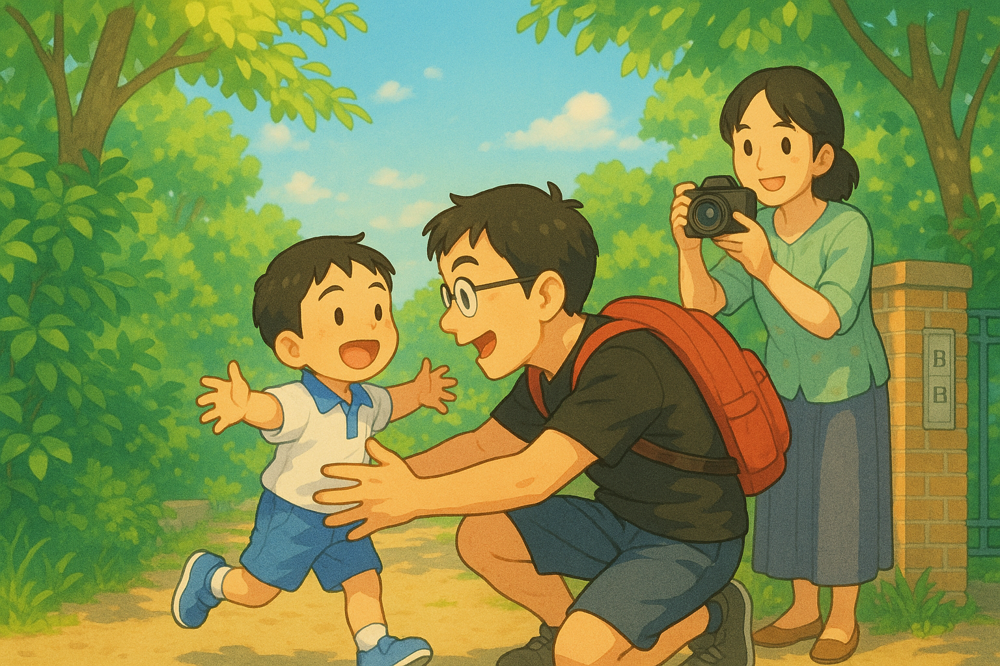

# 【随笔】可爱的爱

早上大宝带着阿宝和大鱼要先出门了，我抱了抱阿宝，然后准备收拾收拾也跟出去。

但，一会儿看见杯子里还剩许多煮姜早茶的红枣，努力多吃了几颗；一会儿发现小玉还躺在阳台睡觉，把它赶回了客厅，关上了阳台门和卧室门；一会儿又发现猫粮没有了，便给它们装上满满一碗猫粮。

等收拾完所有这些意外事件，出门刚走出小区时，接到了大宝的视频：

> 咦？你怎么这么慢？我们都到幼儿园了！

我有点沮丧地告诉他们，我还没赶到红灯路口。心想，今天早上又不能送大鱼进幼儿园了。

不过，还是走去幼儿园门口和大宝碰头吧。这么想着，已经走到了红绿灯，我停下来等绿灯，大宝的视频又打了过来：

> 你快一点！你家大鱼等爸爸呢！！！

我一听，顿时来了精神。绿灯一亮，我就飞快地跑了出去，一路飞奔。很快，我能感觉到自己的呼吸急促起来，屁股也有些酸痛了。呜呜～太久没有高速奔跑，能力退化了！我一面琢磨着，要不要找一辆美团自行车骑上更快一点，一面并不愿放慢脚步。

可能也就一、两分钟的功夫，我就来到了幼儿园门前的路上，大宝正在给等待中的大鱼拍照呢。我赶紧冲过去，不等气喘匀，就一把抱起了大鱼。

大鱼挨了挨我的脑袋，然后扭动着身子，说：

> 不是要抱起来！

我知道，他在幼儿园门口都是要自己背包、自己走路的棒宝贝，赶紧又把他放下来，和大宝一起，一边一个牵着他的手走到幼儿园门口。

他的老师在门口亲切地叫了一声大鱼，他和妈妈抱了抱，转身就冲到老师那里去了。想必是认为，刚才已经和我抱过了吧。

看着他小小的身影消失在转角处，我也心满意足地转身！

这时，大宝才告诉我刚刚有趣的状况。她说，在第一次挂断视频之后，大鱼碰见了自己的好朋友好好。好好这次是被爸爸送来的。大宝以为他和往常一样，见到好朋友后，会牵着手就直接进幼儿园。谁知道，这次他和好好打完招呼后，就问：

> 我的爸爸呢？我的爸爸怎么还没来呢？

大宝说，他肯定是收到了你懊恼的「信号」，所以替你做出了决定，甘愿冒着迟到的风险，也要等爸爸。

我说：

> 是啊！
>
> 可爱的宝宝！所以我一听到说他在等我，就迅速飞奔过来了。
>
> 跑得气喘吁吁，屁股酸痛。哈哈！

