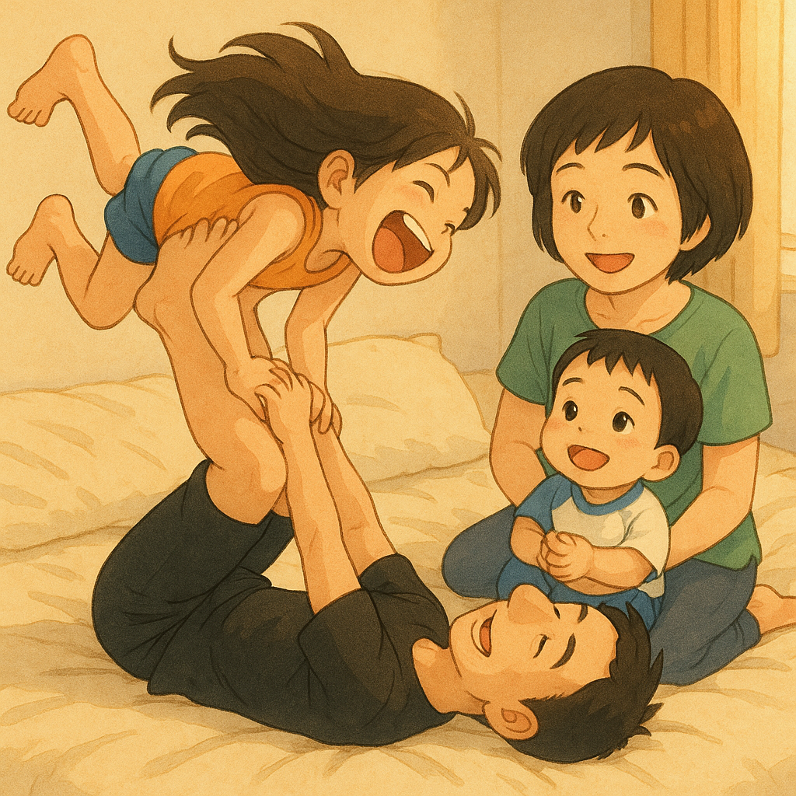

# 【随笔】为什么受伤的总是爸爸

前两天晚上，阿宝去洗漱了，我们躺在床上等她。大宝和大鱼说：

> 我们玩爸爸的爸爸吧？

我很纳闷，不知道「爸爸的爸爸」是什么游戏。

只见大宝仰面躺在床上，把腿弯起来，大鱼爬过去坐在妈妈的脚背上，保住妈妈的小腿。然后妈妈扶着大鱼，用脚把他举到了空中，腿伸直的时候，大鱼已经变成了头朝下，脚朝上。

一点点小小的害怕，变成了兴奋，大鱼咔咔笑个不停。然后这么一边摇着，一边还和妈妈一起唱着儿歌：

> 爸爸的爸爸是爷爷，
>
> 爸爸的妈妈是奶奶……

闹了半天，这是在模仿外面小店门口的摇摇车啊！

妈妈玩累了，我热情地邀请大鱼：

> 来，爸爸和你玩。

可是，他总是没法稳稳地坐在我脚上。这时候，阿宝进了卧室。一看我们玩得不亦乐乎，开心地叫道：

> 我来跟爸爸玩！

阿宝的体重，可能有大鱼的两倍了吧。不过，我还是开心地扶着她，把她举到脚朝天倒立的状态。她兴奋地尖叫起来。我索性把腿伸直，带着她继续往自己的脑后举过去，让她倒立着继续往我身后倒，阿宝更兴奋地尖叫起来，几乎一个跟头翻过去的感觉让她开心不已。

就这样，一次、两次、三次。

忽然有一次，我不知道是翻得太往后了，还是自己没劲儿了，我感觉阿宝几乎就要翻倒在我脑后，有点回不来了。这要是倒过去，不知道会不会伤到阿宝，或者压到我的脑袋和脖子。

于是我咬紧牙关，赶紧使足了全力，终于硬生生把阿宝又翻回了。

这下把我累坏了，赶紧让阿宝从我腿上下来，躺在那里休息。

大宝说：

> 那我们睡觉吧？
>
> 你快去帮忙把大鱼的水杯拿进来！

我答应一声，爬了起来。

从躺平放松的姿势变成直立，我这才发现，自己「伤」到了！

我惊讶地说：

> 完了，我把自己背搞伤了！

我站在那里，不敢乱动，大宝也赶紧过来查看是什么情况。

我发现，只要稍微转头，或者向前弯，向后弯，自己上背部都疼痛得厉害，只有保持竖直不动勉强可以忍受。

> 完蛋了，我变成这样了！

我一边拿了水进卧室，一边向大家示范自己好像机器人一样僵硬的动作。

大家觉得又搞笑，又不知所措。

大宝让我做几个眼镜蛇式反方向拉伸一下，我试了试，又仔细感觉一下，发现趴在床边让上背部放松地拉伸似乎要更舒服一点。不过，显然脊椎骨应该没有受伤，只是上背部和颈部附近的肌肉有点拉伤了。

很可能是最后一下超过了自己的力量极限。但是躺平放松的状态又什么事儿都没有，嗯，这样看来，这状态和落枕了有点像。

大宝无奈地说：

> 为什么和孩子玩，受伤的总是爸爸？

我也很无奈，不禁想起有一次爬山，在山间一处石凳休息时，听见一位妈妈吐槽自己老公：

> 你们直到他半月板怎么伤的吗？
>
> 他伸直腿，让儿子坐上去。结果他儿子往上一坐，咔嚓一声！

为什么同样和孩子疯玩，受伤的却总是爸爸呢？

