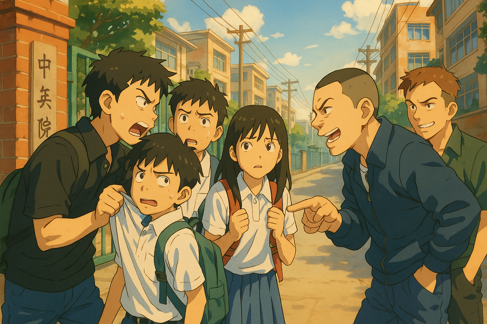

# 【生命•故事】（134）抢钱的小混混

刚上高中时有一段时间，简直觉得自己可以横起来走。

原因嘛，现在想想觉得实在是搞笑。只因为聊起天来，发现自己也属于背后有人的阶层！

是的，自己那朝夕相处三年，刚刚才分开不久的初中同学们，给自己了一种「有坚实后盾」的错觉。似乎只要有需要，随便一个招呼，就能拉上一大票人来帮自己打架一样。

但这个错觉，很快被一次意外事件消灭了。

那是一天中午，我和两三个同学吃完饭后在校门外逛，眼看着要回学校的时候，被几个小混混拦住了！

那时候的小混混都一样，也不过是一些学着「古惑仔」混社会，欺负学生抢零花钱的小孩子罢了。

但是，当他们凶巴巴地围上来时，我们几个都怂了，乖乖地掏出了自己身上所剩不多的零花钱。然后，我们气哼哼、愤怒不已地回到了学校。

当时，我们越想越生气，记得同行的一个同学冲回校门后，就想要叫人出去和那小混混打一场。后来，不知道为啥，这个想法也作罢了。

我想过很多次，要不要去找自己那些初中的好朋友们来这里，找到那些小混混们算账。最终还是不了了之。

真正事到临头时，才发现叫人来为我打架，还真不是一件容易的事情，有许多需要克服的心理障碍。实操起来，远不如自己想象的简单。

事后，和同桌Y聊起来，作为在这条街混大的小伙子，他略略不解，告诉我：

> 当时就应该打回去。
>
> 然后，离学校那么近，随便一个人跑回来，喊一声，就能叫到人出来帮你们。

他个子比我还小，但眼神里透露出的桀骜不驯，是我所不具备的。他给我看他的拳头，果然比我硬许多，想必是在街头的各种混战练出来的。

……

遭遇小混混的抢劫事件，也这么一次。后来的高中三年，也许是治安好了，也许是我们大了、长个儿了，再也没有遇到过类似的事情。

