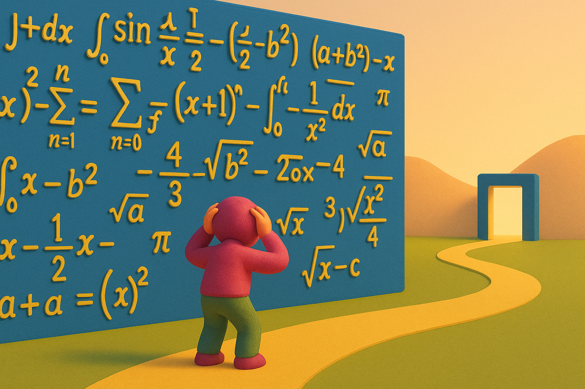

# 【生命⋅修行】天才也爱笨功夫

继发现 ThePrimeagen 是个天才之后，[在那段访谈播客中](https://lexfridman.com/theprimeagen-transcript#chapter9_perseverance)，我又发现了另一件让我惊讶的事实。

当时，Lex Fridman追问他在学校遇到学习困难、又终于突破的故事时，ThePrimeagen这么说：

> 是的，我再把故事说清楚一点，简单快速地回顾一下。我第一次学微积分预科挂科了，第二次学又挂科了，第三次学勉强拿了个C。然后我暑假选修微积分1，期末考本来是两小时的考试，我30分钟就答完了，而且考了全校最高分。从那之后，我一直在微积分和微分方程课程中拿全校最高分。

> 微分方程的期末考试，全校400个人里，我是唯一一个做完的，而且分数也是最高的。所以我突然从特别差变得特别好。我唯一做的事情，就是告诉自己“我必须赢”。这不是一个选择，不是“做到就很好”，而是“如果我做不到，我就无法毕业，无法完成学业。”

> 因此，我每天起床，上课，然后马上去数学学习中心做题。回家后，我拿着课本，后面附有奇数题的答案，我不停地反复练习这些题目，直到我彻底掌握。这成为一种惯性记忆，就像熟记乘法表一样，把微积分公式都牢牢地记在脑子里：三角代换、反三角代换、泰勒级数、麦克劳林级数……所有这些都一遍又一遍地练习。最终，这些题目变得简单了，非常简单，只不过是我花了很多精力才做到这一点。

> 对我来说，没有什么能替代投入的时间。如果我要给出一个建议，那就是你必须投入大量的时间。一小时又一小时的努力，最终会让你慢慢变好。一开始你会感觉非常沮丧、很痛苦，因为你做得不好。
>
> ……

我被这一整段故事震撼到了。聪明如ThePrimeagen，在他相对擅长的数学和编程领域，他的经验，以及他的建议，居然是：

**下笨功夫，一遍又一遍下笨功夫！**

这不就是曾国藩在家书中给儿子写的那段吗？

> 余于凡事皆用困知勉行工夫，尔不可求名太骤，求效太捷也。以后每日习柳字百个，单日以生纸临之，双日以油纸摹之。临帖宜徐，摹帖宜疾，专学其开张处。数月之后，手愈拙，字愈丑，意兴愈低，所谓“困”也。困时切莫间断，熬过此关，便可少进。再进再困，再熬再奋，自有亨通精进之日。

中庸里说：

> 或生而知之，或学而知之，或困而知之，及其知之一也；或安而行之，或利而行之，或勉强而行之，及其成功一也。

然而，大部份人，甚至包括大部份各领域的天才，在各自生活的实际困境中，能用、好用的却都只是「困知勉行」的方法。

我也是一个热衷于寻找捷径、寻找「更聪明」的方法来工作和学习的人。

然而，在这世界上跌跌撞撞几十年之后，终于，越来越认可「笨功夫」这个道理。

之前只是拿着曾国藩的这段话来指导大宝练字；后来发现自己练拳遇到困境时，也同样需要这样熬过去，才能进步；再后来发现越来越多的困境上，其实都需要如此熬过去。

天才都爱笨功夫，我撑死了不过中人之姿，还是认真抱好「困知勉行」、「下笨功夫」这条大腿吧！

----

以下把ThePrimeagen 这段故事的完整原文和 GPT 的翻译都放在这里，供大家参考：

**Lex Fridman**[(01:03:00)](https://youtube.com/watch?v=tNZnLkRBYA8&t=3780) The other moment you mentioned that I think is really inspiring is that you failed pre-calculus. You really struggled in school. You realize that school is really hard and then eventually you’re able to sort of persevere and, I don’t know, break through that wall of struggle. Can you, by way of advice, figure out what happened and what kind of advice you can give to people who are struggling? 你刚才提到另一个让我非常受启发的经历：你在微积分预科上挂科了，你在学校里的学习非常挣扎。当时你觉得学习太难了，但最终你成功地坚持下来，突破了困难的墙。你能不能给正在挣扎的人一些建议呢？

**ThePrimeagen**[(01:03:25)](https://youtube.com/watch?v=tNZnLkRBYA8&t=3805) Yeah. I’ll paint it in a more clear picture, or a very fast speed run of it is that I took pre-calculus, failed. I took pre-calculus again, failed, took pre-calculus again and got a C. So I took it three times. Then I took Calc over the summer, so Calc 1. In that one at the end, the final… The final was a two-hour final. I finished it in 30 minutes and that was the highest score in all of the school. And I proceeded to be the highest score in all calculus and Diffy Q. 是的，我再把故事说清楚一点，简单快速地回顾一下。我第一次学微积分预科挂科了，第二次学又挂科了，第三次学勉强拿了个C。然后我暑假选修微积分1，期末考本来是两小时的考试，我30分钟就答完了，而且考了全校最高分。从那之后，我一直在微积分和微分方程课程中拿全校最高分。

[(01:03:54)](https://youtube.com/watch?v=tNZnLkRBYA8&t=3834) I was the only person out of 400 people to finish the Diffy Q final. And I got the highest grade. And so I was like… I got really good. So I somehow went from really bad to really good. And my only… The thing that I did is that I had to win. It was not a option. It was not like, “Oh, this would be really great.” It’s like, “I will not graduate, I will not finish my stuff if I cannot do this.” 微分方程的期末考试，全校400个人里，我是唯一一个做完的，而且分数也是最高的。所以我突然从特别差变得特别好。我唯一做的事情，就是告诉自己“我必须赢”。这不是一个选择，不是“做到就很好”，而是“如果我做不到，我就无法毕业，无法完成学业。”

[(01:04:16)](https://youtube.com/watch?v=tNZnLkRBYA8&t=3856) And so every single day I got up, I went to my however many hour class it was. Right after that, I went straight to the math learning center, did those problems. When I got home, I just got the book and it had the odd answers in the back. And I would try to walk through the problems over and over and over and over again until I absolutely got it. And it just became this thing where it’s just I… 因此，我每天起床，上课，然后马上去数学学习中心做题。回家后，我拿着课本，后面附有奇数题的答案，我不停地反复练习这些题目，直到我彻底掌握。

[(01:04:37)](https://youtube.com/watch?v=tNZnLkRBYA8&t=3877) Just simple rote memory took over and the ability to just effectively have the times table, but for calculus, all stuck in my head. Inverse trig substitution, trig substitution, doing Taylor and MaClaurin series. All those things, just over and over and over and over again. Eventually they became easy. They became very easy. It’s just that I had to cram it in there. 这成为一种惯性记忆，就像熟记乘法表一样，把微积分公式都牢牢地记在脑子里：三角代换、反三角代换、泰勒级数、麦克劳林级数……所有这些都一遍又一遍地练习。最终，这些题目变得简单了，非常简单，只不过是我花了很多精力才做到这一点。

[(01:04:57)](https://youtube.com/watch?v=tNZnLkRBYA8&t=3897) And some people, you hear these stories, whether they barely show up to class and they get As, I’ve never been that person. I’ve always been the person that has to sit down, read through everything, and I’m bad at abstract concepts. I like the concrete into the abstract, not the abstract into the concrete. Very bad at talking about things theoretically, then trying to apply them. But if I can do it once literally, then it’s really easy for me to go into the abstract. 有的人，你听说过这些故事，他们几乎不去上课，也能拿到A。我从来不是那种人。我一直都是必须坐下来，把一切东西读完才行的人。我不擅长抽象的概念，我更喜欢从具体到抽象，而不是先抽象再具体。先理论再实践，我会做得非常糟糕。但如果让我具体操作一次，再转化到抽象理论就容易得多。

[(01:05:20)](https://youtube.com/watch?v=tNZnLkRBYA8&t=3920) And so it’s just like… For me, it’s just I had… There’s no substitute for the hours. So if I were to give advice, it’s just that you have to have time in the saddle. Hour after hour will make you slowly better. And at first, it’s crushing. It’s defeating and it’s not fun because you are bad at it. 对我来说，没有什么能替代投入的时间。如果我要给出一个建议，那就是你必须投入大量的时间。一小时又一小时的努力，最终会让你慢慢变好。一开始你会感觉非常沮丧、很痛苦，因为你做得不好。

[(01:05:40)](https://youtube.com/watch?v=tNZnLkRBYA8&t=3940) But then at some point you’re just not bad at it if you can just do it long enough, and you’ll start getting okay at it. And then at some point you might even get good at it. And when you get good at something, it feels amazing. 但只要你能坚持足够长的时间，你就不再糟糕，你会变得还可以。再之后，你甚至可能变得很优秀。而当你在某件事上变得优秀的时候，那种感觉非常棒。

[(01:05:50)](https://youtube.com/watch?v=tNZnLkRBYA8&t=3950) There’s like an exploratory thing. If you’ve ever played a musical instrument, you stop having to think about all the little teeny things you have to do to be able to play something correctly. And you start thinking about how you can explore that space. 这就像探索的过程。如果你演奏过乐器，你就会知道你不再需要去想每个小细节该如何做到正确，而是开始思考你可以怎样探索这片空间。

**ThePrimeagen**[(01:06:00)](https://youtube.com/watch?v=tNZnLkRBYA8&t=3960) …play something correctly and you start thinking about how you can explore that space. It’s like it’s a completely different problem. And same with programming, programming has an identical kind of feel to it. It’s just like you’ll cross that barrier and it becomes magical as opposed to a chore. ……你开始思考怎样探索这个空间。这就变成了完全不同的问题。编程也是如此，有着相同的感觉。一旦你跨越那个障碍，它就会变得神奇，而不是一项苦差事。

**Lex Fridman**[(01:06:15)](https://youtube.com/watch?v=tNZnLkRBYA8&t=3975) Yeah. Once you cross that barrier, somehow other things become easier. But then if you want to have a truly successful life, then you find the next barrier. Yeah, I’ve always been the same. Everything’s come really hard. 没错。一旦跨越了那个障碍，其他的事情也会变得更简单。但如果你想拥有真正成功的人生，你会去寻找下一个障碍。我自己也一直是这样的人，每件事情对我来说都很难。

**ThePrimeagen**[(01:06:27)](https://youtube.com/watch?v=tNZnLkRBYA8&t=3987) Yeah, I’ve had no free lunches. Everything’s just been a lot of pain and struggle. 是的，我从来没有轻松过，每件事都是充满了痛苦和挣扎。

**Lex Fridman**[(01:06:35)](https://youtube.com/watch?v=tNZnLkRBYA8&t=3995) I think somebody said that on this topic that you think work smarter not harder is a phrase that you dislike. Somebody on Reddit told me this. 关于这个主题，我想起有人跟我说你特别讨厌“要更聪明地工作，而不是更努力地工作”这句话。

**ThePrimeagen**[(01:06:47)](https://youtube.com/watch?v=tNZnLkRBYA8&t=4007) Yeah. I don’t just dislike it. I hate that phrase. 没错。我不仅讨厌，我非常痛恨这句话。

**Lex Fridman**[(01:06:49)](https://youtube.com/watch?v=tNZnLkRBYA8&t=4009) Okay. Tell me about your hatred. How do you feel? 好的，跟我说说你为什么这么痛恨它？

**ThePrimeagen**[(01:06:54)](https://youtube.com/watch?v=tNZnLkRBYA8&t=4014) The reason why I dislike that is that there is kind of a hidden suggestion there, which is that you already know what smarter is, so just do that. That actually things should be easy. You should just not have to try that hard. You should just do the quick, easy, obvious path and boom, it’s done. It’s like I’ve never experienced that in anything I’ve done. Everything is actually really hard and most of the time I don’t even know what I’m doing, so therefore I don’t even know what smart looks like. And so for me, the only way I can learn how to work smart is by working very, very hard and knowing that there’s no shortcuts. And then when I finally figure out what smart is, when I work smart and work hard, it is that much better. 我之所以讨厌它，是因为这句话暗示了一种假设，那就是你已经知道什么才是“聪明的做法”，你只需要去做就行了。似乎事情本应该简单易行，你不该费太大劲，选个简单快捷明显的路就搞定了。但我从来没有经历过这种情况。我做的每件事情都非常难，大多数时候我甚至不知道自己在做什么，所以我根本不知道怎样才算聪明地工作。
 对我来说，唯一能学会聪明工作的方式，就是非常非常努力地工作，并且明白根本没有捷径可走。当我终于发现了聪明的方法，我同时兼具聪明与努力，事情就会变得好得多。

**Lex Fridman**[(01:07:39)](https://youtube.com/watch?v=tNZnLkRBYA8&t=4059) I think there’s a deep profound truth to that. 我认为你这句话包含着非常深刻的真理。

**ThePrimeagen**[(01:07:42)](https://youtube.com/watch?v=tNZnLkRBYA8&t=4062) There’s a lot of these phrases that just drive me nuts in our society, 我们社会上有很多这样的俗语，真让我烦透了。

**Lex Fridman**[(01:07:45)](https://youtube.com/watch?v=tNZnLkRBYA8&t=4065) But that one is… Sorry, that one is really accepted if you can just linger on it because it really bothers me as well. So one, which is a really nice thing you said, the presumption there is things should be easy and you’re a failure if you don’t see the easy path. That’s kind of the implied thing. 但这句尤其明显。它让我也很困扰。你刚才说得很好，这句话背后的假设是：事情本该简单，如果你看不到简单的路径，那你就是失败者。

**ThePrimeagen**[(01:08:02)](https://youtube.com/watch?v=tNZnLkRBYA8&t=4082) Just work smart, daug, why are you putting in all those hours? “聪明点干啊，伙计，你干嘛要花那么多时间？”

**Lex Fridman**[(01:08:05)](https://youtube.com/watch?v=tNZnLkRBYA8&t=4085) And so it makes a lot of people that struggle feel like they’re a failure because I don’t see it. And then the choice they have, well, I’ll just be lazy and then maybe the profound truth will come to me somehow. And yeah, I don’t think I’ve ever, and I don’t think I’ve met great engineers that find the smart way without the extremely hard work. The annoying thing about those great engineers is then looking back, they forget the hard work because they remember all the joy they now are experiencing from all the efficient, smart work they figured out how to do. They forget. So when they give advice they give the stupid advice of, well, just do it like the easy way 这就会让很多挣扎中的人觉得自己很失败：“我就是看不到所谓的捷径。”于是他们的选择就是懒惰一点，希望深刻的道理会自己出现。但我从来没遇到过，也没见过不经过极端努力就能找到聪明方法的优秀工程师。
 烦人的一点是，那些优秀的工程师回顾时常常忘记他们付出的努力，因为他们现在只记得从高效的聪明工作中获得的快乐。所以当他们给建议时，会说：“你就这么做，很容易的。”

[(01:08:53)](https://youtube.com/watch?v=tNZnLkRBYA8&t=4133) And here’s the easy way. But no, you have to put in the hours. Musical instrument is a beautiful example of guitar and piano. I’ve put in, I don’t know how many thousands of hours. And now when I’m explaining stuff jiu-jitsu as well, I sound like one of those people just relax in jiu-jitsu. By the way, just relax is a really wonderful thing for physical endeavors like piano and so on. But to learn how to relax your hand, how to relax your mind, your body and use whatever the biomechanics of your body to apply the correct kind of leverage and the timing and all that, that takes thousands of hours of learning. Just to learn how to relax takes a lot of really hard work. In jiu-jitsu that takes many months of getting your ass beat over and over until you ride the bus home crying. 但事实并非如此，你必须投入大量的时间。音乐就是个很好的例子，吉他、钢琴我都花了成千上万小时，柔术也是如此。当我教别人柔术时，我会说“放松点”，但实际上“放松”这种事，要学会怎么做是极为困难的。光是学会如何放松，就需要大量辛苦的训练。

[(01:09:55)](https://youtube.com/watch?v=tNZnLkRBYA8&t=4195) Your ego completely shattered and destroyed. And then a little element is figured out late that night or next morning. And from the depression, there’s this little plant that grows this flower of insight. And you use that insight to then get your ass kicked again all next month and year. And then you grow and grow and grow. And from that you discover how beautifully simple jiu-jitsu is or Judo is, just speaking for myself, or piano or guitar. And then yes, the profound truth or the mastery of a skill feels simple when you finally arrive to it, but the path for most people is going to be a hard one. 你的自尊心被彻底击垮，然后从这种沮丧之中，你偶然获得一点领悟。这种领悟像一朵花一样从泥土中慢慢长出，推动你继续接受失败，直到你最终发现柔术、钢琴或吉他的简单与美妙。尽管掌握技能之后会觉得很简单，但对于大多数人来说，这条路都是艰难的。

**ThePrimeagen**[(01:10:46)](https://youtube.com/watch?v=tNZnLkRBYA8&t=4246) I think I should make an addendum to the phrase, I think the phrase should be work hard, get smart. 我觉得应该修改一下这句话，它应该是“努力工作，然后变得聪明。”

**Lex Fridman**[(01:10:51)](https://youtube.com/watch?v=tNZnLkRBYA8&t=4251) Nice. That’s a t-shirt. 不错，这句话适合印在T恤上。

**ThePrimeagen**[(01:10:53)](https://youtube.com/watch?v=tNZnLkRBYA8&t=4253) That’s what it should be.  没错，就应该是这样。

**Lex Fridman**[(01:10:54)](https://youtube.com/watch?v=tNZnLkRBYA8&t=4254) Yeah, agreed. Okay, that was a tangent of a tangent. 同意，好，我们又扯远了。