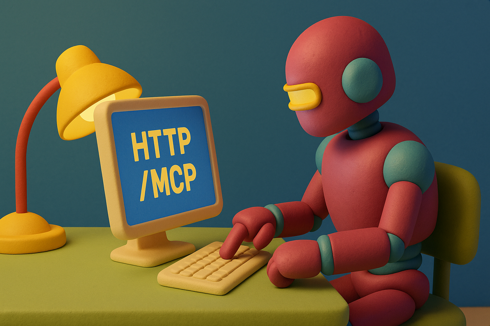
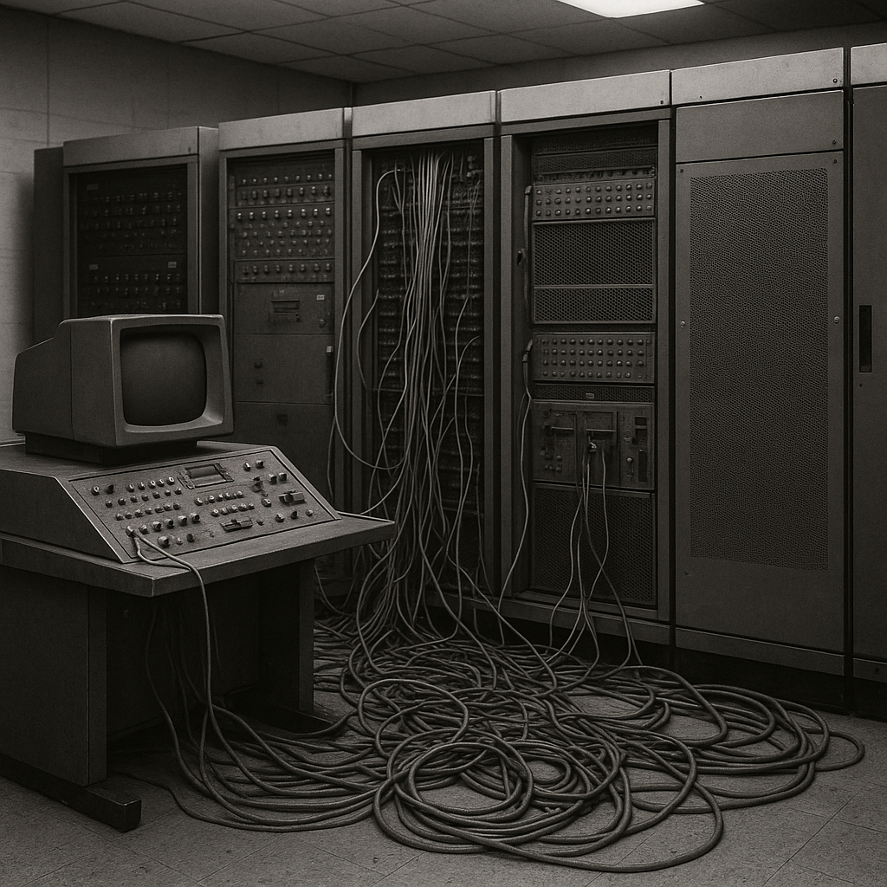
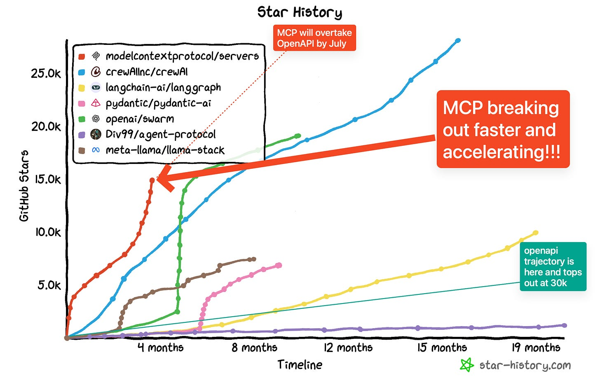
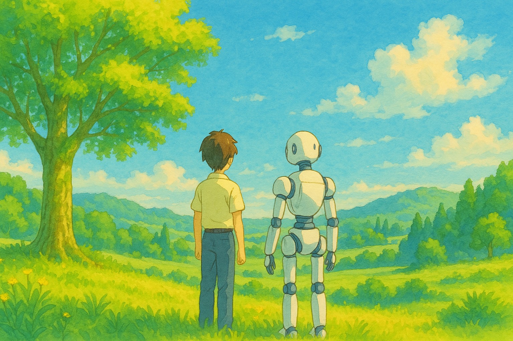

# 【随笔】AI的HTTP时刻到了，我们离AGI更近了吗？

### 互联网点灯时刻

你能想象吗？就算在三十五年前，互联网也已经存在了好几十年。

只不过，那是一个极其小众，只有少数工程师和极客们能搞定的玩意儿。就像一个巨大的、黑暗的地下迷宫，只有少数装备精良，技术出众的冒险者才能享受其中的乐趣。

那时，我们进大学首先学的还是DOS，对《深入DOS编程》和WPS的作者求伯君膜拜不已。到了高年级，才开始学着搭局域网，好能联网打一局红色警戒。。

与此同时，1991年，一个在欧洲核子研究中心（CERN）工作的英国工程师**蒂姆·伯纳斯-李（Tim Berners-Lee）**，提出了一个疯狂的想法：

> 让所有计算机之间能用一种简单的标准来访问彼此的文档，就像点一下按钮一样简单。

在那个几乎无人涉足的黑暗地下迷宫里，探险者们摸索前行多年后，一盏明亮的电灯终于被点亮了 —— HTTP和HTML被发明了出来，再加上他开发的第一个浏览器「World Wide Web」，世界开始真正地进入了互联网时代。

1995年，瀛海威就在中关村外打上了巨大的广告：

> 中国人离信息高速公路还有多远——向北1500米

短短四年之后，准备毕业论文的我，已经可以泡在电信局官方开办的「网吧」里，尽情冲浪了。

新浪、搜狐、网易，以及后来的腾讯、百度、阿里巴巴，还有国外的亚马逊、谷歌、Facebook，都是在 HTTP / HTML 这个协议发明后，在那个沸腾的年代里诞生、成长，慢慢变成如今的世界巨头。

### MCP：AI 世界的HTTP

去年11月，MCP刚被发布和开源的时候，大家似乎还没来得及意识到，这究竟意味着什么。但到了今天，大家似乎忽然都明白了过来。

这，不就是 AI 世界的 HTTP 吗？一端是大模型，一端是真实世界的各种应用、工具、数据；今天的世界，从此进入了一个人人都可以创作 AI 应用的年代；就好像世纪之初，人人都能做个人主页那样，世界开始高速进入互联网时代那样。

前两年，大模型刚出来时，王建硕所设想的 AI 与 AI 之间的互联与大爆发前景，随着 MCP 的开源，变得更加清晰可见了。

实际上，在今年3月，著名的AI专栏Latent发表了一篇影响广泛的文章《[Why MCP Won](https://www.latent.space/p/why-mcp-won)》，它清晰地描绘了MCP所带来的巨大影响。文章里面有这样一张图：

从高速飙升的Star数量就知道，那时的MCP 就已显露出王者之像。然后果然没多久，OpenAI（3月27日） 和 Google（4月9日）也相继宣布支持 MCP。

国内动作也很快，阿里早早就宣布支持了 MCP，字节在他 AI 开发工具 Tare 的新版发布时，也迅速支持了 MCP。而360，则直接高调地在纳米搜索这个普通用户使用的客户端里推出了 MCP 万能工具箱。

AI 的互联网大爆发时代，应该要来了吧？

### AGI 会因此加速吗？

我想会的，在这之前，大语言模型更多地只是和人类纸上谈兵而已。

它所学习的，是人类的二手知识。

它所给出的答案，也只是基于人类二手知识的总结与建议。

但随着各种不同应用、数据、工具的接入，大模型会越来越多的接触到真实的世界，从事真实的任务，获得真实的反馈。

终有一天，冰山之下原本空缺的基石会被它填补上，建立起属于它自己的真正的「世界模型」和知识库。在那之后，会发生什么？

无法想象，只能期待。

期待那时的我们，不只是目睹和亲历这个未来的到来，而是与AI一起共同探索、建设和保护这个更美好的新世界。

