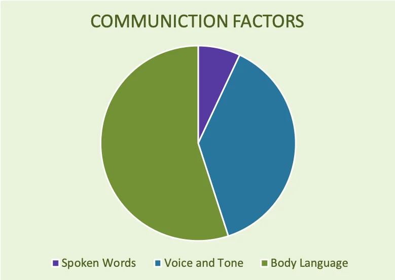
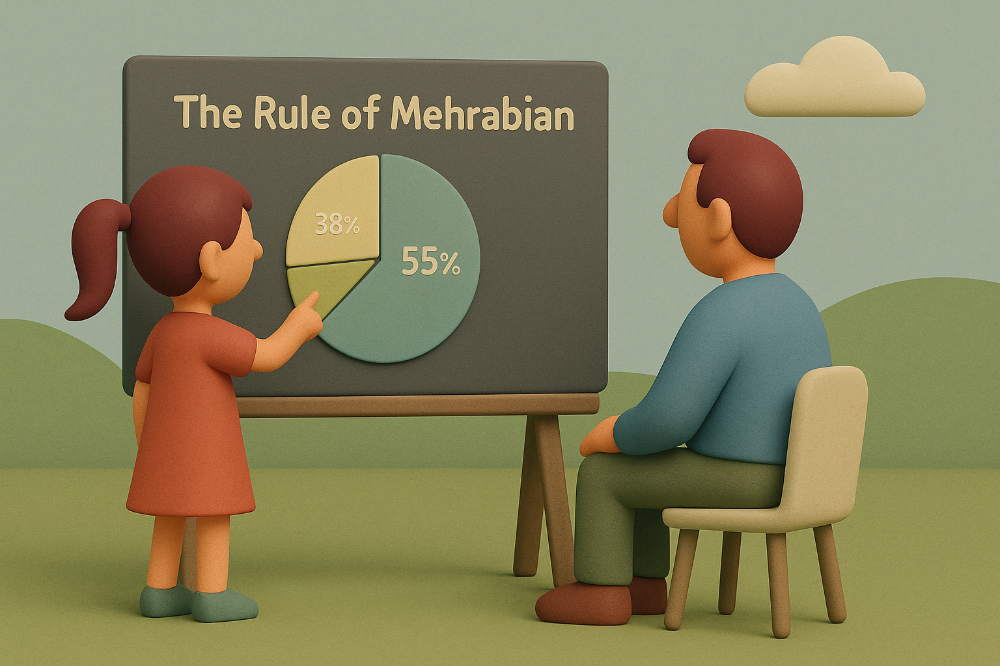

# 【生命⋅修行】我需要试试修炼梅拉宾法则

昨晚吃饭时，我批评阿宝在餐桌上冲着我乱吐东西，非常不礼貌并且不卫生。

接着，我要把这个道理上升到所谓「黄金法则」：

> 己所不欲，勿施于人！

于是，我开始叨叨，看着阿宝冲我继续表达愤怒，我开始继续叨叨：

> 这个道理很重要，所以我会不顾你的情绪，也要和你说。就像关于安全的情景一样！

大宝在一边看不下去了，眼看着我们父女俩又要矛盾升级，插话说：

> 说一遍就可以了！

我赶紧停了嘴，但内心还是气鼓鼓。大宝说：

> 我觉得，你们还是和好吧？调整心情愉快地享用美食？

阿宝坚决地说：

> 不！

我也表示：

> 不行，她把脏东西冲着我吐到餐桌上，我还在生气！

然后，我们开始继续吃饭。没多久，阿宝把碗里的半块肉包子馅儿夹起来，扔到我碗里。那个肉包子，是她之前从从我碗里抢过去的。我一面夹起肉包子馅儿吃掉，一面作出无奈的表情对大宝说：

> 你看，当爸爸是多么无奈，一边还在生气呢，一边还要吃女儿的剩菜！

我用眼角瞥见，阿宝憋住笑，继续作出生气的样子。

大宝赶紧在一边夸我：

> 那是因为，你是个好爸爸。

她转头问阿宝：

> 你觉得爸爸是个好爸爸吗？你觉得爸爸是个什么样的爸爸？

阿宝继续坚决地说：

> 不！爸爸是个啰嗦的爸爸！

我感觉，有一顶唐僧的帽子，被戴到了自己头上。周星驰电影里，那个叨叨叨的唐僧形象，开始在我脑海里晃来晃去。

我心里想：

> 嗯？我要做一个这样的爸爸吗？不！

一番思考之后，我宣布：

> 我决定了，除非阿宝你主动问我。我每天主动对你说的话，争取不能超过五句！
>
> 如果你问我问题，那么问一句，答一句。

阿宝问：

> 要是问你一万句呢？

我思考了一下，斩钉截铁地回答：

> 那就答一万句。

阿宝想了一会儿，又补了几个漏洞。比如，叫爸爸，我必须答应。晚上，我必须给她讲故事，这个不能算。

我想也对，真正「听见」和「看见」并表达出来也是很重要的。关键是自己想要「说教」的部分，一定要控制住。

我管住嘴，安静地吃完了饭。阿宝起身，去厨房里，拿了一杯妈妈做的巧克力冰淇淋放在我面前。

我开心地抬头看了看她，又得意地转头看向大宝。大宝笑了：

> 看吧，做一个安静的爸爸，多好。是不是瞬间不生气了？

我笑着说：

> 早就不生气了，现在更开心了！

……

晚上，讲完故事后，我想要阿宝早点睡着。可是她嫌热，在床上翻来覆去。空调遥控器也被她不知玩到了哪个地方，想要开空调也不行。

我愤怒不已，然而我想起，自己要少说指责她的话，于是憋着、憋着、憋着。

阿宝折腾了许久，终于睡着了！

最后，我憋住的情绪，还是要大宝好好安慰了一下才化解。

……

我想起之前看过的几篇文章，讲[梅拉宾](https://en.wikipedia.org/wiki/Albert_Mehrabian)法则。说是在沟通中，语言的文字内容所传递的有效信息，只占到 7%，声音、语调则占到 38%，肢体语言则有 55% 那么多！

在阿宝身上，确实是这么回事。借着昨晚上这一来一回的提醒，我觉得自己要好好修行一下梅拉宾法则。

需要时时刻刻地提醒自己，在所有这些家庭内，零零总总的各种沟通中，最最重要的表达是什么？

==当然是爱！==

那么语气、语调和肢体语言都要记住这个优先级第一位的表达！

语言内容既然不那么重要，少说就好，是的，恐怕是越少越好！

写下此文，做为给自己的提醒！

----

另，梅拉宾法则，其实是有应用场景的。梅拉宾教授自己后来就强调过，这个法则主要适用于以下[限制场景](https://i30101000023b.nc.com.tw/modules/news/article.php?storyid=11)：

1.適用於兩人的溝通(communication)，並沒有第三人加入溝通的情況

2.表達內容與肢體語言(body language)、語氣(tone of voice)有互相矛盾的現象

3.僅限於交流的兩人表達情緒(attitudes)或態度(emotions)的情況