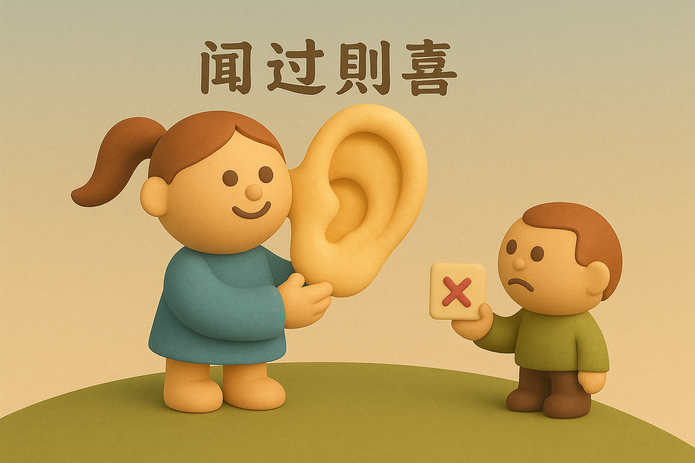

# 【生命⋅修行】闻过则喜

> 孟子曰：子路，人告之以有过，则喜。
>
> ——《孟子•公孙丑上》

> 闻过则喜，知过不讳，改过不惮。
>
> ——《陆九渊集》

想起「闻过则喜」这个词来，竟然又是因为阿宝的教育问题。

昨晚吃过饭后，正在厨房里把用脏的碗筷收拾到洗碗机去。阿宝跑出来，和弟弟一起吃给他们留下的几个可乐鸡翅。

可能是大宝做的菜，对他们来说太香了，我在厨房都能听见他们吧唧嘴的声音。

转头看过去，似乎主要是阿宝发出的声音。

而这一转头，正好看见阿宝对着盘子「噗噗噗」地吐着渣。

> 这～也太恶心了吧？

不过，我有点犹豫，该不该就这件事情批评他们。

我知道有许多所谓的规矩和教养——什么吃饭不要吧唧嘴，尽可能闭着嘴嚼啊；什么喝汤时不要发出太大的声音，不要弄在桌子上啊；女孩子不要岔开腿坐啊，等等……

而且，我记得冯唐也说过，年轻人如果懂点人情事故，知道如何那些基本的「取悦」别人的道理和规矩，会更容易遇到「贵人」，走得更顺些。

包括之前给孩子们讲《西游记》，龙王水晶宫里那幅「张良三进履」的画，也是在说这些个道理吧？

甚至，我还清晰地记得，自己在三十多岁读到《弟子规》时惊叹，这些重要、简单的道理，自己为什么小时候没学呢？

但与此同时，我又担心，这些所谓的「规矩」，会太禁锢孩子的「天性」了！

这两种拉扯，让我在「要不要」批评他们这件事情上，犹豫了许久。

当然，没等我犹豫完，他们就扔下脏盘子和鸡骨头，跑去书房玩了。

……

我跟去书房，冲大宝说了说我的犹豫。然后跟了一句抱怨：

> 本来想把可乐鸡翅的汁儿留着下次拌饭吃的。
>
> 看到阿宝「恶心」地往盘子里吐渣，受不了，只好放弃了！

回到厨房，我又开始继续琢磨这事儿。大宝和我说：

> 我觉得，该说就说。
>
> 只不过，你不用指望一次性就管用，很多事情，都是要长时间耳濡目染的。
>
> 只能持续地「叨叨叨叨」！

我告诉大宝：

> 你说的对。
>
> 不过，我已经想太远了！
>
> 我在想「闻过则喜」这件事，怎么才能让孩子们养成「闻过则喜」这样的品质呢？

大宝说：

> 我觉得，你不要拿「圣人的标准」来要求孩子，来要求别人。
>
> 这样别人会很难受的！

我恍然大悟，原来我又在用那本来之应该用在自己身上的「修行之刃」，去对待别人了！

大宝说：

> 我现在很释然了！
>
> 第一：我们是普通的父母；
>
> 第二：我们的孩子是普通的孩子；
>
> 所以，我们会犯错，孩子也会犯错。
>
> 但同时，我们这样的普通人，经历各种正确、错误的教育，都能过得很好；我们这普通的孩子们，经历他们所经历的正确、错误的教育，最终也一样能过得很好。

我也释然了。

然后在这一瞬间，我忽然意识到，过去我对「闻过则喜」的认识，很有些片面。

我过去只认为，这是克服「人性弱点」的修行结果，人的本能是听到自己不对就激烈反抗。因此，能「闻过不怒」就已经很难了，要做到「闻过则喜」更是难上加难！

此时，我却发现。这背后其实还有一个微妙而关键的心态——

那就是不害怕犯错、甚至因为犯错而欣喜！

把「错误」当作成长的必然，甚至重要原材料。因为追求「成长」的生命本能，而自然而然地拥抱一切错误，以及一切帮助自己发现错误的人、事、环境。

能够做到「闻过则喜」，或许只在一转念间。

我又想，那些把「闻过则喜」变成自己本能的人们，是在怎样的一个环境中，才更容易成长出这样一个特质的呢？

真是值得好奇的一件事！

