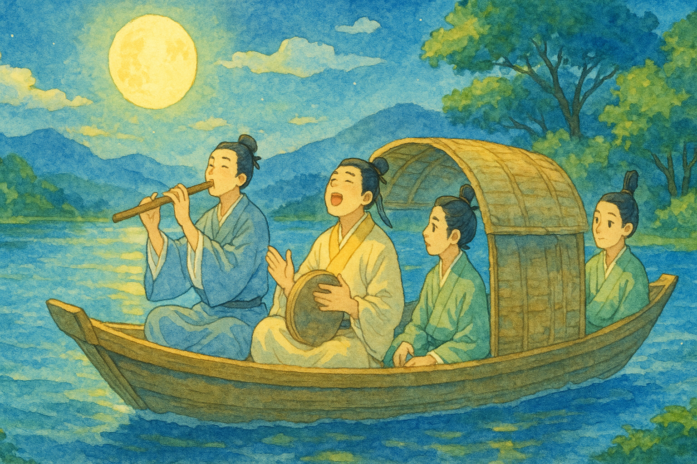

# 【生命⋅修行】人生苦短

> 每天花时间、平静、专注地思考生命中什么是<u>真正重要</u>的，优先级是否井然有序，无论死亡何时来临

在笔记本上把这段话抄写了又一遍之后，我读到一位「大佬」推荐[保罗•格雷汉姆](https://www.paulgraham.com/vb.html)近十年前的一段旧文 Life is Short（[简书上有中文版本](https://www.jianshu.com/p/682429f8ac3f)）。 

在从办公楼下来的电梯上，在路口等红绿灯的自行车上，在上楼回家的电梯上，最后在门前我还站了一分钟，把这篇短短的文章读完了。

> Relentlessly prune bullshit, don't wait to do things that matter, and savor the time you have. That's what you do when life is short.
>
> 无情地剔除「屁事」，重要的事情叉手立办，珍惜每一秒你所拥有的时光。人生苦短，就得如此！

可能因为有两个单词（Relentlessly，Prune）都不认识的缘故吧，最后那句英文给我感觉很有力量。

我忍不住和大宝感叹自己的感悟。我说，最近肯定是被她启发了，越来越觉得当下的时光值得好好珍惜：

* 小孩子不停地叫：「爸爸！陪我玩！！！」
* 猫咪「蹭」地蹦到你腿上，转着圈想躺在你身边
* 老婆兴奋地从烤箱里端出一盘香喷喷的糕点
* 一场突如其来的暴雨
* 一朵让满屋喷香的茉莉花
* 包括这篇刚刚看到的文章……

这一切的一切都在无时无刻地提醒着我：

此时此刻的生命瞬间，就是你最重要、最值得珍惜、最美妙的时刻！

正如苏东坡在《赤壁赋》里对朋友说的那样：

> 客亦知夫水与月乎？逝者如斯，而未尝往也；盈虚者如彼，而卒莫消长也。盖将自其变者而观之，则天地曾不能以一瞬；自其不变者而观之，则物与我皆无尽也，而又何羡乎！且夫天地之间，物各有主，苟非吾之所有，虽一毫而莫取。惟江上之清风，与山间之明月，耳得之而为声，目遇之而成色，取之无禁，用之不竭。是造物者之无尽藏也，而吾与子之所共适。

如果能真正地珍惜自己拥有的这每一个瞬间，尽情地与心爱之人共同享受这无尽造物的美好 ——

人生虽短，又何苦之有呢！

