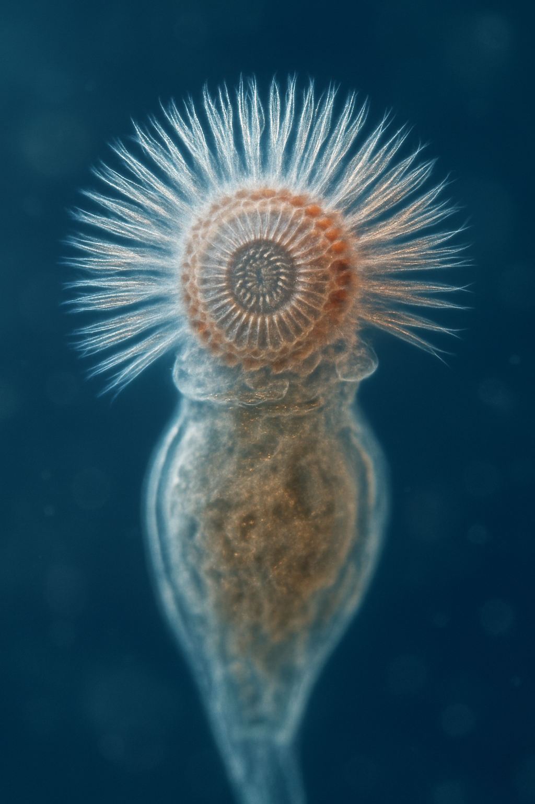
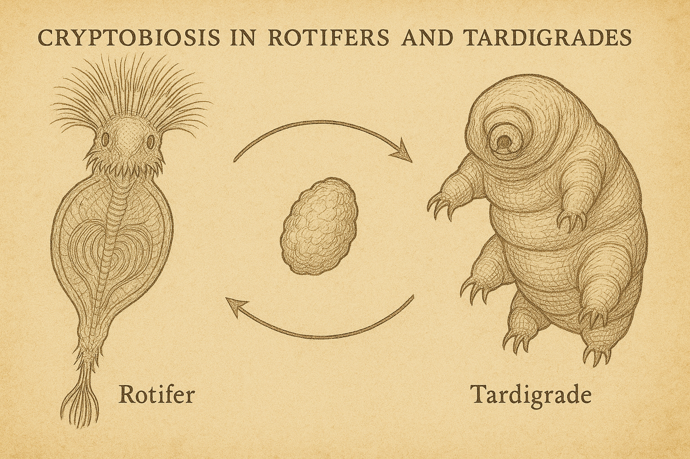
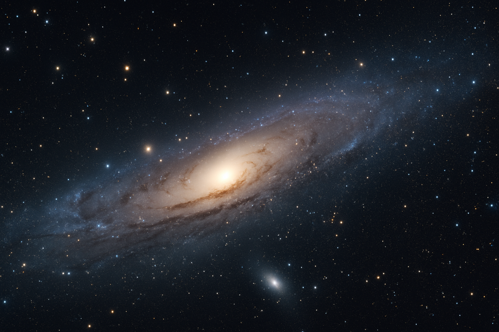

# 【随笔】生命是什么

眼见着四月份就过去了，一种类似伤春悲秋，还许多事没做，时间却飞速流逝的惆怅在心头酝酿着……

不过，这种心态，仔细想想其实没啥意义，不如及早打住。

李银河在某篇文章里写过，解决生命中遇到的忧愁和烦恼，有一个方法，那就是思考一下那些「宏大的命题」。

然后，我就看到了一篇科普文章《[介于生死之间（或之外）的“微小动物”](https://mp.weixin.qq.com/s?src=11&timestamp=1745965658&ver=5961&signature=pnFVEFXsFH*fMEz*Buvb1yeMWvjH08458aB047gFbviBjLj*2VyWNRvERXPF6npDpNt-Me92R161qnK2gg6gsk-2BHBG9tAAaClI8Yo9qTYRaq28QSo1xDUsZCyTOnIQ&new=1&poc_token=HGVSEWijqQEXPpIVzaTDnsYfFzq5qUn2DlnmeSZY)》，讲那些具有非生非死，第三态的生物。比如轮虫，比如水熊虫，等等……

我这才意识到，原来，关于生命，人类、甚至只是在学术界，竟然还没有一个达成共识的定义。[维基百科——生命](https://zh.wikipedia.org/wiki/%E7%94%9F%E5%91%BD)这一词条的开头是这么说的：

> 生命是一种特征，物质存在的一种活跃形式。**目前对于生命的定义在学术界还无共识**，较流行的定义是一类维持体内平衡、具有生命周期和稳定的物质和能量代谢现象、能对刺激做反应、能进行自我复制和繁殖、进化的半开放物质系统。由细胞组成，能够成长、适应环境。其他定义有时包括非细胞生命形式，如病毒和类病毒。

病毒挑战了「细胞」这个界定；而轮虫和水熊虫们则挑战了「新陈代谢」这个界定。

看到2021年网上有一则新闻《[西伯利亚冰封2.4万年蛭形轮虫重获生命](https://www.bbc.com/ukchina/simp/57406250)》，重获生命这个词，说得好像它失去过生命一样，但实际是什么情形呢？还说不清楚。

或许，还是回到更宏观、抽象的方向上来，才能让我这种执着的理工科学生有所理解。知乎上[NnWinter](https://www.zhihu.com/people/nnwinter)回答[有没有位于生物和死物之外的第三态？](https://www.zhihu.com/question/533522055/answer/2493978162)这个问题时，说：

> 如果我们能够拍下从地球形成到如今的画面，把它加速几万亿倍播放，我们会不会感觉地球的万物演化像一个活着的物体呢？我们会不会是地球这个生物的一部分呢？银河系是不是活的呢？宇宙呢？

顺着这个方向，我尝试给出一个我自己关于生命的定义：

**在一个我们划定的界限内，如果正在从「无序」走向更高的「有序」，或者更严谨地说，「熵」正在减少，那么它就是活着；反之，它就是死了。**

其实，我们自己明明白白、确定无疑地知道，自己是「活着」的。但我们并不知道，它的反面——「死亡」是怎么一回事。

在我们之外，我们只能观察和总结——这是活的，这是死的。生死有着明确的界限，但细究起来，这界限却模糊不清。

看来，正像[萨古鲁](https://baike.baidu.com/item/%E8%90%A8%E5%8F%A4%E9%B2%81/2985270)所说：

> 关于生命，我们一无所知！

