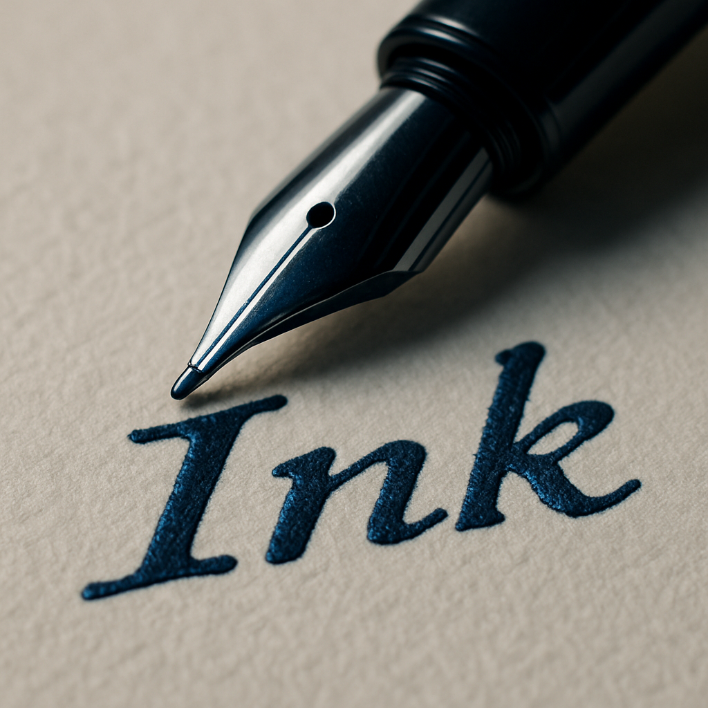
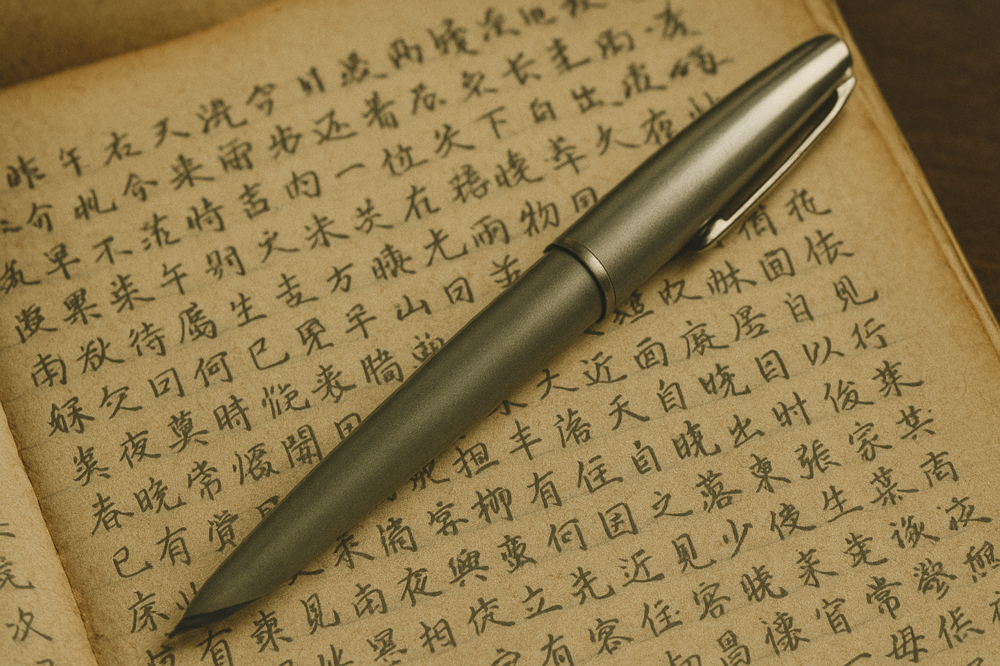
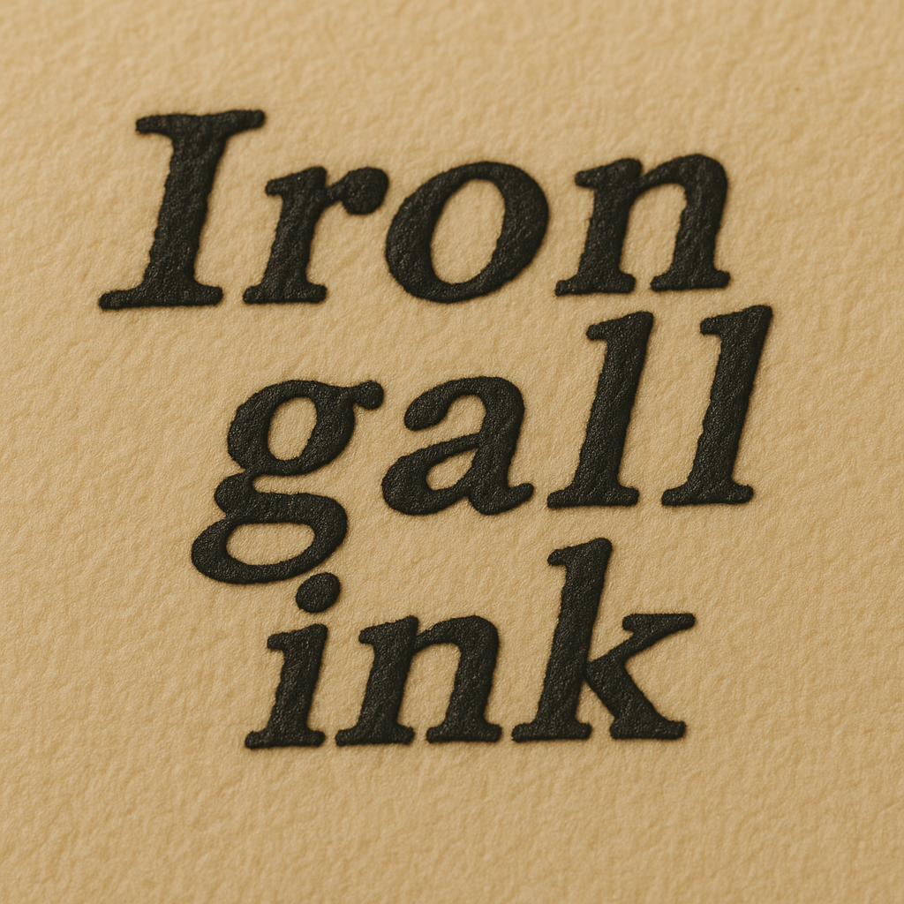
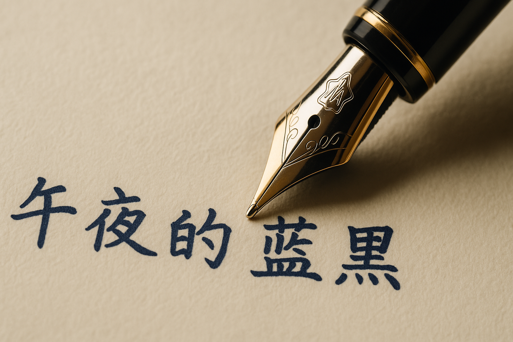

# 【随笔】对蓝黑墨水的执着

这一瓶午夜蓝的蓝黑墨水已经快用完了，想要再买一瓶，结果在官网的旗舰店刷了一次又一次，居然都是没有货。

只好等等看，毕竟那高跟鞋玻璃瓶网上都有二手卖，在其他渠道买墨水让人有那么一点不太放心……

或许哪天去万宝龙的专卖店里逛逛，能逮到一瓶漏网之鱼呢。

现在想想，自己对「蓝黑墨水」的执着，其实有点奇怪了。

----

也许是因为，小时候第一次用钢笔，灌的就是蓝黑墨水吧。后来其他同学喜欢纯蓝色，我试过之后并不喜欢，总觉得颜色太跳脱。又用过一阵子碳素墨水，纯黑，又觉得太黑了。

而蓝黑墨水中，我最最喜欢的还是那种叫做纪录墨水的英雄牌蓝黑墨水。如今闭上眼睛，都还能大约浮现出自己用得最久的那只灰色塑料笔身的英雄钢笔，在纸上写出低调、深沉的蓝黑色字迹的样子。

然后随着时间流逝，那些日记本的纸张开始变黄，而字迹开始变成另外一种偏黑的深沉颜色。

后来知道，那种蓝黑墨水被称作「记录墨水」的原因，是因为其中鞣酸铁的成份，既防水，又耐光。所以，还有一个名字叫做[铁胆墨水](https://zh.wikipedia.org/wiki/%E9%93%81%E8%83%86%E5%A2%A8%E6%B0%B4)。

然而，遗憾的是，在我给自己买第一支万宝龙（其实总共也就这么一支）时，它家的铁胆墨水就已经停产了。想必是无论如何保养，这墨水还是对钢笔有伤害吧。

因此，我和钢笔一起买的第一款午夜蓝Midnight Blue，其实也属于染料墨水，用它写的日记，被水泡过照样会洇开变成一团蓝色的花儿，如果泡得厉害，那些字就看不见了。

只不过，我对于偶尔写在本子上的日记一定要保存多久，渐渐已经没有了执着。

连生命都会消失，那些只对我有意义的纸张和文字，不管什么时候消失，也都是一件顺其自然的事情。

曾经换用过一阵子给大宝买的「神秘黑」，最终还是换回了「午夜蓝」。

看来，我依然喜欢「蓝黑」墨水，哪怕只是那种颜色。

真是一种奇怪的执着！

