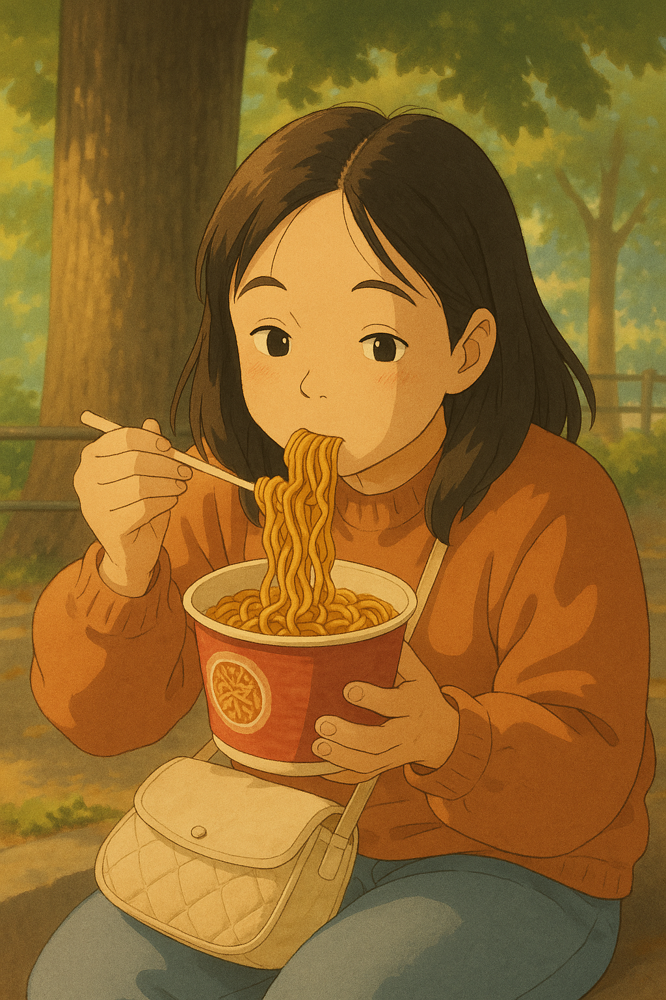
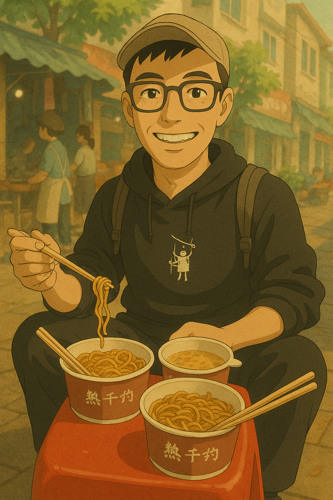
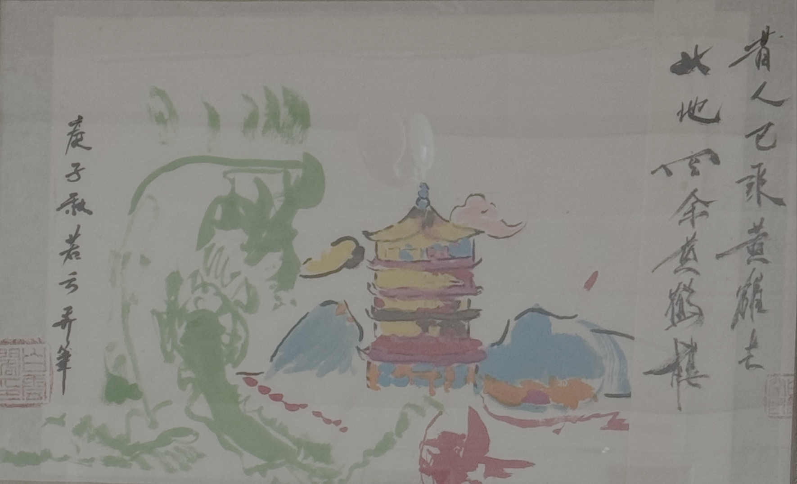
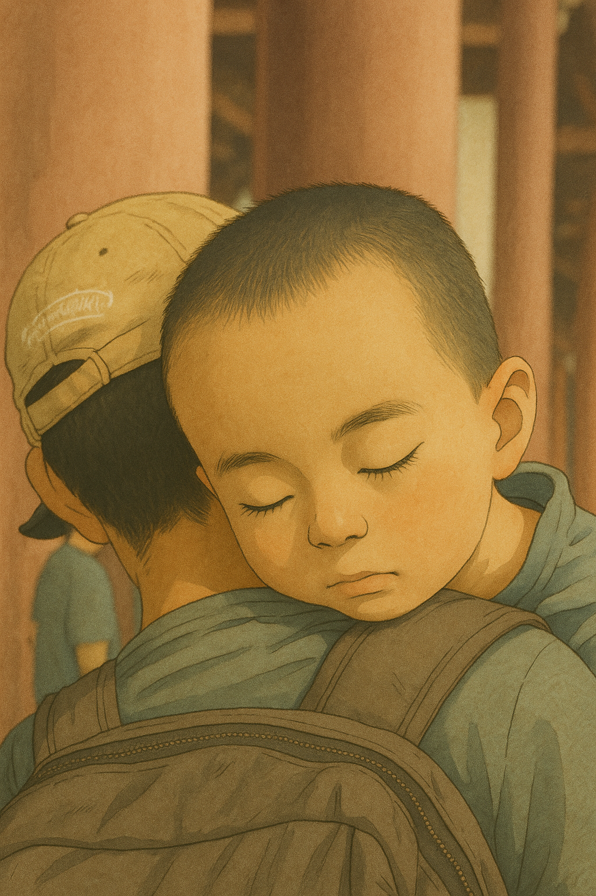

# 【随笔】昔人已乘黄鹤去

坐了一夜火车，休息得不算好，只能说大致过得去。

奶奶一早就起床，赶到地铁换线的地方，接到了我们。她惦记着大宝上次没吃到豆皮，说带我们去吃豆皮，就在地铁出口就有一家老字号。

不过，出乎意料之外，那家店居然劳动节放5天假。不过没关系，爷爷奶奶楼下那家热干面小店也是我们的心头好。奶奶带着阿宝和大鱼先回了家，我们则在路边坐了下来，好好享受了一把街边美食。

等我们吃饱，到了爷爷奶奶家，卸下身上的背包，把装蚕宝宝的盒子拿出来一看，它们早已经把桑叶吃了个精光，正仰着头寻找食物呢。

奶奶告诉我们说，小区后面以前有一棵桑树，不知现在有没有被管理处砍掉。

于是，我叫上大宝和我一起出去找找。

绕过停车场，我见花坛里就有几片叶子像极了桑叶，只是树太小，让我有点儿拿不准。于是，我们继续往小区后面走，看到一辆汽车旁边有些叶子也很像，只不过，边缘有点和桑叶不那么像。

我打开手机，想用「识花君」帮忙确认一下，谁知道它只认花，不认叶。

大宝后退一步，正想远远看看，仔细辨别辨别。忽然惊喜地对我说：

> 你看哦，这不是满地的桑椹吗？

我们哈哈大笑，闹了半天这眼前的两株大树都是桑树，赶紧抬手摘了两大枝特别嫩的桑叶回家。

……

解决了蚕宝宝的后顾之忧，我们开始出发去 5.1 旅行最重要的一站，**黄鹤楼**。

当年，我们带着阿宝在黄鹤楼下画了这幅画，现在阿宝要带着弟弟也去画画！

但是，这次是 5.1 假期，我们大大低估了游客们对黄鹤楼的热情，不仅仅在门口拍照合影时，怎么取景，镜头里始终全都是游客。然后为了爬楼，我们抱着小家伙绕着黄鹤楼排了一个多小时的队，却还在一楼。还没开始上楼呢，大鱼就已经耗尽了精力，趴在我肩头睡着了！

无奈啊！

昔人已乘黄鹤去，

游人满满黄鹤楼！