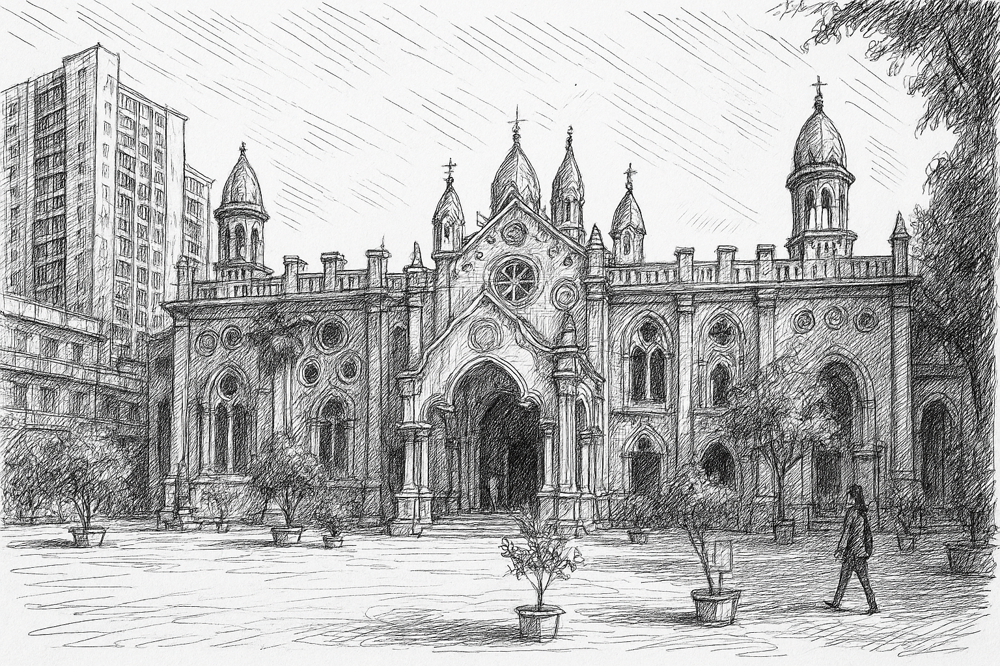

# 【随笔】一座奇幻的寺庙

这个假期的第二天，我和大宝按原计划，早早起床，骑自行车去了东湖绿道。

除了早锻炼的武汉人，只有三五个游客，我们在湖中间的湿地公园稍稍休息，就一路骑到了磨山脚下。进入楚城，看到一处巍峨的楼梯，抬头一看原来是仿古楚国章华台修建的楚天台，便爬了上去。

等我们绕东湖，骑自行车一圈，玩够了回来，已经是中午了……

搜过攻略，我们决定带着全家人去一个以前武汉人也没听说过的新晋网红景点——古德寺。

这个地方离我们家并不远，地铁不过几站路，过了长江就到了。

但是，从地铁站出来还有大约一公里步行的路程。就这么一小段路，大鱼累了不肯走，才把他抱起来没走几步，他就又睡着了。

显然，大鱼对于人多的景点有着自己的睡觉免疫法，和黄鹤楼一样，这又是一个人山人海的地方。而且，这里的游客几乎全都是一种类型——打扮得花枝招展的年轻美女们，还有她们的摄影师们。

女孩们穿得各不相让，以汉服和各种Cosplay的服饰为主。我近距离经过，却觉得她们长得都差不多，尤其是那尖尖的下巴、深深的眼线，我简直怀疑是不是照着一个模版，做过医美。

与女孩们形成鲜明对比的，则是这里的建筑——明明是佛家的寺庙，却是西式的尖楼，有着十字架尖顶，甚至还有一些伊斯兰圆顶的感觉。

我差点以为这座庙在租界时期被洋人侵占，建了教堂，后来才还给佛家。加上背后的高楼与周边几座还没拆的老汉口旧楼，放在一起对比，更是奇幻无比。

院子正中，有一座四面佛。而走进一边的观音殿，更让我瞠目。那是一尊造型和用色极具「土味」的观音像。整个观音殿的装修，也呈现出来那种辨识感极强的「土味」。或许，这才是这座庙的真正信众们礼佛拜菩萨的地方吧。

人太多，来不及弄明白这座「古寺」如此「奇葩」的缘由，后来上网查询才知道，原来[「古德寺」和「古德寺」的建筑](https://zh.wikipedia.org/wiki/%E5%8F%A4%E5%BE%B7%E5%AF%BA)都是颇有来历的。

> 古德寺，又名古德禅寺，是湖北省武汉市的一间佛寺，为武汉地区四大丛林之一。其位于江岸区二七街道黄埔路上滑坡（门牌）74号。寺庙几经战火，兴盛时期占地达30000多平方米，目前仅存天王殿、大雄宝殿等建筑，四围被二炮部队驻地、空军医院与其他民居包围。
>
> 寺院由隆希和尚创建于1877年，原名**古德茅蓬**。光绪三十一年（1905年）扩建。
>
> 1911年10月，昌宏法师率古德茅蓬僧众，冒着枪林弹雨，自发救护武昌起义的革命军伤员，后有3000余具烈士遗骨埋葬在寺侧，受到中华民国政府的嘉奖。
>
> 寺院坐东向西，占地2万平方米，建筑面积有3600平方米。山门上原有黎元洪写的“古德禅寺”匾额，山门后是天王殿，殿后是一院落，有一小花园，再进是大雄宝殿。此殿为钢筋混凝土结构，仿缅甸阿难陀寺样式，这种建筑样式极其罕见，目前世界上仅存两座这样的建筑。

当年住在武汉几十年都不知道这个地方，如今竟然奇幻地火起来了，也是神奇！