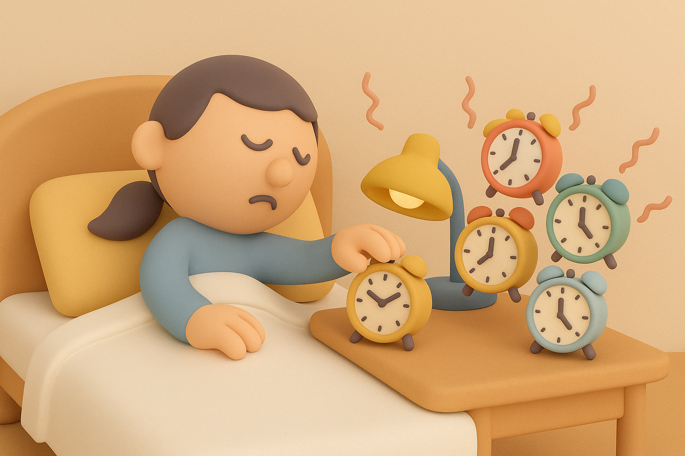

# 【生命⋅修行】早起的难

明显能感觉到，自己早起的「雄心与计划」，在执行中慢慢地滑向了一个艰难的临界线。

起床的时间已经连续几天在 6 点之后，这导致要在早上完成写作这件事情变得越来越勉强。同时，每天我在一边敲电脑，同时看着大宝忙碌着准备早餐和所有孩子们要出门的东西，心里的愧疚和不安也越来越多。

但我知道，这关键的原因在于——晚上睡觉的时间越来越晚了。

已经连续很多天在 10 点之后睡觉了，甚至好几次都接近或者超过了晚上 11 点。

以我的经验，想要早睡，短期来说，最有效的手段就是早起。而想要坚持早起，则必须坚持早睡。

每个人都有自己所需要的睡眠时间节奏。像我这样的人，一旦进入长期睡不够的状态。就会明显感觉到早上起来困，中午起来困，晚上烦躁易怒。继续下去，就会经历明明晚上困倦难过，却一直睡不着的困境。

……

可见，任何一件小事想要长期坚持，都会一路遭遇许多困难与困境。就像曾国藩在给他儿子的信中说的那样：

> 困时切莫间断，熬过此关，便可少进。再进再困，再熬再奋，自有亨通精进之日。

从小到大，哪怕只是「早起」这一个念头，也已经历了无数次「困境」了。这个「困」在这里真是有趣的双关语——闭上眼睛，那在瞌睡中努力挣扎的心理状态，和其他「困」住自己的境遇，还真都是一回事儿呢。

只不过，这么多年下来，除了「熬不过」最终妥协的经验，也积攒了许多「熬过去」后云开雾散、享以精进亨通的经验。

「坚持」、「熬过去」，是护佑自己继续前行的不二心法。这次也是一样一样吧！

