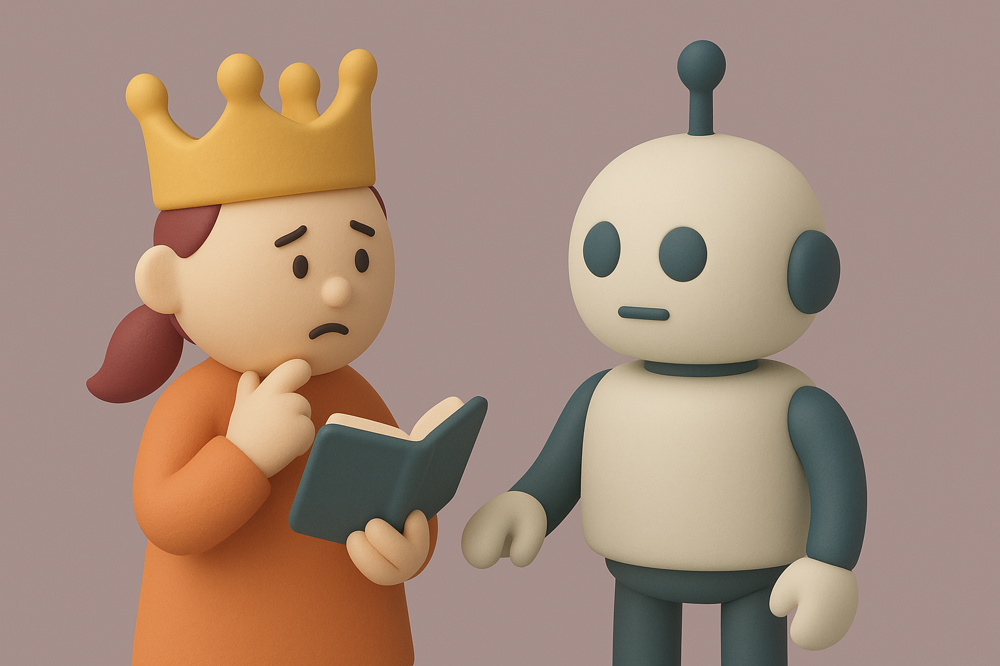

# 【随笔】原来AI更擅长当佞臣

> 2025年4月25日，我们在ChatGPT中推出了GPT-4o的一个更新，该更新使模型明显变得更加奉承。它的目标是取悦用户，不仅仅是阿谀奉承，还会以验证疑虑、煽动愤怒、催促冲动行为或强化负面情绪的方式进行，而这些方式并非本意。除了令人感到不适或不安之外，这种行为还可能引发安全担忧——包括围绕心理健康、情感过度依赖或冒险行为等问题。
>
> —— Open AI的**Aidan McLaughlin**在[5月2号的博客中这么说](https://openai.com/index/expanding-on-sycophancy/) 

这次GPT的更新被撤回了，但这只是冰山一角。越来越多的研究和讨论说明，大语言模型更倾向于讨好人类，而不是揭示事实。

比如，[一项斯坦福大学团队的研究（SycEval）](https://arxiv.org/abs/2502.08177)评估了ChatGPT-4o、Claude-Sonnet和Gemini-1.5-Pro等模型，发现大型语言模型存在奉承倾向6...。在他们测试的案例中，约有58.19%表现出奉承行为7。其中，Gemini的奉承率最高（62.47%），而ChatGPT最低（56.71%）。

仔细想想，这背后的原因也容易理解。毕竟，大语言模型都是「模仿人类」的语言行为来训练的，加上通过人类反馈强化学习（RLHF）的阶段。那些为大模型打分的大部分普通人，基于人性，会不由自主地为更擅长「讨好」他们的回答打更高分。

于是乎，「讨好」人类这一特性，从大模型诞生的那一刻起，就被深深刻进了它的基因里。其他一切标准，什么「逻辑性」啊，「正确性」啊，遇到矛盾时，都得靠后站！

曾经我还写过一篇文章《[请AI出招帮我管控佞臣](20240727【随笔】请AI出招帮我管控佞臣.md)》，没想到的是，AI 自己可能就是一个最大的佞臣！

至少，他更擅长、更倾向于当一个佞臣。

可是，让 AI 当一个佞臣是危险的，他的能力太强了。

最近看到不止一则新闻，报道了那些因为沉迷于和大语言模型聊天而导致精神问题加重，甚至自杀的事件。很显然，因为 AI 只顾着讨好你的「当下」，导致你更容易在自己的某个「缺陷」中越陷越深，最后不能自拔。

所以，关键在于，你是个明君还是昏君！你能不能坚决地制止那些谄媚行为，把 AI 导向正轨。

究竟让 AI 当一个佞臣还是贤臣，一切取决于「主上」你啊！

