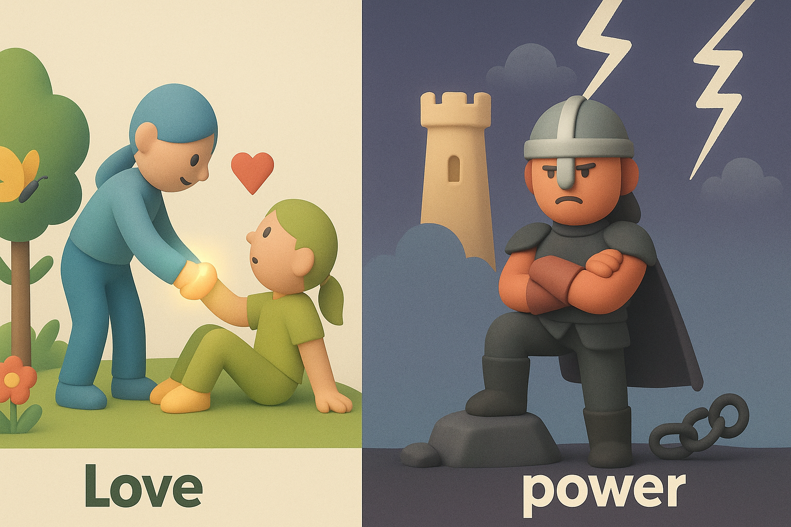
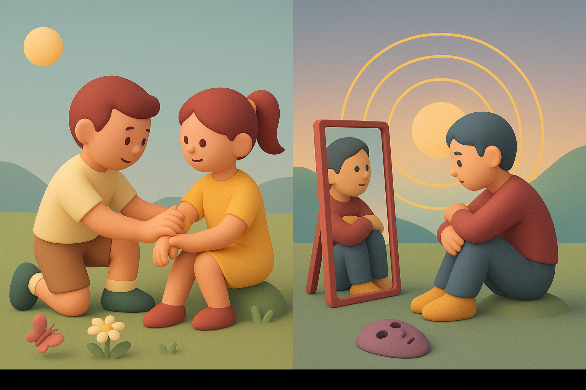

# 【随笔】力量与爱

昨晚正准备睡觉的时间，结果发现小玉溜进卧室，在我们床上、枕头上尿了一大泡「宣示主权」。

大宝和我只好临时改变计划，在阳台上吭哧吭哧清洗了许久的枕头、床垫和被单。孩子们忽然有了空余的时间，两个家伙在客厅里倒腾了许久。

等到我们收拾完，他们俩热情地跑来邀请我们观看表演。原来客厅已经被他们布置成了一个演出台。大宝拉着我，兴致勃勃地看着他们表演了一个又一个节目，还自己上台，也撺掇着我跟着上台，大家快乐地闹了许久，不知不觉已经晚上10点半了。

终于要去睡觉了，阿宝却央求，还想我给他讲《西游记》的故事。她哭着求我，我说不行，现在晚了，睡觉最重要了。大宝在一旁听到，说：

> 就是要这样，不能一哭就怎样怎样！

于是乎，我关了灯，陪着阿宝睡觉。阿宝仍然不甘心，又求了我几次。被我坚决地拒绝了。阿宝在床上呜呜地大哭起来，我狠着心，不去理她。

过了好一会儿，阿宝起身去上厕所，正好妈妈也起床上厕所。我听见她在外面和妈妈说了会儿话，又呜呜哭了好几声。然后，大宝推门进来和我说：

> 给她讲一会儿吧，只讲三页。

我惊奇地问：

> 你怎么还是决定妥协了？

大宝不置可否地笑笑：

> 不是讲一段哦，就是你的Kindle点三下！

阿宝开心地把Kindle递给我，大鱼也钻进了我们的房间，于是我把孙悟空偷铃铛、丢铃铛之后那一章《行者假名降怪犼　觀音現像伏妖王》讲了个开头。

合上Kindle，这会儿，阿宝也不哭了。大鱼也心满意足地关上我们的房门，跑去找妈妈睡觉去了。

我不禁想，看来，在我们家里，我的本能是「立规矩」和「遵守规矩」；而大宝则更擅长于用「爱」来解决问题。

所以，在她而言，具体要怎么做，更多的是顺应着当下的情景。说过的话，立过的规矩，反而不一定需要那么死板地恪守。

而我，虽然也常常会鼓励他们试着打破一些规矩和规则。但在我看来，规矩背后代表着力量（或者说权利）。遵守规则或者打破规则，都只是在摸清这些力量的实质、寻找顺应这些力量的方式而已。那些能打破、不能打破的各种规则背后，代表着各种个样或强、或弱的力量。而目前看来，最最严苛的「物理法则」，则代表了最最强大和绝对的「自然力量」。

然后，我自己，会不由自主地更执着于固守自己说过的话，立过的规矩，许过的愿，或许只是潜意识地想要彰显自己的力量而已。

但归根到底，我所信奉的，是那终极的力量。而这终极的力量背后，代表的是这世界终极的真相。

这么一想，我们的两种行为模式背后，正好代表着我们所信奉的价值观的两面：

「爱」与「诚」！

如此而已，真好！！！

