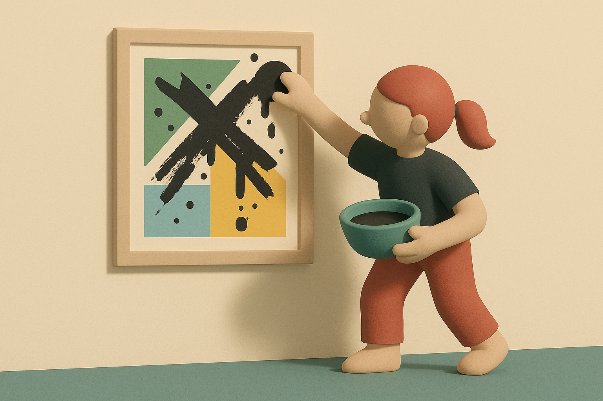

# 【生命⋅修行】再叹限制即自由

昨天，在读到和菜头的公众号文章结尾时，看到他为题图给出的MJ Prompt里有这么一个词（奇怪的是，[他的博客](https://www.hecaitou.com/2025/05/%20Be-aware-rather-than-obsessed-with-feelings.html)里并没有发布Prompt）—— 「富士相机拍摄」。

我想起自己曾经感叹过的那个概念——「限制」即「自由」。

看来在创作上，简直更是如此。因为用富士相机，因为富士相机的性能、参数等等各种条件的组合限制，结果给它拍摄的照片带来了特别的美感和特点。

以至于为了在那张图片中创作出类似的美感和味道，连使用 AI 时，都得重新加上「富士相机拍摄」这个关键字。只有主动套上这个特定的「枷锁」，它才能创作出这种特定的品位。

没有限制，也就没有创作的自由！

原来，孔子所说的「随心所欲而不逾己」，其实是因为已经深刻理解了自己所在那个时空的「限制」，所有的这些当下时空的「限制」与自身完全融为一体，所以才能发挥出它们作为创作资源的全部潜力，才能够真正地随心所欲！

……

昨晚回到家，大宝准备的美味意大利面刚好端上了桌。我意识到自己这一天里，应该再也不会有时间写几个字了——这是这一天里，第三次想要写作的念头冒出来，但是又清醒地选择不去做这件事情。

想清楚了，人就特别的坦然，一点没有以前惦记着要干某件事情时的焦虑和慌张。

我认认真真享受了意大利面，还吃完了阿宝和大鱼碗里，他们吃不完的那些。

然后晾衣服，9点多就洗澡，躺在床上给阿宝讲《西游记》。

虽然自己的智慧，只够洞悉这一段时空的限制，但依然足够让自己充分地享受在这一段时空中的自由滋味。

嗯，自由自在，真的美味！

