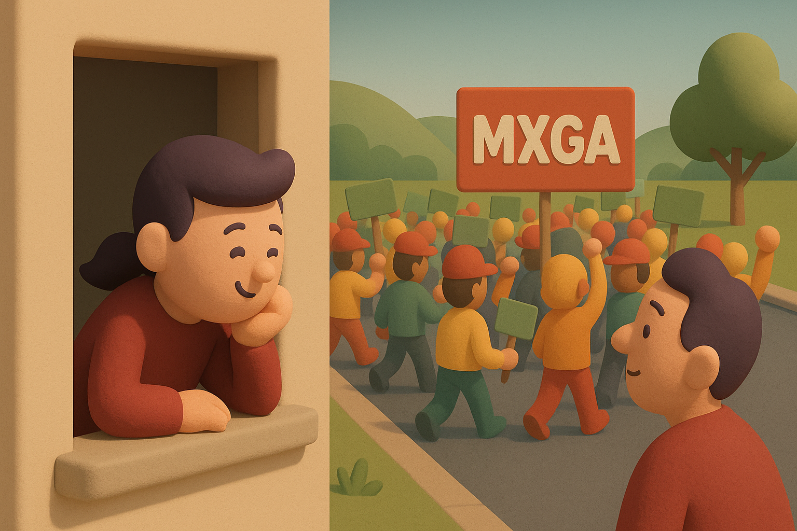

# 【随笔】这乱哄哄的世界

昨天快下班，同事 L 笑着和我说：

> 特朗普又给我们找事儿了吧？这刚刚分析完毕的「关税影响」，现在又得重新来一轮咯😏

我深深叹了一口气……

果不其然，早上随手搜一下财经新闻，净是这类消息：

> 周一（5月12日），美股高开高走，三大指数大幅收涨，且均收于3月以来的最高水平。
>
> 截至收盘，标普500指数涨3.26%，报5,844.19点，纳斯达克综合指数涨4.35%，报18,708.34点，双双创3月3日以来收盘新高；道琼斯指数涨2.81%，报42,410.10点，创3月27日以来收盘新高。
>
> 与此同时，道指和标普的年内跌幅已分别收窄至0.32%和0.64%，纳指的累计跌幅为3.12%。行情还显示，在大型科技股的带动下，纳斯达克100指数已较上月低位反弹超20%，进入“技术性牛市”。
>
> 日内早些时候，《中美日内瓦经贸会谈联合声明》发布，双方承诺将于2025年5月14日前采取一系列举措，包括修改和取消对彼此商品加征的关税，以及暂停或取消非关税反制措施。
>
> ……
>
> 大型科技股集体走高，（按市值排列）微软涨2.4%，苹果涨6.31%，英伟达涨5.44%，市值重回3万亿美元上方。亚马逊涨8.07%，谷歌C涨3.37%，Meta涨7.92%，博通涨6.43%，特斯拉涨6.75%。
>
> 费城半导体指数收涨7.04%，30只成分股全数上涨。市值较大的台积电涨5.93%，阿斯麦涨6.23%，AMD涨5.13%，德州仪器涨8.71%，高通涨4.78%，应用材料涨7.96%，Arm Holdings涨7.78%。
>
> 防御性股票走低，可口可乐跌1.4%，菲利普莫里斯跌2.87%，AT&T跌2.98%。
>
> 中概股跑赢大盘，纳斯达克中国金龙指数涨5.4%。
>
> 热门中概股多数收升，再鼎医药涨14.46%，好未来涨8.81%，小鹏汽车涨7.59%，理想汽车涨6.57%，京东涨6.47%，拼多多涨6.14%，蔚来涨5.79%，阿里巴巴涨5.76%，百度涨5.08%，新东方涨4.48%，腾讯音乐涨1.78%。

昨天晚上就开始躁动的投资者们，从东半球吵吵到西半球，今天又该东半球吵吵一轮咯。

而我，则感到一种深深的疲惫。截止如今，这第二轮的特朗普关税事件，闹剧化收场的概率显然已经变得更大了。然而，我这在一边看戏的人，莫名地开始出戏了。

其实，也不是莫名。加上最近在读万斯的《乡下人的悲歌》，断断续续在听、在读的《资治通鉴》。更是感叹，几千年来人类的把戏，来来回回总是那些。而驱动人类的，也还是那些拨动情绪的各种小把戏，比如，那些常见的热门标题：

> 你绝对想不到，这个习惯正在悄悄毁掉你的生活
>
> 太多人都中招了，但你可能还不知道
>
> 真相曝光！他们居然这样对待…
>
> 你一直以为XX是对的？其实完全搞反了
>
> 改变一个小习惯，竟让她减掉了20斤
>
> 原来最难的不是成长，而是看着他们老去
>
> ……

自己前几天不也是中招么？那则《金华撞人女司机内幕》的新闻，让同样为人父母的自己，为之感同身受，愤懑不已。

纵然其中许多事实，拨动自己情绪的，却还是那些「弹药」。

人类共同的软肋，你有、我有、他也有。能操控自己的，也正操控着这世界几十亿乌嚷嚷的人群……

一想到这，就觉得自己跟着这乱哄哄的世界，一起情绪上下波动，有那么点无聊和不值当了。

于是，想起《旁观者》里，德鲁克提到他参加游行，发现自己被人群裹挟着，一脚踩入水坑后的顿悟。

或许，躲在一边当个「旁观者」，还是来得更逍遥快活些吧……

