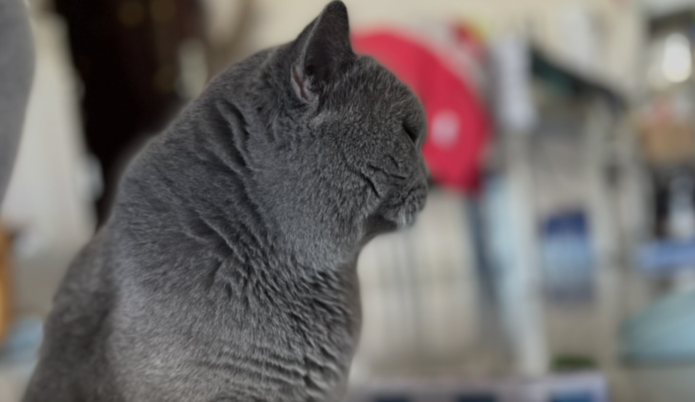

# 【随笔】天亮得真早

早上在床上，内心里挣扎了好一阵子。大约是第三次对自己说——「最后」来几个深呼吸，大约是第二次睁开眼睛——呼，这次天已经完全大亮了！

就在这时，客厅里传来了手机闹钟的声音。

原来，已经6点了！

> 被闹钟叫起床，这已经连续超过7天了吧！

我在心里嘟囔着，爬起身。脖子酸疼，头还昏昏沉沉的。我一面去到卫生间用冷水洗脸，一面试图回忆，昨天曾经想过的那个问题的答案

> 今天早上写什么呢？

但是，昨天晚上明明已经在脑海里出现过的答案，此刻竟然烟消云散。脑子里一片模糊，即便是清凉的水浇在脸上，自己觉得自己越来越清醒，但那个问题的答案，却找不到了！

> 我必须立刻动笔，不能像前几天那样磨磨叽叽，最后导致早上时间完全不够用！

天气颇凉，我穿上一件薄外套来到客厅。天已经完全亮了，甚至远处某些高楼上，已经有第一缕阳光照了上去。我打开电脑，坐到沙发上，码起字来……

神奇的是，那明明已经消失的答案，此刻竟然又冒了出来。我赶紧打开笔记软件，把它记录了一下，这样下一次「脑雾」出现时，我至少还有一个救生圈可以依靠。

戴着伊丽莎白圈的小玉跳到椅子上，喵喵叫着探起身看满桌子的东西。我拍了拍巴掌，把它吓了一跳。我继续拍了两声，它终于明白我不许它上桌子，不太情愿地转身跳下了椅子。

Cup 却被我的掌声吸引，冲着我走了过来。然后跳上沙发，让我摸了几下。我觉得老 Cup越来越可爱，越来越好看了。

尤其是，大宝昨天专门给它洗了一个澡。

已经好几年没给它洗澡了，此刻它终于香喷喷的，它也更加享受让我们抚摸它。

虽然，还是一摸一手毛。

