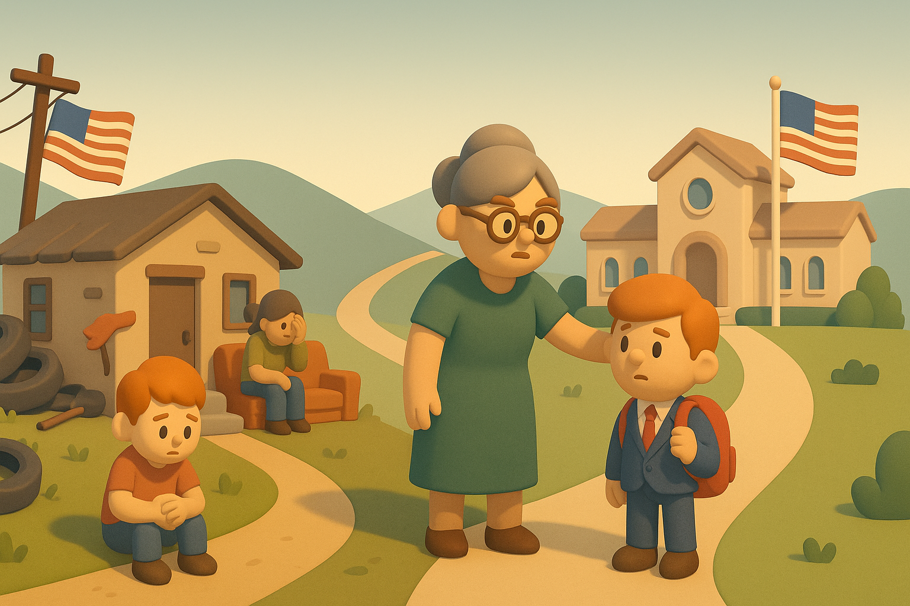

# 【随笔】人类的悲歌

前两天，把万斯那本《乡下人的悲歌》看完了。万斯在书快结尾时说：

> 当我物质上比较宽裕，情感上心有余力的时候，我会帮助她，满足她的需要。但我也意识到自己能力有限，而且把钱给了母亲或花时间陪了母亲，我自己可能就没钱付自己的账单了，对那些我最重要的人也不那么有耐心了，因此我更愿意与母亲分道扬镳。我就在这样的妥协下进退两难，现在仍是如此。

我感受到一丝深深的共鸣——作为一个普通人，钱和资源是有限的，时间是有限，精力是有限的，情感也是有限的。归根结蒂，每一段生命本身，也一样是有限的长度和深度。

正如一天只有24小时，把这段时间花在手机上，就不可能花在读书上；一天的精力也同样有限，大部分精力花在工作上，面对家务时就会畏难和退缩；情感和心力同样也有限，当我把最多的心力给了大宝，面对父母、面对阿宝时就更少了许多耐心。

或许，只有像传说中的佛与菩萨，才能分身遍布恒河沙国土，随时随地出现在不同的地方，面对不同的人，把自己的光与热给予所有的人。

作为一个普通人，只能一而再，再而三地提醒自己，争取把这有限的生命，都花在对自己最最重要的事情上。

然而，什么是最重要的？只能时时刻刻地扪心自问了！

回到这本书上，我还是从两个角度来说说我的看法：

### 好看 🌟🌟🌟3星

万斯努力地以一个普通人视角，娓娓道来的介绍自己的过去。包括那些让他爱恨交加的家人，让他充满回忆又不得不逃离的家乡。

至少前面大半部份，文笔都不错，让我可以轻轻松松地读下去。

### 启发 🌟🌟🌟🌟4星

除了我之前说的那一点「两难境地」的共鸣，还有一点启发我想谈一谈。

万斯写这本书时，可能还只是一个刚刚混出头的「小镇做题家」。没人能想到，他在7、8年后成为美国的参议员，副总统。

这也让这本书从一个独特的视角，描绘、诠释了地球另一面，一个重要又特殊群体的生活。

这是这群人的「悲歌」，又何尝不是「人类的悲歌」？因为自己个体、群体以及社会的原因，他们看不到、并且不肯面对真相；他们看不到不同的选择可能性。

于是，只能在悲苦中越陷越深！

然而，这种「痛苦」其实是普遍性的！更大程度上，是一种「逃避真相」带来的「心理痛苦」的外部显现！

正如万斯所说，这种「痛苦」生活的基本条件，是地球另一面，伊拉克的孩子们一生都梦寐难求的。

### 总体 🌟🌟🌟 3星

如果你手边有，或者图书馆里能借到，不妨拿来一读。

你会对地球另一面，那个美丽大国的副总统，作为一个具体的人，有更多的了解。

