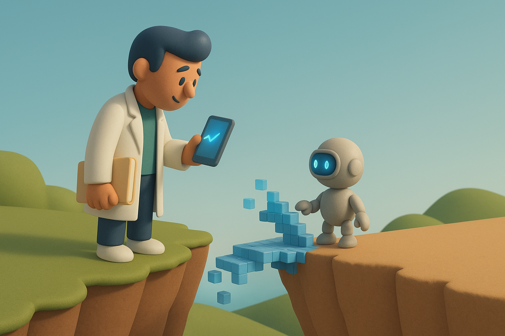

# 【随笔】面对AI的人类

>I think if you work as a radiologist you're like the coyote that's already over the edge of the cliff but hasn't yet looked down so doesn't realize there's no ground underneath him.
>
>我认为，如果你现在还在做放射科医生，就像那只郊狼已经跑出了悬崖边缘，却还没低头看一眼，不知道自己脚下已经没有了地面。

这是昨天在新闻里，听到的这么一段十多年前，「AI教父」Jeffrey Hinton说过的话。

他还说：

> 人们现在就该停止培养放射科医生了，这已经完全显而易见。五年内，深度学习将比放射科医生做得更好，因为它能积累远比人类多得多的经验。

他指出，医学影像分析（如核磁共振MRI和CT扫描）正是计算机很快将胜过人类的那类工作。

然而，有趣的是，可能正因为这段话，放射科医生反而成为了一个探讨「 AI 是否、以及何时会夺走人类工作」的讨论中，一个典型的案例。

《纽约时报》最近走访了明尼苏达州的梅奥诊所（Mayo Clinic），发现那里放射科部门不仅全面拥抱了人工智能，反而还扩充了人力。他们用AI来预测疾病、标记可疑影像、分析组织样本。例如，以前一个肾脏测量过程需要放射科医生耗时30分钟，现在AI几秒钟就能完成。

这让放射科医生腾出更多时间，去做AI尚不擅长的事情：凭借自身经验为外科医生提供建议、与病人交流，或基于个人病史制定治疗方案。

自辛顿做出预测以来，梅奥诊所的放射科团队规模扩大了55%，还新设了一个由40人组成的AI团队。

该院数字项目负责人也提出了自己的预测：

> 五年后，不使用AI将被视为医疗失职。但未来不会是人类或AI，而是人类与AI协作共事的时代。

这真是一个让人乐观的事实与观察。

我想起，应该是王建硕、或者吴恩达，在前两年 Chat GPT 刚刚横空出世时曾经说过，根据历史经验，新技术冲击最大的行业，因为生产力极大发展，反而会成为一个最大增长的行业。比如过去几十年，IT领域的工作岗位数量，比如程序员，相比起理发师来，已经十倍、百倍、千倍的增加了。

那时候，我就想，这一次人类面对 AI ，遭受冲击最大的行业，除了数字创作领域，依旧还是软件开发吧。

参考这个乐观的「事实」，5 年后的软件开发领域，会变成什么样子呢？

