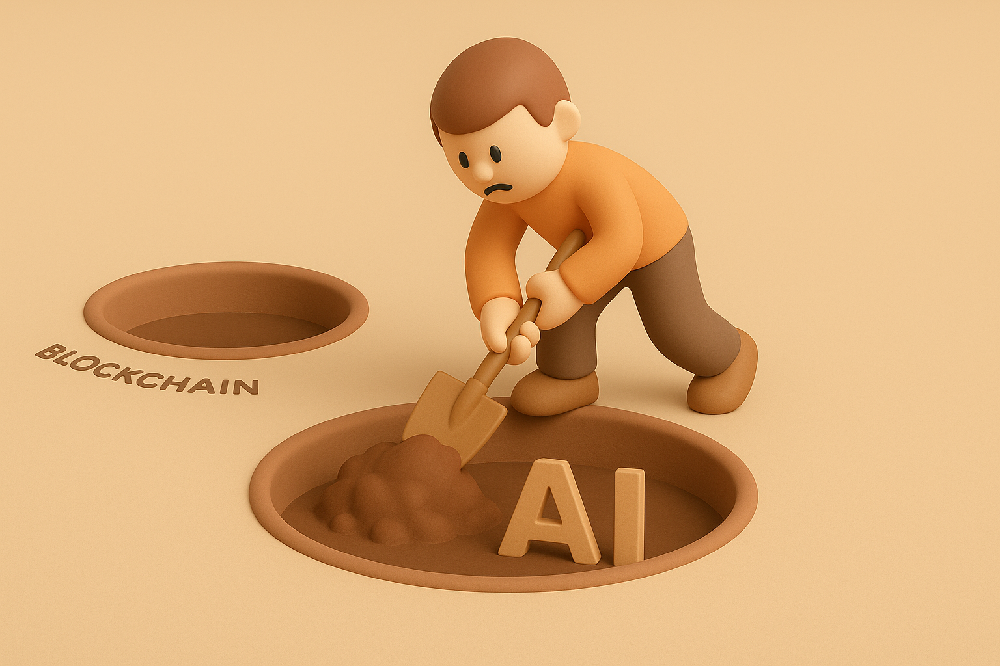

# 【随笔】又一个看似难以完成的主意

靠近周末的时候，开始想更新那份所谓的、面向普通人的《AI 创富指南》。却发现，没有整块的时间让我一口气完成这个东西。

为什么不让 AI 帮我写一个呢？

这么想过后，我立刻就这么试过了。

我给了Chat GPT 一句Deep Research的指令：

> 帮我准备一份给普通人的 AI 入门培训文档 2025版，受众从8岁到80岁，都能看懂，并被说服。让他们明白 AI 是什么，身为人类此时此刻应该怎么办。基本原则 —— Invite AI to Everything，和 AI 一起进化发展。读过这个培训文档后，读者能够明白 AI 是什么，以及作为人类个体，此刻应该怎么办。

GPT 琢磨了一阵子，扔给我一篇8000字的文章。但是，我对此很不满意。

至少，粗看下来，这比我手头已有的素材，人类准备的材料——吴恩达的 [AI for Everyone](https://www.deeplearning.ai/courses/ai-for-everyone/)，以及 MIT [Day of AI](https://dayofai.org/) 上的系列教程，还是要差很远的。

然后，我思维开始发散、开始犹豫，既然如此，那么到底值不值得做这件事情呢？

我越来越觉得，AI 是一个不需要「教」的东西，「它」其实就会自动地、越来越融入我们的生活。

就好像智能手机一样，在PC时代，电脑还是要学的，但手机却不用学——下至3岁人小孩，上至80岁老人，慢慢的，几乎都会用了。

然而，换一个角度看，如果不主动地去学，那么手机对于我们——更多的是一个被「产品经理」和「商家」们处心积虑「塞」给我们的东西。

我们使用手机的方式，更多是被动的、「纯多巴胺驱动」的状态。

AI 会不会也是这样呢？

显然是的。

如果不用一种主动的态度拥抱，那么岂不是只有等着被喂食、等着被主宰、最多等着被拯救的一条路了吗？

另外，即便看我们家的每一个人，对于 AI 的理解与应用程度，显然也是不一样的，我和大宝不同，阿宝和大鱼也不同，我们的父母、其他亲戚显然也各不相同。

把我自己的个人经验、路线总结出来，供还在自己身后一两步，乃至身边的人参考，未尝不是一件有价值的事情。

于是，我想起自己曾经写了个开头的《大白话区块链》系列，关于AI，用这种方式来梳理一下自己的经验与所得，是不是更合适呢？

这样，就可以把任务分布到每天早上的那一个多小时，不至于像《大白话区块链》那样，变成一个一直没能填上的坑。

……

但是，我冥冥之中感觉到，其实，我给自己又挖了一个更大的坑！

因为，早上的一个小时到一个半小时，似乎也根本不够我自己写出一篇让自己满意的科普文章来。

