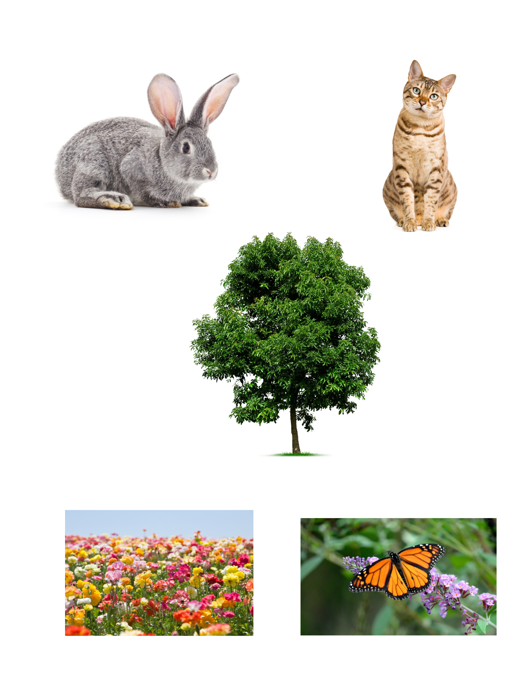
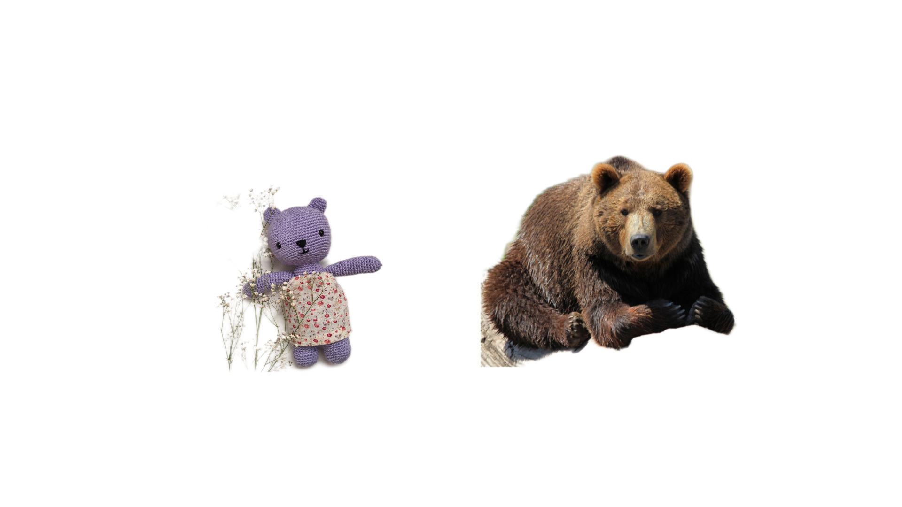
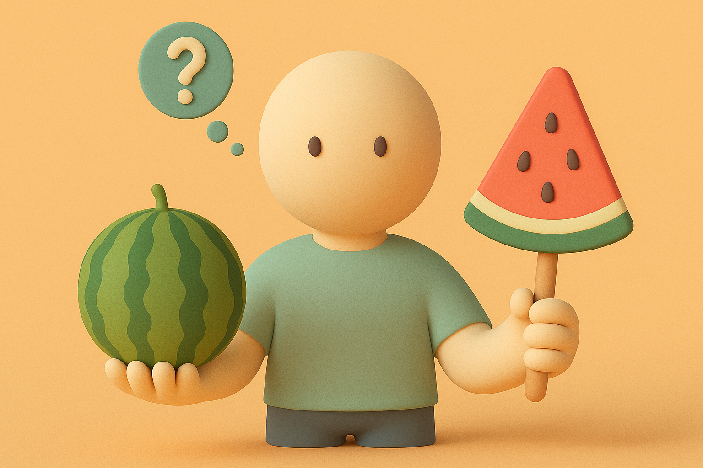

【AI】小白话系列——什么是人工智能（AI）（一）

当你听到「什么是人工智能」这个问题的时候？你是怎么想的呢？你的答案是什么呢？

我发现不管要介绍什么（哪怕是区块链[1]也一样），都免不了面对「什么是人工智能」这种类型的问题：

> 什么是什么？

当然，回顾一下小孩子在长大过程中，最喜欢问问题的方式，其实又不同。他们常常是用手一指，又一指：

> 这是什么？这是什么？这是什么？

这两种问法，一正一反，正好是我们学习的两种方式。那么，我们也试着用这一正一反的两种方法，来拆解一下这个看起来非常简单的问题：

> 什么是人工智能？

人工智能——英文叫 Artificial Intelligence——AI

由两个词组成，人工（A）和智能（I）

那么，什么是人工，什么是智能呢？

## 什么是人工

我想，除非是3、4岁的小朋友，大家一定都听过这么一个词——「巧夺天工」，「人工」正好是「天工」的另一面。

我们学认字的时候，可能都用过上面这些类似的图片，或者直接对着真实的东西，一一回答这样的问题：

这是什么——兔子

这是什么——猫

这是什么——树

这是什么——花

这是什么——蝴蝶

……

这些东西，都是来自大自然的，不需要人来制造。中国人历史上喜欢把统帅大自然的神秘力量叫做「天」，因此这些都是「天工」。

有时候，我们也会用「天」和「地」一起来称呼大自然，因此，又可以说这些都是「天造地设」。

那么，再看看下面这些图片。

继续回答一下这些都是什么？

勺子、足球、书、汽车。

显然，大自然里没有这些东西，如果没有人类制造它们，这些东西既无法「生」也无法「长」出来。

所以，这就是人工。

人工的意思就是字面意思——由人来制造，而不是天造地设，在大自然自己就会出现的东西；或者说，如果没有人来制造，就不可能出现的东西。

比如，左边这只泰迪熊是人工的——人用布做的玩具熊；而右边这只熊是天工——是熊妈妈生的它，不需要人来制造。

那么你觉得，下面这个小人手里的，哪个是人工，哪个是天工呢？

今天先写到这里，下次继续下面的话题……

## 什么是智能

## 什么是人工智能

……

----

以上参考了 吴恩达的[AI for Everyone](https://www.deeplearning.ai/courses/ai-for-everyone)，[Generative AI for Everyone](https://www.coursera.org/learn/generative-ai-for-everyone)，MIT [Day of AI](https://dayofai.org/)，以及Gemini、GPT为我生成的一些报告等等…… 
