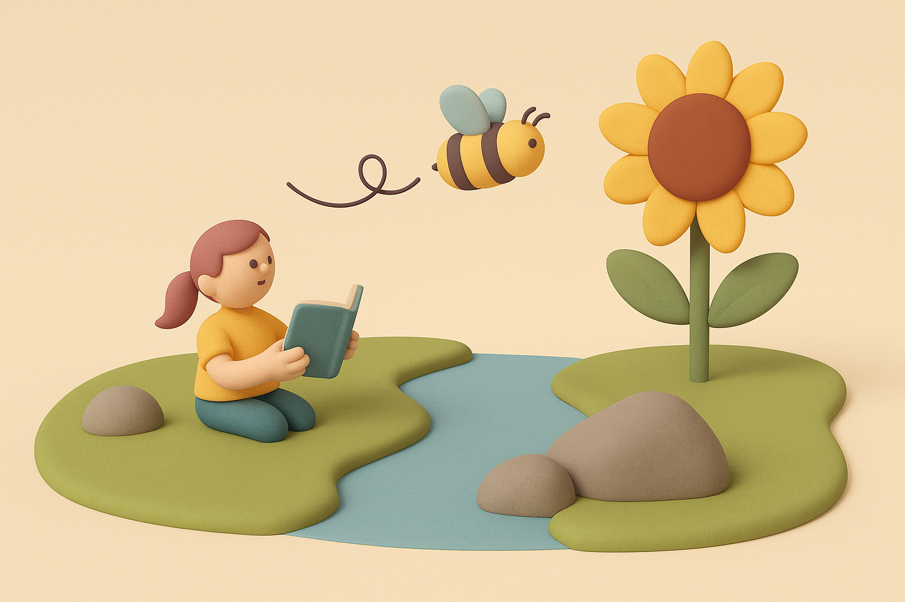

# 【AI】小白话系列——什么是人工智能（AI）（二）

上次聊了[什么是人工，什么是天工](20250520【AI】小白话系列——什么是人工智能（AI）（一）.md)。

最后那个问题，我拿去问阿宝。她说，西瓜也是人工，因为西瓜是人种出来的！你觉得她说得对吗？

关于这个问题的讨论，以后再展开。我们接下来看看，问题的后半部分：

## 什么是智能？

关于智能，我们人类有一种颇为「骄傲」的观点——我们每一个人，都拥有智能。

以至于，科学家们管现代人类的祖先，也起名叫做「智人」。

那么，什么是「智能」呢？

让我们先想想看，什么不是「智能」。中国有句老话，形容一个人愚蠢，不聪明，没有智慧时，会说：

> 这个人蠢得跟榆木疙瘩似的！

榆木是一种比较硬的木头，过去常常拿来做家具，或者木制装饰品。可是，榆木上长疙瘩的部分，硬得有点夸张。在古时候的工具面前，基本上是一种砍不开，锯不动的存在。

看到没？**对外界没反应**就是没有「智能」的典型。

那么，再回到「智能」这个词上来看。

甲骨文的「智」，长这样：

你看，左边像不像困惑的迷宫，右边是一个路标或者说箭头？「智」就是知道的意思。

而「能」表示我们能够从不知道变成知道，然后还能继续做点什么。

所以，你看。我们之前能够在观察很多不同的事物之后，比如兔子、猫、花、树、蝴蝶、勺子、足球、书和汽车，然后弄明白它们有些是「人工」，有些来自「大自然」，属于「天工」。

这就是「智能」。

或者再广泛一点——所有能像人一样，感知、理解这个世界，并且行动的能力，就叫做「智能」。

感知这个世界，我们人类用眼睛看、用耳朵听、用鼻子闻、用舌头尝、用身体触摸，也就是俗称五感。

然后，我思考、理解这个世界，思考、并指挥我们的行动。

思考，又叫做「意」。俗话说，就是动脑子。

眼、耳、鼻、舌、身、意——加到一起，这就是人类表现出智能的六个基本条件。

那么，来个难点的思考题：

你说说看，这个绕过石头的小溪和飞向花朵的蜜蜂，谁具有「智能」呢？

今天先写到这里，下次继续……

## 什么是人工智能

以上参考了 吴恩达的[AI for Everyone](https://www.deeplearning.ai/courses/ai-for-everyone)，[Generative AI for Everyone](https://www.coursera.org/learn/generative-ai-for-everyone)，MIT [Day of AI](https://dayofai.org/)，以及Gemini、GPT为我生成的一些报告等等…… 
