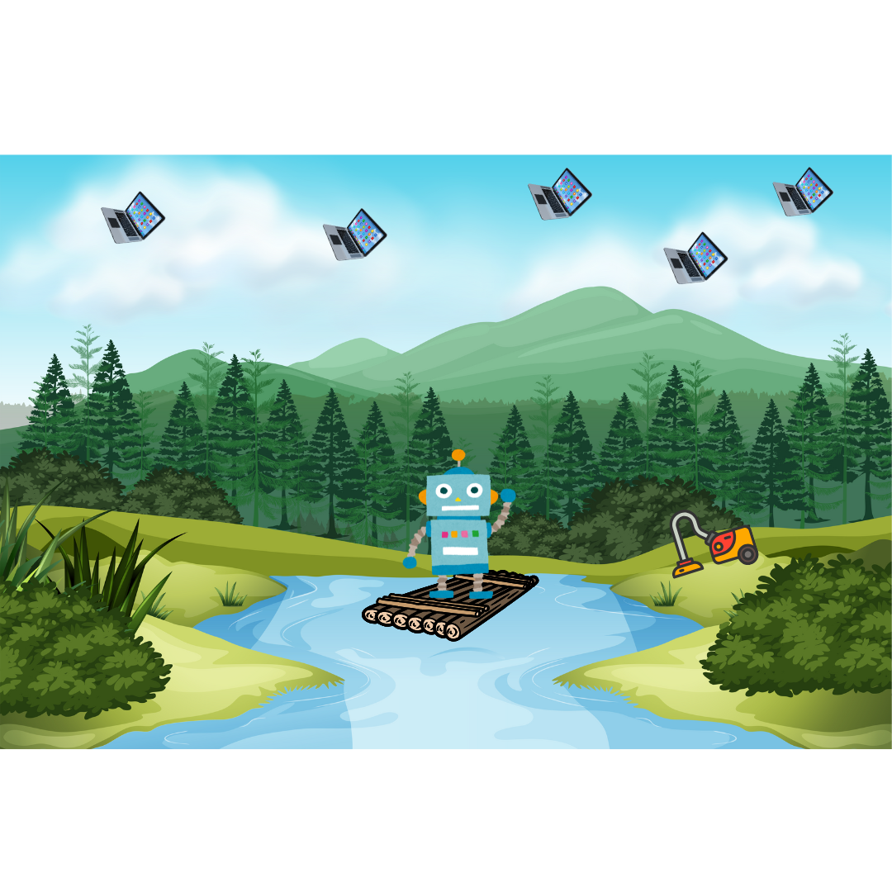
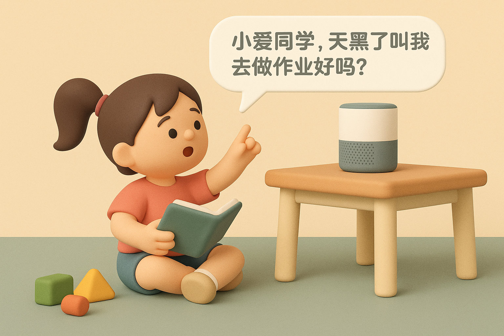
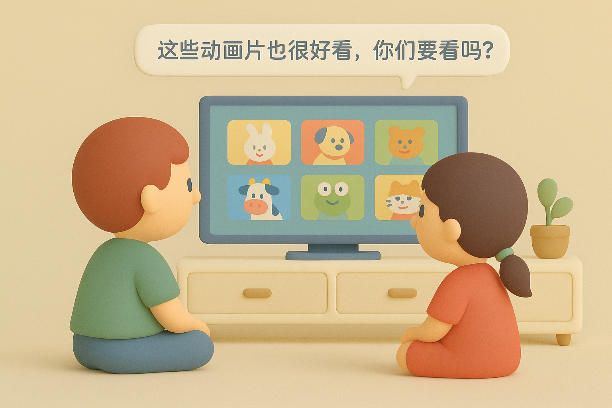

# 【AI】小白话系列——什么是人工智能（AI）（三）

上次聊了[什么是榆木疙瘩，什么是智能](20250521【AI】小白话系列——什么是人工智能（AI）（二）.md)。之前，还聊过[什么是人工，什么是天工](20250520【AI】小白话系列——什么是人工智能（AI）（一）.md)。

这两个词一拼起来，下面这个问题的答案就呼之欲出了：

## 什么是人工智能

下面这张图里的，汽车、挖掘机、机器人等等，都是来自大自然的吗？

它们能像我们人类一样，聪明又有智慧吗？

显然，这些都是「人工」制造的产物。而且，在最开始的时候，像汽车啊、挖掘机啊都是没办法自己干活的。

需要人来指挥他们。

因为，他们没有像我们一样，可以用来思考的大脑！

但是，在上面的图中，你有没有发现？其中有一种人类制造的有趣机器——计算机。笔记本电脑、平板、手机都是计算机的一种，只是长得不太一样。

计算机里可以运行人类制造的各种程序——比如你们玩的游戏，就是一种计算机程序；在小爱音响里放歌的，也是一种计算机程序；在计算机（或者平板、手机）给你们播放动画片的，也是计算机程序。

人类科学家发现，我们可以让计算机学习很多很多的东西——包括让他们看很多图片，听很多声音，读很多文字，甚至让他们玩很多游戏……

然后，有一些程序就开始变得有点「智能」了！

所以，「**人工智能**」就是「人工」制造的一种程序，它可以让计算机做那些看起来有像人类一样，有「智能」的事情。

当然了，接下来，我们还可以把运行着这种「智能」程序的计算机，放到「人工」制造的任何东西里。

### 人工智能就在我们身边

于是，环顾四周，你会发现，我们身边，早就已经有了各种个样的「人工智能」！

比如，你可以叫家里的智能音响帮忙提醒你一些事情。

你们看动画片的时候，电视也会推荐给你更多你们喜欢的、好看的动画片。

当你在路边看见一朵不认识的美丽小花时，你也可以掏出手机来问问里面的小程序。

这些都是「人工智能」。

说起来，什么是人工智能这个问题已经回答完毕。

不过，其实还有些细节可以探讨，比如：

### 什么是，什么不是「**人工智能**」

今天先到这里，下次接着聊……

----

以上参考了 吴恩达的[AI for Everyone](https://www.deeplearning.ai/courses/ai-for-everyone)，[Generative AI for Everyone](https://www.coursera.org/learn/generative-ai-for-everyone)，MIT [Day of AI](https://dayofai.org/)，以及Gemini、GPT为我生成的一些报告等等…… 
