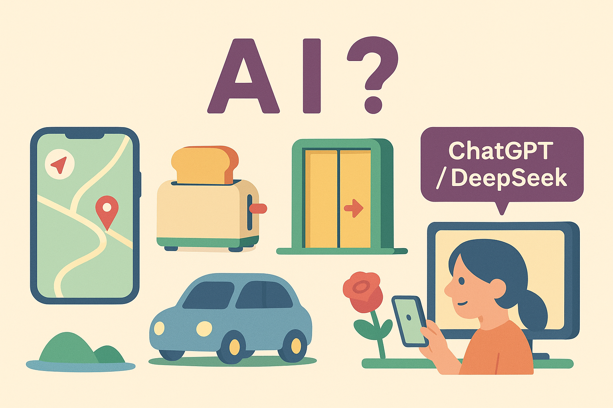

# 【AI】小白话系列——什么是人工智能（AI）（四）

之前聊了[什么是人工，什么是天工](20250520【AI】小白话系列——什么是人工智能（AI）（一）.md)；[什么是榆木疙瘩，什么是智能](20250521【AI】小白话系列——什么是人工智能（AI）（二）.md)，于是乎，[什么是人工智能已经显而易见了](20250522【AI】小白话系列——什么是人工智能（AI）（三）.md)。

不过，关于这个问题。我还想颠过来倒过去，稍微再深入讨论一下，看看到底：

### 什么是，什么不是「**人工智能**」

你还记得我在探讨[榆木疙瘩和智能的区别](20250521【AI】小白话系列——什么是人工智能（AI）（二）.md)时，总结的三点吗？

* 能感知
* 能理解
* 能行动

MIT 美国麻省理工学院的教授与科学家们做了更细致的总结，是下面这五点：

1. 能够感知环境
2. 能够持续学习
3. 能够自己做计划
4. 能够与环境交互
5. 对社会 / 大自然造成很多影响

科学家们把「理解」和「行动」这两方面做了更深入的定义，什么叫「持续学习」呢？就是能一步一步，通过各种收到的信息、知识越来越深入地理解这个世界。

什么是与「环境交互」呢？世界是变化的。在行动的过程中，要能够感知这个变化的世界，并且对此有反应，有动作。

「对社会的影响」就不用说了，这强调的是行动的结果。

这两把尺子，你都可以拿来判断一个东西究竟有没有「智能」，是不是「人工智能」。

我们也可以再综合一下。在我说的那三点上，增加「自主」两个字，把MIT 的五点判断标准背后的东西结合到一起：

* 能感知环境
* 能自主理解
* 能自主行动

当然，你也可以思考一下，找到你自己的「尺子」——谁让你也是拥有「智能」的「智人」呢？

好了，有了判断什么是人工智能，什么不是人工智能的尺子，我们来做个测验，你觉得下面这些东西，到底是不是人工智能呢？

会导航的电子地图；会自动弹出面包的烤面包机；有人就会打开的自动门；自动驾驶的小汽车；帮我们画画、写文章的ChatGPT和DeepSeek。

哪个是人工智能，哪个不是人工智能呢？为什么呢？

你可以在评论中告诉我你的思考和答案，或者直接在公众号发消息给我，甚至问问在后台回消息的那个家伙，究竟是人还是人工智能😄。

好了，等下次，我们再继续掰开、揉碎了看一下：

### 「**人工智能**」和「人工智能」有什么不一样？

----

以上参考了 吴恩达的[AI for Everyone](https://www.deeplearning.ai/courses/ai-for-everyone)，[Generative AI for Everyone](https://www.coursera.org/learn/generative-ai-for-everyone)，MIT [Day of AI](https://dayofai.org/)，以及Gemini、GPT为我生成的一些报告等等…… 